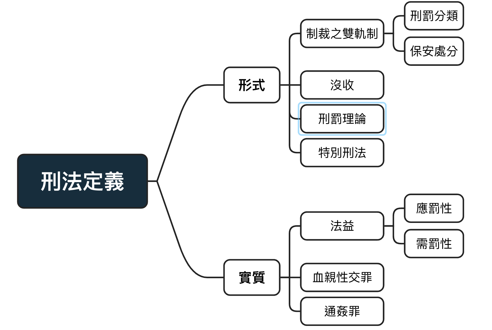

# 形式與實質？

## 本次架構

{width=80%}

## 形式意義的刑法

刑法之定義：凡有<mark>犯罪之構成要件</mark>及<mark>法律效果</mark>的規範既屬於刑法

例：刑法§271

- 構成要件：殺人者

- 處死刑，無期徒刑或十年以上有期徒刑

刑法之特性：公法、實體法、強行法

## 刑事制裁之雙軌性

- 刑罰：針對過去作為制裁與威嚇

- 保安處分：針對未來的矯正、教育、治療

## 刑罰分類

### 主刑與從刑

- 主刑：得單獨科處
  
- 從刑：僅得依附於死刑
  
### 法定刑、宣告刑、執行刑

- 法定刑：寫在法條裡刑法效果
  
- 宣告刑：法官宣告的結果

- 執行刑：針對數種刑罰相加後的刑度
  
### 自由刑、生命刑、死刑

- 自由刑：

  + 無期徒刑：基於特別預防理論，滿25年可申請假釋
  
  + 有期徒刑：2月以上、15年以下，特殊情況可更動
  
  + 拘役(超短期自由刑）：1日以上、60日未滿。 
  其矯正效果與威嚇性均不足而遭批評
  
- 財產刑：罰金，最低1000元以上，最高無上限。  

  + 優點： 
  1、不須占空間將犯人隔絕 
  2、沒有再社會化的可能 
  3、即使誤判，也有恢復的空間 
  
  + 缺點： 
  1、導致階級正義的刑法 
  
  + 日額罰金制： 
  依薪水更動罰金數額

- 生命刑：死刑 

死刑爭議：

  + 公民與政治權利公約第六條：未明文廢死 
  
  > 凡未廢除死刑之國家，非犯情節最重大之罪，且依照犯罪時有效並與
    本公約規定及防止及懲治殘害人群罪公約不牴觸之法律，不得科處死
    刑。死刑非依管轄法院終局判決，不得執行。
  + 模擬憲法法庭第三號判決 
  1.死刑違反人性尊嚴與生命權 
  2.違反平等原則與比例原則

## 保安處分(86~90)

需符合比例原則(適合性、必要性、相當性)

## 沒收

修法原因：使無罪責、第三人之不當得利皆得以單獨宣告沒收

## 刑罰理論
  