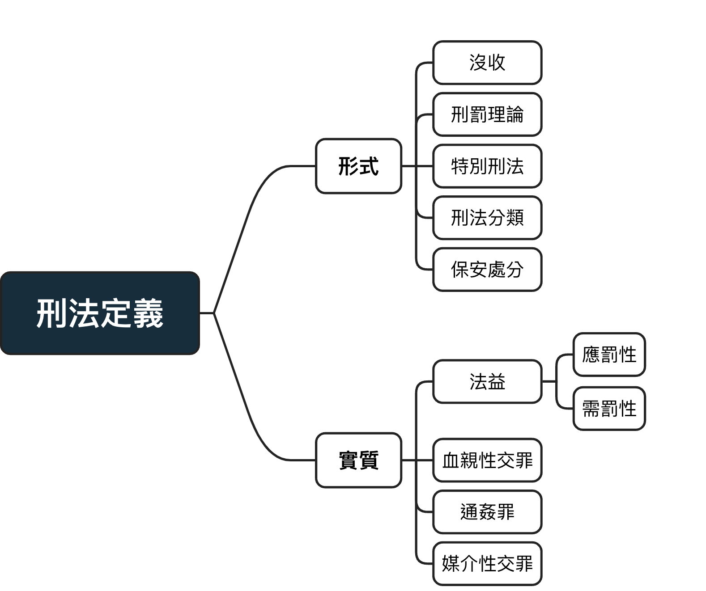

# 形式與實質？

<table border="1">
    <td colspan="4" align="center"><strong>About：112601033</strong></td>
  <tr>
    <td rowspan="4" align="center"><strong>個人照片</strong> </td>
  </tr>
  <tr>
    <td colspan="2">Name: <input type="text"> 
    Gender: 
      <input type="radio" name="gender" value="Male"> Male
      <input type="radio" name="gender" value="Female"> Female
      <input type="radio" name="gender" value="Other"> Other
    </td>
  </tr>
  <tr>
    <td>County:
      <select>
        <option value="Taipei">Taipei</option>
        <option value="Tainan">Tainan</option>
        <option value="Taichung">Taichung</option>
        <option value="Taoyuan">Taoyuan</option>
      </select>
    </td>
    <td>Birthday: <input type="date"></td>
  </tr>
  <tr>
    <td colspan="2">Email: <input type="email"></td>
  </tr>
  <tr>
    <td>Say something</td>
    <td colspan="2"><textarea placeholder="在這裡輸入一些文字"></textarea></td>
  </tr>
  <tr>
    <td>Hobby</td>
    <td colspan="2">
      <input type="checkbox" id="swimming"><label for="swimming">Swimming</label>
      <input type="checkbox" id="volleyball"><label for="volleyball">Volleyball</label>
      <input type="checkbox" id="movie"><label for="movie">Movie</label>
      <input type="checkbox" id="game"><label for="game">Game</label>
      <input type="checkbox" id="sleep"><label for="sleep">Sleep</label>
    </td>
  </tr>
  <tr>
    <td>Skill</td>
    <td colspan="2">
      <input type="checkbox" id="java"><label for="java">Java</label>
      <input type="checkbox" id="html"><label for="html">HTML</label>
      <input type="checkbox" id="python"><label for="python">Python</label>
      <input type="checkbox" id="office"><label for="office">Microsoft Office</label>
      <input type="checkbox" id="premiere"><label for="premiere">Premiere</label>
    </td>
  </tr>
  <tr>
    <td colspan="3">
       <button>提交</button>
       <button>重設</button>
    </td>
  </tr>
</table>

## 本次架構

<link href="https://fonts.googleapis.com/icon?family=Material+Icons" rel="stylesheet">

## 本次架構

{width=80%}

## 形式意義的刑法

刑法之定義：凡有<mark>犯罪之構成要件</mark>及<mark>法律效果</mark>的規範既屬於刑法

例：刑法§271

- 構成要件：殺人者

- 處死刑，無期徒刑或十年以上有期徒刑

刑法之特性：公法、實體法、強行法

### 刑事制裁之雙軌性

1. 刑罰：針對過去作為制裁與威嚇

2. 保安處分：針對未來的矯正、教育、治療

## 刑罰分類

### 主刑與從刑

1. 主刑：得單獨科處
  
2. 從刑：僅得依附於死刑
  
### 法定刑、宣告刑、執行刑

1. 法定刑：寫在法條裡刑法效果
  
2. 宣告刑：法官宣告的結果

3. 執行刑：針對數種刑罰相加後的刑度
  
### 自由刑、生命刑、死刑

自由刑：

  + 無期徒刑：基於特別預防理論，滿**25年可申請假釋**
  
  + 有期徒刑：**2月以上、15年以下**，特殊情況可更動
  
  + 拘役(超短期自由刑）：**1日以上、60日未滿**。 
  其矯正效果與威嚇性均不足而遭批評
  
財產刑：罰金，最低1000元以上，最高無上限。

  + 優點： 
  1、不須占空間將犯人隔絕 
  2、沒有再社會化的可能 
  3、即使誤判，也有恢復的空間 
  
  + 缺點： 
  1、導致階級正義的刑法 
  
  + 日額罰金制： 
  依薪水更動罰金數額

生命刑：死刑 

死刑爭議：

  + 公民與政治權利公約第六條：未明文廢死 
  
  > 凡未廢除死刑之國家，非犯情節最重大之罪，且依照犯罪時有效並與
    本公約規定及防止及懲治殘害人群罪公約不牴觸之法律，不得科處死
    刑。死刑非依管轄法院終局判決，不得執行。
  
  + 模擬憲法法庭第三號判決 
  1.死刑違反人性尊嚴與生命權 
  2.違反平等原則與比例原則

## 保安處分(86~90)

刑罰以行為人之罪責為出發點，也就是過去之行為，因此其上限由**罪責**決定。 
保安處分放眼於**未來的危險**，只要合乎比例原則，處分輕重**不受罪責原則限制**。 
[參考：罪責原則]()

針對⾏為⼈的**外來危險性**，希望可以排除，⽬的在於**矯正**、**治療**與**教育**  

1.第 86 條(**感化教育**) 

「因未滿⼗四歲⽽不罰者，得令⼊感化教育處所，施以感化教育。」

將少年輔育院改名為矯正學校，為了更好的社會化

2.第 87 條(**監護處分**) 

「因第⼗九條第⼀項之原因⽽不罰者，其情狀⾜認有再犯或有危害公共安全之虞時，令⼊相當處所或以適當⽅式，施以監護。」

地點:精神病院、司法精神病院 

時間：5年以下 -> 太短，應修正於以延長

3.第 88 條(**毒品禁戒**) 

「施⽤毒品成癮者，於刑之執⾏前令⼊相當處所，施以禁戒」

4.第 89 條(**酒精禁戒**)

「因酗酒⽽犯罪，⾜認其已酗酒成癮並有再犯之虞者，於刑之執⾏前，令⼊相當處所，施以禁戒。 」

5.第91-1 條(**性犯罪之治療**) 

「犯第⼆百⼆⼗⼀條⾄第⼆百⼆⼗七條、第⼆百⼆⼗⼋條、第⼆百⼆⼗九條、第⼆百三⼗條、第⼆百三⼗四條、第三百三⼗⼆條第⼆項第⼆款、第三百三⼗四條第⼆項第⼆款、第三百四⼗⼋條第⼆項第⼀款及其特別法之罪，⽽有下列情形之⼀者，得令⼊相當處所，施以強制治療：」

6.第95條(**保護管束**) 

「第⼋⼗六條⾄第九⼗條之處分，按其情形得以保護管束代之。(三年以下，責付家 屬或代理⼈) 」

7.第95條(**針對外國⼈的犯罪⾏為驅逐出境**) 

「外國⼈受有期徒刑以上刑之宣告者，得於刑之執⾏完畢或赦免後，驅逐出境」

## 沒收

修法原因：使無罪責、第三人之不當得利皆得以單獨宣告沒收

## 刑罰理論

{width=80%}
  
  
## 特別刑法：

相較於特別刑法，我國之主刑法為中華民國刑法。

有些刑法會在主刑法出現，而有特別法針對細節，有些則交由特別法處理

- 依特別對象：陸海空軍刑法

- 依特別的事物：貪污治罪條例

- 依特別的時間：921地震災區治罪暫行條例

- 散佈與其他法規：著作權法、商標法

## 實質意義的刑法

以法益為中心，探討應罰性與需罰性，若缺少其中一項，即缺乏正當性。

### 什麼是法益？{-}

《論犯罪與刑法》：「只有侵害法益才構成犯罪，國家僅能就侵害法益的行為施加刑罰。」

99%的刑法條文皆有要保護的法益

### 應罰性：法益受到危害{-}

### 需罰性：需要刑法才能維護法益{-}

## 刑§230：血親性交罪

> 與直系或三親等內旁系血親為性交者，處五年以下有期徒刑

1.犯罪之構成要件：

  + 「直系」或「三親等內旁系」血親：請參考[三親等列表](https://nurse.ukn.edu.tw/ezfiles/13/1013/img/415/21.pdf)
  
  + 「性交」：包括肛交、口交、以異物進入性器皆包含在內，請參考性交之[立法解釋]()

2.法律效果：處五年以下有期徒刑

## 血親性交罪法益{-}

### 1.優生保健：{-}

正方：避免產生有**遺傳疾病**的下一代
  
反方：

1. 變相**歧視身障者**；
  
2. 帶避孕套、墮胎及**可避免**;
  
3. 行為人雙方可能皆**無生育能力**：男男、女女、不再有受孕能力的婦女;
  
4. 此法採用定義更廣之「性交」一詞，而**肛交、口交**等性交行為不會產生下一代
  
### 2.性自主：{-}

正方：此為**立法理由**，避免上位者利用上下的支配關係發生性交

反方：

1. 以此法限制倆血親性交才是侵害性自主。
 
2. 有**其他法條**可以適用： 
  1.刑§228(權勢性交) 
  2.刑§227(未成年性交) 
  3.刑§221(強制性交)、§225(趁機性交/猥褻罪)
 
### 3.家庭、婚姻：{-}

此指涉之婚姻**非為個人之婚姻，而為整體之婚姻制**。

正方：導致**家庭、婚姻受到迫害**

反方：

1. 倒果為因，**家庭再行為人則受定罪前早已被破壞**。
  
2. **血親與性交不必然有關係**

### 4.善良風俗：{-}

正方：違反**社會共同之倫常觀念**

反方：法律應是最低之標準而**非道德守門員**

**善良風俗不應作為主要甚至唯一的法益**

## 刑法§231：媒介性交罪

> 意圖使男女與他人為性交或猥褻之行為，而引誘、容留或媒介以營利者，處五年以下有期徒刑，得併科十萬元以下罰金。以詐術犯之者，亦同。 
公務員包庇他人犯前項之罪者，依前項之規定加重其刑至二分之一。

刑231將我們俗稱之車伕、老鴇列入刑法規制的對象，用以逞罰以性產業為營利者。但若性工作者與嫖客**皆為合意**，且這些周邊工作更能保護性工作者之安全，此條刑法**所欲保護的法益為何**？

### 體系解釋{-}

其被放在**妨礙風化章節**(230~236)中，代表法律對善良，健康的社會不包括性工作。

這是很標準的行為人刑法，指其罰的對象是人，而非行為人本身。

### [大法官解釋第666號](https://cons.judicial.gov.tw/docdata.aspx?fid=100&id=310847) {-}

因為原法規罰娼不罰嫖，顯然違反平等原則，但經修正後的條文依然充滿問題。

1.規定上允許建立「性工作區」，但因為民意傾向而無法達成。

2.若在專區外則娼嫖皆罰，並無法改善性工作者之生活

3.再以231條之規定，即使娼與嫖皆合法，週邊的共犯仍須受到逞罰。

## 通姦罪之廢除：[大法官釋字791號](https://law.moj.gov.tw/LawClass/ExContent.aspx?ty=C&CC=D&CNO=791)

刑§239原文(已廢除)

> 有配偶而與人通姦者，處 1 年以下有期徒刑。其相姦者亦同。 
  但刑法第 239  條之罪，對於配偶撤回告訴者，其效力不及於相姦人。

### 姦的定義
姦的定義：與配偶以外的**「異性」發生「生殖器官」之接合** 
姦的定義相較於前述之性交**範圍限縮**。

### 要怎麼證明通姦([參考資料](https://www.chaohsin.com/lists_01.php?id=1580))

一、捉姦在床：當然最好是抓姦在床，只是現在的環境要剛剛好拍到正在性交的畫面太困難。

二、用過的保險套、擦過精液的衛生紙、記錄發生性關係的錄影錄音、目擊者看到雙方進出賓館、簡訊或書信中透露不尋常的關係、兩人親密往來的畫面等等，但因為不是直接證據，所以須互相搭配證明。

三、裝GPS、針孔：當事人為取得通姦罪的證據，在自己的房間裝監視器，為捉姦而蒐證，非「無故」偷錄，屬合理的權利行使，目前多數法官認為合法。

### 系爭規定一：違憲{-}

- 婚姻**自由權**：配偶一方違反婚姻忠誠之義務，不必然使婚姻完權無法延續。 
  再者，通姦之行為**尚不致明顯損及公益。故國家是否有必要以刑法處罰通姦行為尚非無疑**
  
- **性自主權、隱私權**：雖此罪具有一定之效果，但追訴審判的過程必然侵擾個人核心之隱私權。 
	限制所致之損害顯然大於其目的所欲維護之利益，而有失均衡。(憲法22、23)
	
### 系爭規定二：違憲{-}

- **平等權**： 
「其效力不及於相姦人」，代表原告可單一撤回對配偶之告訴，而小三(小王)卻仍需面臨刑責，形成「共犯」不罰的狀況。(憲法第7條)

- **無助於達成維持婚姻延續的法益**： 
	前述提前此條但書得使配偶有權利決定原諒與否，使婚姻得以延續。 
	1.若元配撤回告訴，表其本欲維持婚姻，與本法無關。 
	2.若不撤告，此法淪為報復工具，何以維繫婚姻？

### 系爭規定一、二：性別平衡{-}

在實務上女性被告多於男性，其性別平等性值得懷疑。(憲法增修條文第10條第6)
  