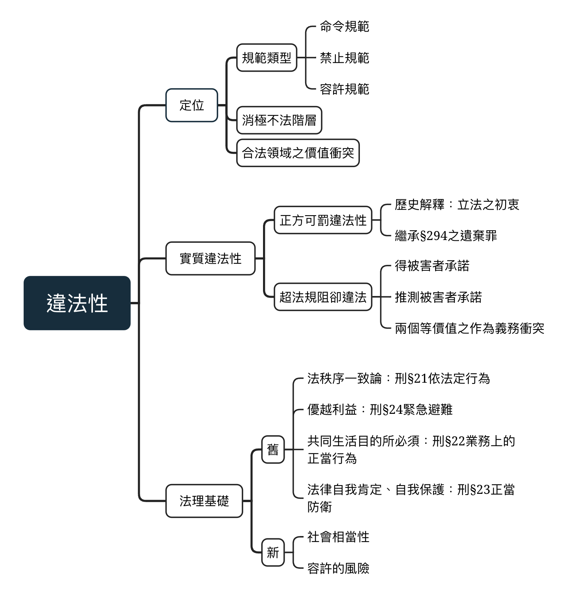

# 違法性

{width=80%}

**找到阻卻違法事由，使合制違法性事由不具備**

不管是**法律明文規定之阻卻違法事由**，或是普遍承認的**超法規阻卻違法事由**，只要有一個就無違法性

\pagebreak

## 階層體系定位

### 禁止規範：你不能做...

刑法分則中大多數都是**禁止規範**

例：殺人罪(你不能殺人)

### 命令規範：你必須做...

命令行為人為特定作為，通常有特定字眼(不為...)，常見於**不作為犯**

例：遺棄罪(你必須負起養育扶助的義務)

### 容許規範：你可以...

法律允許人民牴觸禁止、容許規範

例：監獄管理員依監獄行刑法執行死刑，抵觸殺人罪之禁止規定

例：對於不負扶養義務之父母，孩子可依遺棄罪之但書不扶養之，抵觸容許規範

### 消極不法階層

不法構成要件為積極構成要件要素，相對違法性則是消極面構成要件

每一個案件都要有消極面與積極面，缺其一，不構成犯罪

### 違法與不法

不法會依事情嚴重程度而有層次之區別，有民事/行政/刑事之區別

違法沒有層次區別，只有有無抵觸法律上之區別，因此只討論有無阻卻違法事由，無關乎程度

### 法條合法領域之價值衝突

刑法之手段最嚴重，因此刑法因為最後手段

因此其他法律許可之情事，即不會受到刑法懲罰，吻合法律秩序

## 形式與實質違法性

### 可罰違法性理論

微財犯罪：偷竊一張信紙，是否有違法性

74台上4225：採可罰違法性之理論，認為微罪不具被「實質違法性」

質疑：若偷竊的是2張信紙呢？3張呢？100張呢？

**以法順序來論，偷竊本身就是違法行為。**

討論違法性應只有存在與不存在兩種思維，偷竊即有違法性，**不應偷渡可罰違法性作為阻卻違法事由**。

若要判決符合比例原則，應是在刑期上做適當的降低，而不是以**阻去違法直接無罪**

### 超法規阻卻違法事由(實質違法性的真正意涵)

某些行為不在21~24之阻卻違法事由內，卻**缺乏實質違法性**

為使其得以阻卻違法，我們以超法規阻卻違法事由包含其在：

**1.得被害者承諾/推測被害者承諾**

例：病患拒絕被插管，醫生之不救治即是獲得人之允許，而實質阻卻違法性 
(安寧緩和條例/病人自主權力法)

**2.兩個等價值之作為義務衝突**

只有出現在**不純正作為犯**

超法規阻卻違法事由還在不停的發展，如318學運，法院透過類推緊急避難來阻卻違法。

\pagebreak

## 法理基礎

在阻卻違法事由提出之初期，四個不同的理論建構了四個阻卻違法事由(如下圖)

後期學者提出社會相當性與容許的風險將四者包含其中，但因範圍過廣較為空泛

<table>
  <tr>
    <th width = 50%>理論</th>
    <th width = 50%>阻卻違法事由</th>
  </tr>
  <tr>
    <td>法秩序一致論</td>
    <td>刑§21依法定行為</td>
  </tr>
  <tr>
    <td>優越利益(利益權衡)</td>
    <td>刑§24緊急避難</td>
  </tr>
  <tr>
    <td>共同生活目的所必須</td>
    <td>刑§22業務上的正當行為</td>
  </tr>
  <tr>
    <td>法律自我肯定、自我保護</td>
    <td>刑§23正當防衛</td>
  </tr>
</table>

## 正當防衛

::: box

刑§23： 
對於現在不法之侵害，而出於防衛自己或他人權利之行為，不罰。但防衛行為過當者，得減輕或免除其刑。

理論：法律自我肯定/法律自我保護 

審查要件： 
1.客觀防衛情狀： 
&emsp;&emsp;I.來自人為 
&emsp;&emsp;II.屬捍衛自己與第三人權利 
&emsp;&emsp;III.具備不法性 
&emsp;&emsp;IIII.具備現在性 
2.客觀防衛行為： 
&emsp;&emsp;I.適合性 
&emsp;&emsp;II.必要性 
&emsp;&emsp;III.非權利濫用情形 
3.主觀防衛意識： 

:::

### 理論：法律自我肯定/法律自我保護

前者認為對於不公不義的行為予以痛擊在所應當，後者認為面對法益受侵害之局面應得以展開保護之行動 
這兩種理論鞏固正當防衛之合理性，不但排除了違法性，更承認其**權利性質**，是其與本質為**利益權衡**之緊急避難有天壤之別。 
以殺人罪為例，其本質應為「該當犯罪構成要件之權利行使行為。」

### 結構

正當防衛由**防衛情狀**與**防衛行為**組成
情狀侵害行為有現在性與不法性，且是基於保護自己或第三人的權利對人為的侵害進行排除
防衛行為指行為在客觀上有合理/必要且無權利濫用，主觀上有防衛意思

## 要件1：客觀防衛情狀

### 侵害來源：人為的侵害

指他人之一切足以破壞法益或妨害權力之行為，必須具備**刑法上行為的品質**
必須是來**自然人**之侵害，若是來自**自然界或動物**之侵害，應屬**緊急避難事項** 
例：郵差被狗追逐，情急下將狗踹飛，或是不得以躲進住宅，為緊急避難阻卻違法事由 
相反，若狗兒受人類指揮，當屬正當防衛事由。

另外，侵害的類型當不限於蓄意之行為，故意或過失行為都應屬侵害行為的樣態。 
當然，行為也不限於作為與不作為。 
例：無故侵入住宅，得退去要求仍留置者(306)，得以正當防衛使用強制力而阻卻違法

### 捍衛自己或第三人的權利

只要是保護法益之行為，幾乎不受限制

例1：若如今有堆人拿著你的黑白相片，播著死亡進行曲，並大聲哭喊你的名字，觸犯公然侮辱罪，你可以上前奪取、撕毀照片來保護你的法益來阻卻毀損罪。

例2：一隻狗在路上被擊打，兩種角度讓逮補虐狗犯阻卻違法：

  1.動物保護法§6、25明定不得對動物進行傷害，已是法律上的現行犯，依法令之行為阻卻違法
     
  2.透過類推適用，動物權可為第三人權利之延生，正當防衛阻卻違法
  
例3：看到醉醺醺的人準備駕車(還未有不法侵害)，即使他開車會造成往來人車之生命安全，並非正當防衛所涵蓋之事項。若他已經開始駕車，為現行犯，當屬緊急避難阻卻違法事由 
此類社會或國家集體性法益，除非為使國家陷入毀滅之零星事件之外，皆不在正當防衛涵蓋之列。

### 侵害具備不法性

侵害必須為不法，不法指行為要件該當，行為人有無罪責並非重點，無責的侵害也可以主張正當防衛，但行為之手段必須特別注意
面對年齡之無責的行為人(例：14歲以下的少年)，必須特別注意權利濫用
至於年齡障礙無責的行為人，幾乎以一般行為人無異。

### 侵害具備現在性

針對現在性仍有極大爭議
實務與通說採狹義見解，必須是現在進行式，當場做出保護法益保護行為

而**有效性理論**認為侵害是否屬於現在，應就**行為可採取之有效防衛之最後時間點為界線**，換言之，若再遲就無法保護法益時，即屬於現在侵害。 
此理論背景是為處理鄧如雯殺夫案(受家庭暴力之婦女，在其丈夫睡著時殺之) 
但此學說並無登上主流，乃因正當防衛保護之效力過於強大，應限縮其使用之範圍

當侵害已屬過去，當不屬於正當防衛
例：在3年後，偶遇殺父仇人，將其殺害顯然不是正當防衛，只能依現行犯將其逮補，為依法令行為 
應注意判斷**正當防衛之界線與犯罪之既遂沒有必然之關聯**，
侵害現在性的考量基準建立在防衛者的權利保護及正當化的界線，犯罪既遂則在於不法侵害者的刑罰性與輕重
例：小偷偷走珠寶項鍊偷亡之路上，雖犯罪已既遂，但竊盜犯顯然與贓物尚未建立穩固牢靠的持有關係，此時行為仍具備現在性，壓制小偷可主張正當防衛。但若小偷已逃至安全之地並將其收納，行為結束，雖然對法益之侵害持續，但行為並沒有現在性

當侵害出現在未來，基於此之對危險去除也不在正當防衛之列
但注意預防性的防禦措施雖是針對未來的侵害做預防，但只要不逾越要件2之必要性，屬於正當防衛
例：在莊園養幾隻惡犬防賊，當歹徒觸發防禦措施時侵害必然已屬現在式，但若惡犬將歹徒殺害，應不符必要性
  

## 要件2：客觀防衛行為

### 適合性：

手段必須能去除不法之侵害 
例：對性侵害犯使用防狼噴霧符合適合性，但面對公然侮辱回敬以三字經就不具備適合性

\pagebreak

### 必要性

在**數個同等有效之行為，採取損害最小之行為**。 
在正當防衛之考量必要性之權衡相較緊急避難來的複雜數倍，其中法益重要性之比較只是其中一小個環節。 
例：面對3個殺手環伺，不應要求其選擇不一定有效之逃跑，而認為其開槍行為過當

### 非權利濫用的情形

正當防衛只要行為與結果**沒有超乎尋常之不成比例，原則上不做限制**。 
反之，不管是**行為與結果，皆不以利益權衡、保全法益之優越性與手段適用之相當性為適用前提**。 
極端情況下，為保護低階之財產法益而侵害高階之生命法益不被概括排除

而**防衛權之行使是否以達到濫用，乃從規範觀點與社會倫理觀點所做為之評價**； 
反之前述之**必要性純粹取決於事實**，尤以**侵害行為之方式**與**強度**來判斷。 
至於實際哪些情形必須節制，以下列出4點

**1.微財犯罪** 
指所防衛法益與所反擊及法益極度失衡的情形，防衛之行為即屬權利濫用的行爲而不被容許，縱使防衛行為乃保護法益的必要，甚至是唯一手段，亦然。 
例：小偷只拿了幾個櫻桃，應先採取口頭喝斥，而非直接將其射殺。 
其次，即使射殺小偷乃奪回櫻桃之唯一手段(符合必要性與適合性)，僅是為了幾顆櫻桃(微小的財產法益)，就對小偷之生命法益造成無可恢復之傷害，顯然**已極度不成比例**，屬權利濫用

**2.侵害來自無責任能力之人** 
例：面對5歲小孩偷東西，同樣不當以射殺為優先 
但如前述，正當防衛不以有責無責為判斷基準，尤其是遇到精神障礙而無責之人，例如精神障礙隨機潑灑硫酸，行為人無需冒高風險承受危難採取低成功性之舉動。
  
**3.近親關係中的不法侵害** 
此例即顯示權利濫用亦受社會倫理評價，近親不因對輕微而不至於危害生命身體法益之行為作出強烈之反擊，因選擇逃避或甚至忍受輕微之攻擊，但此種觀點在現代社會對於家庭暴力之重視下受到強烈的懷疑與批評 
例：面對妻子之打鬧，丈夫應先採取迴避手段，直接動手反擊屬權利濫用

**4.挑唆防衛** 
挑唆防衛因先分成兩種類型，其一是**被攻擊者蓄意挑唆**，其二是**被攻擊者以其他可資非難的方式挑唆** 
前者唆使對方來對自己產生積極之侵害行為，以使自己有正當防衛之權限，明顯屬於**權利濫用之行為** 
例：某甲明知挑釁某乙就會引起其暴力行為，仍施行挑釁之行為，其後行為非正當防衛 
後者雖非蓄意挑唆，但行為亦是引起法益侵害之原因，於此，行為人更應被要求以**最低之侵害之方式免除侵害** 
例：A對B瘋狂辱罵，其並無使B抓狂而有暴力行為而使其獲得正當防衛權利，但其辱罵無疑是可非難之行為，對於B之攻擊因採取躲避或其他更單純之防禦行為。 
其中，所謂可非難之方式並**不須行為本身有違法性為必要**，例如A之辱罵並不必要為公然侮辱之行為。 
其次，挑唆防衛之行為之間當與**某種時間與空間之密接性為必要**，若否，則因視為一般個案論斷，例如A對B之辱罵是來自網路上或是在3個月以前，此時A之行為當不受限制。

### 要件3：主觀防衛意識

**欠缺防衛意識的行為，即偶然防衛，不得主張為正當防衛**。 
例：兩殺手互相瞄準，雙方都不知道對方將殺死自己，其二者之開槍行為在客觀上都是防止法益受到侵害之行為，但在主觀上並沒有防衛意識，屬偶然防衛。 
同此案例，行為人雙方互毆之情況下，雙方皆欠缺正當防衛之意識，皆非正當防衛。

**多數說認為是既遂犯，僅得在量刑下減輕** 
少數說認為偶然防衛說缺主觀上對正當防衛行為的認知，雖有行為不法，但客觀上防止受到侵害，結果不法並不存在，屬未遂犯

案例：勇夫殺賊案 
一名勇夫聽進小偷甲闖入家中，趁其不備，將其壓制而後致死，其中勇夫並不知甲有無帶武器 
判決認為，勇夫甲受過專業的軍事訓練，面對身高矮小之甲，雖確實為現在不法侵害，但並未以侵害最小之手段避免侵害發生，屬防衛過當，犯罪既遂。

案例：停車糾紛案 
甲與乙因停車位糾紛大打出手，甲從車上拿出鐵棒攻擊乙，乙情急之下奪下金屬棒，並將其推倒，甲不慎跌倒頭部撞到地面，而後死亡，事後甲之家屬提出過失殺人罪 
判決之法官認為乙並未採取其他防止手段，又疏於注意將對方致死，不合乎必要性。 
爭議在於判決顯然對行為人乙有過多之要求，即便不能直接以正當防衛阻卻違法，也應在過當防衛之脈絡下免除其刑。

## 過當防衛

> 刑§23但書：「但防衛行為過當者，得減輕或免除其刑」

典型的防衛過當是指： 
1、行為人主觀上出於防衛意思 
2、客觀上具緊急防衛情狀 
3、**使用了超過必要性之防衛手段(必要性與適合性)**

關於權利濫用，照理論上屬防衛過當，然而，防衛行為若以到了「濫用」之程度，**通常難以主張減免罪責的防衛過當**

而何種類型的手段可免除其刑或減輕其刑，大致分為： 
**不知覺**的防衛過當 -> **欠缺期待可能性** -> **寬恕罪責**的過當防衛 
**有知覺**的過當防衛 -> **有意選擇較重之手段** -> **減輕罪責、不法程度降低**

## 緊急避難

::: box

刑§24I： 
因避免自己或他人生命、身體、自由、財產之緊急危難而出於不得已之行為，不罰。

法理：兩害相權取其輕，保護優越利益優先

審查要件： 
一、存在緊急危難： 
&emsp;&emsp;I.法益之危難 
&emsp;&emsp;II.危難屬現在性 
二.緊急避難行為： 
&emsp;&emsp;1.行為屬客觀必要 
&emsp;&emsp;&emsp;&emsp;I.適合性 
&emsp;&emsp;&emsp;&emsp;II.必要性 
&emsp;&emsp;2.行為符合利益權衡 
&emsp;&emsp;&emsp;&emsp;I.優越性 
&emsp;&emsp;&emsp;&emsp;II.相當性 
三、避難行為出於救助意思： 

:::

## 要件1：存在緊急危難

### 存在緊急危難之情狀

危難情狀包括**生命、身體、自由、財產等法益的現在性危難** 
危難可以是來自自然人、自然災害、動物攻擊，但來自人類之侵害當優先援引正當防衛。

在法理基礎方面看，緊急避難之關鍵在於法益權衡與手段相當，並未概括排除哪種特定法益，但我國刑法僅有明定「生命、身體、自由、財產」4種個人法益，其餘之個人法益(例：名譽)或整體法益(例：公共安全)，似乎僅能藉由超法定阻卻違法事由的解釋於以彌補

### 危難之現在性

危難之指**若未採與避難行為，法益損害很可能會發生或擴大** 
緊急避難之現在性相較於正當防衛判斷更為寬鬆，可以分為**迫在眼前之危害**與**持續性的危難** 

迫在眼前之危害無須多言，例如孩童被困在著火之房子中 
持續性的危害則有許多種，一言以蔽之，皆是危難「隨時」可能轉化爲實際損害，即危難尚非為實害，但無法排除其變成時害之可能性。典型之例子如有坍塌危險之房屋。其他還有反覆性危難，如長期反覆遭受家庭暴力之婦女(鄧如雯殺夫案)，若此類危難以即迫到非立即實施緊急避難不足以有效排除危難時，即符合現在危難之要求

## 要件2：緊急避難行為

緊急避難行為必須**客觀上必要、規範上符合利益權衡並且主觀上出於救助意思**

### 避難行為必須是客觀必要者

雖緊急避難同樣以必要性為基準，但基準與正當防衛有所不同，法條內文以「出於不得已之行為」

**必要性之前提：適合性** 
此與正當防衛相同，即行為必須能減緩或避免危害發生才受到阻卻

**必要性** 
僅管與正當防衛都以**最小損害手段**為基準，但緊急避難對於行為人之手段**更為要求**。 
最明顯例子為「**躲避義務**」，在緊急避難中，當行為人有躲避可能時，當以躲避為優先手段 
而正當防衛則無「躲避義務」，選擇以輕微之侵害手段亦無超越必要性原則 
其他例子還有若公權力得以支援時，應優先選擇之。

### 避難行為必須符合利益權衡

避難行為本質上**僅是法所容任的行為，並非如正當防衛是權利行使行為，因此受到利益權衡的限制**。 
所謂利益權衡，指符合**優越利益原則**與**行為相當性原則**。前者是從損害(**結果**)面來評估，後者從避難(**行為**)做評價。

**優越利益原則**

何謂優越利益原則？只當被救助的法益「**明顯高於**」(不包括「相當於」)被犧牲的法益時，亦即符合保護優越法益原則，才能阻卻違法

優越法益判斷的參考基準，首先是「**衝突法益的位階關係**」。 
抽象位階大致是：生命 > 身體 > 自由 > 財產，不可以為了保護任何財產法益為由侵害他人之身體法益(將即將跌坐在自己商品上之路人推向隔壁車道)。

此外，**同樣等價之法益之間也不得彼此侵害**，多個相等法益與單一相等法益也**不因數量之差而有優越之異**。 
例：為了維持數個人的生命，而將一個人殺死作為食物也是不允許的。

最後，法定刑之刑度雖不能當決定要素，但能作為關鍵的參考因素之一

**相當性條款**

相當性條款類似於公法上的**比例原則**，避難之手段必須是**排除危難之相當手段** 
將他人財物盜取分送給貧民之類案例中，不論是否客觀必要或法益有無優越性，該避難手段**非排除危難的相當手段**(有道德倫理非難性)。

**綜合運用與特別限制**

優越法益及相當評價衡量標準包括：**所有值得保護之利益與價值**，尤其是危險的方式、來源(如自招危險)、強度及接近度，衝突法益的價值與位階與關係，承受特別危難之特別義務(如特別義務者之排除挑款)，避難者之終目的發生損害的不可恢復性，法益被救助之機會的大小(行為成效越低，對他人法益的侵害就應越保留)

1.**特別義務者現者條款**： 
即刑§24II「**前項關於避免自己危難之規定，於公務上或業務上有特別義務者，不適用之。**」 
以軍警消而言，出於其業務性質本身就對生命或身體有危險性，因而不可為了保全己身利益而**拋棄救助義務**。 
所稱「不適用之」，**僅排除部分緊急避難**，例如，消防員以屋內名貴之家具阻擋火舌蔓延從而逃生，只要不減損救援他人的機會，並無不可，可見相當性條款之靈活適用。

2.**攻擊型避難之特別限制**： 
攻擊與防禦型之緊急避難**相當性**基準有別。 
**防禦型**緊急避難指危難屬被犧牲者所致，通常容許**較大的侵害行為**。 
**攻擊型**之被犧牲者屬偶然的第三人，此時避難行為應造成較為**輕之侵害** 
例：Ａ車煞車失靈，即將撞上行人道，Ｂ為阻止Ａ車，而將Ａ撞翻，此時Ｂ的行為對Ａ所做出的避難行為屬防禦行為，即使將A車之人撞死，也有阻卻違法的討論空間。 
若此時B車波及無辜之Ｃ，此時Ｂ對C之行為屬攻擊性行為，應當為過當避難

## 要件3：避難行為出於救助意思

與正當防衛如出一轍，若缺乏對緊急危難情狀之「認知」，即使客觀上雖有此情狀，但行為人主觀上完全缺乏認知者，**不得主張緊急避難**。

例：學生甲因為仇視教授乙，使用石頭砸破乙之窗戶，不料，學生丙也心生仇視，縱火欲燒死教授乙，甲打破創戶之行為不只叫醒乙，還讓他有辦法從窗戶逃出以免遭到燒死。 
本案之甲雖符合緊急避難之客觀要件，但其缺乏救助乙之主觀要件，其損毀財務之行為無緊急避難之適用。

## 過當避難

**刑§24I但：避難行為過當者，得減輕或免除其刑** 
依此脈絡，過當避難本身不阻卻違法，但影響罪責。

典型的過當避難指： 
1、行為人主觀上出於避難意思 
2、客觀上具緊急危難 
3、**避難手段超過必要性(適合性or並非最小手段)** 
或**不符利益權衡**要求

與正當防衛之權利濫用相比較，雖然**利益權衡**亦屬客觀要件，但不符合利益權衡之過當避難，**仍可能通過非難可責性之罪責觀點**，視其程度而仍得有罪責減輕、免除之可能。

### 過當避難實例討論

**強制捐血案** 
一次嚴重之車禍，導致駕駛甲失血過量送醫，醫院中，醫生A與護士B發現甲之血型極為罕見，找了半天終於找到血型吻合之義工乙，怎料乙一見甲臉色大變，拒絕輸血給甲。A與B情急之下按住乙強制進行輸血，乙則揮出一拳阻止A與B... 
本案例中，1.A與B是否能主張緊急避難？/ 2.乙揮拳行為是否得主張正當防衛？

針對第一種問題，有不同見解 
通說採否定說，認為乙之人性尊嚴與人格自主性之優越性並無低於甲之生命權，並且強制捐血顯失相當性，況且乙也無保證人地位，沒有輸血之義務

肯定說認為，生命法益並非與人性尊嚴、人格自主權無相權衡之可能，強制抽血亦為法所容許的強制手段之一(刑訴§§204、205-I)。依舉輕明重之觀點，醉態駕車罪此種相對輕微之犯罪都得使用強制抽血之手段，為救助生命更應容許這種手段。更何況緊急避難立基於社會共同生活容許一定之互助義務。

而正當防衛之成立必須針對違法之侵害(侵害不法性)，因此問題2決定於問題1之緊急避難究竟存不存在。 
若採肯定說，乙在無面對不法侵害性之情況下，無法主張正當防衛，僅得視情況做緊急避難行為(逃逸) 
若採否定說，乙面對違法侵害當得失以正當防衛之手段。

**同一法益** 
在火場中，某甲抱著⼀嬰兒，甲認為在不做出決定，他們兩⼈同死  此時其觀察到底下有平整之灌⽊叢，他將嬰兒往下⼀丟，嬰兒因此受到輕傷但未死亡 
但不久之後，消防⼈員將甲完好無損的就出…

此案屬於風險替代之案例，從原本較高之風險(被火燒死)轉成新而低之風險(摔死或摔傷)。此案不屬於風險降低，因為摔死屬於的風險，仍有客觀可歸責。

至於有無違法性(是否屬於緊急避難行為)，應判斷： 
1：本案中，緊急危難之情狀與現在性以存在 
2：行為人甲之行為確實出於救助意思 
3：本案以較低之法益取代較高之法益，且此為不得以之唯一手段，不論法益是否同屬一人，都應成立緊急避難。
若本案中嬰兒最後死亡，甲之行為從我國學說救助之可能大於犧牲，也屬緊急避難之一。

**自招危難** 
自招危難之討論應分為1.蓄意自招危難以施行某種犯罪行為/2.因為故意或過失招致危難，但非蓄意自招危險以施行否種犯罪行，第一種情況無需討論，顯非緊急危難之情形。而第二種情況應以個案判斷

1.甲挑釁路邊野狗，不料將其激怒後，野狗飛撲上來，甲情急之下以他人雨傘防禦，將其打傷驅趕 
本案例中，雖急難之情狀部分可歸咎於甲，但無論是法益之位階或是手段相當性來論，應符合利益權衡與段必要性，仍屬緊急避難。

2.人溺己溺案：行為人甲在殺害丙後，背負受傷之同夥乙跳入河中躲避追緝，不料河流湍急，甲在不得已之情況下拋下乙，獨自游上河岸，乙因此死亡。 
此案中到底危難是否為甲自招並非關鍵，而在於甲犧牲乙之生命法益換取己身之生命法益本就違反利益權衡原則，本就不當論以緊急避難

3.72台上7058裁判：交通違規者即小客車駕駛T，為避免與前方突然偏左之第三人N機車發生碰撞，而偏左
衝入對象來車車道撞擊機車並致騎士Ｏ及後座P死亡。Ｔ在本案中因其違規在先而被判定為自招危險者，但本案在避難行為能否通過客觀必要與法益優越的審查顯有疑問。 
最高法院在此案中不當地宣稱了一個概括法則：**基於社會公平正義，過失之自招危難者不得主張緊急避難** 
這個概括命題不但本身錯誤，而且錯過了利益權衡之關鍵判斷

## 依法令行為

>刑§21-I： 
依法令之行為，不罰。

依法令行為乃基於法秩序一致性而來，若為其他法律所允許之事項，制裁最為嚴厲之刑法應亦評價其為合法之行為

### 現行犯

依刑事訴訟法88，人人都得逕行逮捕所謂「現行犯」，而不受其他刑事法定罪

>刑事訴訟法88： 
現行犯，不問何人得逕行逮捕之。 
犯罪在實施中或實施後即時發覺者，為現行犯。 
有左列情形之一者，以現行犯論： 
一、被追呼為犯罪人者。 
二、因持有兇器、贓物或其他物件、或於身體、衣服等處露有犯罪痕跡，顯可疑為犯罪人者。

依刑事訴訟法88，人人都得逕行逮捕所謂「現行犯」，而不受其他刑事法定罪

補充幾點：

1.若無偵查權之人，逮補之後不交由交檢警，反而私行拘禁甚至遊街示眾，仍構成私行拘禁罪或強制罪(§§302、304)，無法主張阻卻違法事由

2.此項阻卻違法事由與受逮捕之人是否確實為犯罪之人無關，例如將被誤會為逃犯之上班族攔下逮補，亦阻卻違法

3.逮補之過程所受之隨附傷害，同樣可以主張阻卻違法事由(刑訴§90，在抗拒依法逮補之情形，得強制使用腕力)

### 懲戒權的行使

父母依民法§1085使懲戒權，對孩子進行身體上之管教，不受傷害罪、強制、私行拘禁罪約束

>民§1085： 
父母得於必要範圍內懲戒其子女。

客觀：短暫、暫時的傷害

主觀：教育之目的必要範圍內

### 自助行為

某甲參加和會(互助會)，而後會首乙跑路，某甲損失2000萬財產。因為被倒會心情鬱卒，決定出國散心的甲不巧遇到正有前往夏威夷度假的乙，甲立即上前壓制乙...

這種短暫的強制行為屬民§151的自助行為，其符合

1.不及受法院或其他有關機關援助：債務不履行是民事糾紛，報警沒用

2.非於其時為之，則請求權不得實行或其實行顯有困難者：若放任乙出國，甲的債權難以實現。

>民§151： 
為保護自己權利，對於他人之自由或財產施以拘束、押收或毀損者，不負損害賠償之責。但以不及受法院或其他有關機關援助，並非於其時為之，則請求權不得實行或其實行顯有困難者為限。

### 其他依法令的行為

有非常多種類的阻卻違法事由

刑事訴訟法上的強制處分：羈押、搜索、逮補

民法：監護行為

中央與民意代表的言論免責權

優生保健法§9：只要符合第一項六種情況，即不會構成刑法之墮胎罪

>優生保健法§9： 
懷孕婦女經診斷或證明有下列情事之一，得依其自願，施行人工流產： 
一、本人或其配偶患有礙優生之遺傳性、傳染性疾病或精神疾病者。 
二、本人或其配偶之四親等以內之血親患有礙優生之遺傳性疾病者。 
三、有醫學上理由，足以認定懷孕或分娩有招致生命危險或危害身體或精神健康者。 
四、有醫學上理由，足以認定胎兒有畸型發育之虞者。 
五、因被強制性交、誘姦或與依法不得結婚者相姦而受孕者。 
六、因懷孕或生產，將影響其心理健康或家庭生活者。

## 所屬上級公務員命令之職務上行為

>刑§21-II： 
依所屬上級公務員命令之職務上行為，不罰。但明知命令違法者，不在此限。

1.必須為層級較高對層級較低的公務員發布之命令

2.必須符合實質/形式審查

### 實質審查說

除了審視是否合法，還必須考量符不符合比例原則等(實質違法)

在現實中，畢竟是上下級命令，要求所有公務都需實質審查因屬過苛

### 形式審查說(合法性審查)

必須檢驗上級長官之命令，否則無阻卻違法

1.有無與法規相抵觸(合不合法)

2.有無重大瑕疵

## 業務上的正當行為

法理基礎：具備社會上的相當性而阻卻違法

>第 22 條
業務上之正當行為，不罰。

### 醫事行為

截肢手術會對身體完整性進行侵害，但此為業務上之正當行為，有社會相當性，不罰。

但醫事行為不只可以經由22條阻卻違法，也和其他阻卻違法事由有競合關係。

例如外科手術替患者截肢，可依緊急避難，或推測之承諾等事由為阻卻違法事由

### 運動競賽

個類競賽運動中，身體之間產生摩擦進而造成傷害在所難免。基於其為**社會上的行動**，雖非狹義之業務，但有社會相當性，不罰

拳擊比賽中，傷害、擊倒對方為比賽之方式，在比賽期間對他人之身體造成傷害得阻卻違法

足球、籃球等運動雖不以傷害對方為比賽方式，但諸多例如鏟球、蓋火鍋、搶籃板等動作不慎使他人身體受損，也是業務上的正當行為。

### 業務的定義

目前對業務之定義採兩派學說，分別為**行政許可說**與**業務正當說**，以是否需為行政許可事項為前提區分。

後者為通說，認為只要是**業務上的正當行為，擁有社會相當性者**，有行政罰則，但**阻卻刑事違法**。 
例：齒模師雖無牙醫執照，開設牙醫院所違反行政法規，但其替患者拔牙也為業務上之正當行為屬阻卻違法事由。

## 超法規阻卻違法事由

得被害人承諾/義務衝突

## 得被害人承諾

### 成立要件

承諾的本質是**放棄法律的保護**，是以，只有在法秩序容許被害人自主決定放棄法益的個案中才能成立。一般而言，承諾的要件包括：

**1、受保護法亦具可處分性**

其中集體法益甚至是涉及公共利益的生命法益(->刑275受囑託殺人罪)當然不包含在其中 
其次，身體法益也有所限制，過重之傷害(§282II幫助他人使之自傷)或違反公序良俗者無處分權。

**2、承諾人必須具有承諾能力**

此點必須在個案中加以判斷，被害人對捨棄法益代表之意義、效力、範圍有足夠認知 
不以民法上之行為能力或刑法上之責任能力作為標竿。 
欠缺承諾者應由其代理人代行承諾，如醫療目的傷害之承諾。

**3、承諾人必須正是該有權處分人**

必須為該法益持有人，除部份個案得由「法定代理人」代為承諾，他人無代為承諾之權。

**4、必須出於承諾人之自由意思**

必須無瑕疵，諸如因詐欺、脅迫、蓄意隱瞞者，除為無關緊要部分，不得阻卻違法。

**5、承諾必須於行為前明示**

**6、具有主觀認知**

### 承諾與同意

所謂承諾，是指「**基於被害人之承諾，將某種犯罪行為阻卻違法**」。 
其中，被害人必須對**行為客體有處分權，而主動自願放棄該權利**。 
於此，該行為仍屬構成要件該當，而在違法性階段被排除

與阻卻違法之承諾經常有混淆「**構成要件該當之同意**」 
有些刑法分則條文以**被害人不同意(違反被害人意願)為構成要件**，如強制罪、強制性交罪、私行拘禁罪。若得到被害人同意，在構成要件該當排除。 
例：經10歲小孩同意後，將他手中之氣球拿走，不構成竊盜罪 
有些條文則以**被害人同意為構成要件**，如準強制性交罪、詐欺罪、重利罪。若未取得同意，構成要件不該當。
 例：若未得到被害人同意即與其發生性行為，則不會成立準強制性交罪(但會成立強性交罪)

### 區別實益

**要求能力**

同意能力是事實上的屬性，取決於同意人自然的意思能力 
反之，承諾要求行為人有一定之認知與心智之成熟。 
例：10歲兒童對其玩具之所有權移轉同意有效，但對其身體侵害行為之承諾無效。

**瑕疵容忍**

同意容忍瑕疵，如一名14歲少女同意性交，即使其同意有瑕疵，仍不失為構成要件同意。 
承諾則無對瑕疵之容忍，由詐欺而得來的傷害之承諾，不被認定為承諾。

**誤認法律效果**

當誤認不同意為同意時，如以為屋主同意而進入房屋，通常欠缺構成要件故意。 
當誤認同意為不同意時，如以為屋主不同意其進入房屋而闖入其屋，通常連犯罪皆不既遂。 
至於誤認未承諾為承諾，為誤想承諾，屬容許構成要件錯誤。 
而誤認承諾為未承諾，同於欠缺主觀要素之偶然防衛與偶然避難者同。

### 推測之承諾

**實際上並未得到被害人之承諾，惟為被害人利益而實行之行為，卻每為實現社會生活所要求。**

此種行為自然未能獲得行為人之事前承諾，但該行為是**為了法益持有由人之實質利益而為**。 
例：醫生為無意識之車禍者開刀，或者手術至一半突然有特殊情形發生，必須做急迫之醫療行為。

其中，實質利益評價之基準並非客觀之法益或利益衡量，而是**綜合被害人主觀意思與客觀情狀**。 
包含個人利益、需要、希望、價值觀。(因信仰不能被捐血之基督徒)

若以近必要之注意義務，縱使誤判法益持有人真正意思，仍得依照推測的承諾而阻卻違法。 
其他錯誤之情況，依一般之錯誤原理解決。

## 義務衝突

**不純正不作為犯限定，並且要是兩作為義務衝突**。

例：小孩跌倒撞破頭，媽媽有保證人地位，有防止義務，其不作為會構成不作為之殺人、不作為之遺棄。旁邊路人也有救助之可能，但其沒有防止之義務，不會構成不作為之犯罪。

一個保證人，有兩個等價之作為義務同時發生，履行其一，不履行剩餘的，屬不作為之犯罪，但得依義務衝突做阻卻違法。 
在一個失事的飛機上，一位母親帶著兩個孩子，但只有一個降落傘，她只能安全地抱著一個孩子降落。他對兩個孩子皆有保障人地位，因此不管選哪個都會構成不作為之犯罪，但可依義務衝突做阻卻違法。

實務對義務衝突與學說明顯有別。 
【台南⾼分院104年606號判決】 ： 
酒駕逮補現行犯案中，實務認為其「**不酒駕之不作為**」與「**逮補現行犯之作為**」沒有義務衝突，因為法令上禁止酒醉駕車。

其中有兩個錯誤    
1.義務衝突應為兩作為(作為+作為)之衝突  
2.逮補現行犯阻卻違法之內容應是傷害、強制行為，並非有關之一切行為。

## 問題討論：

醫生在急迫之情況下，為病人做截肢之處分...

**1.風險降低** 
醫生將全身感染之風險，降低至一隻腳斷掉之風險，阻卻客觀可觀性之成立(將阻卻違法性提前至構成要件，遭度不少學說質疑)

**2.業務上的正當行為** 
醫生遵守醫生法之義務，替病患做必須之處分

**3.緊急避難** 
在病患受到緊急危難之基礎下，符合利益衡量原則(生命法益與身體法益>身體法益)，做出較小之侵害而阻卻違法

**4.推測之承諾** 
截肢是為了被害人之最佳利益所做之行為，即使被害人醒後表示相反之意見，但以符合注意義務並且綜合其他因素之考量，仍屬阻卻違法事由。

在討論阻卻違法事由時，應採取類似**請求權競合之觀念**，多個合理之論點同時存在之時，可**同時被提出而不互相排斥**。

## 318學運

針對有各種潛在問題之服貿協議，學運團體強制闖入立法院，使其無法運作而不讓其通過。而後檢察官以刑§153煽惑犯罪起訴，而後在一審被法院判定為全部無罪

### 實務

法院⼀審台北地院104年矚訴1號判決摘錄

1.被告等人並無「煽惑他人犯罪」之事實。

2.被告等人被起訴之「煽惑」行為，實乃「象徵性言論」而受到憲法保障。

3.被告等人呼籲、帶領群眾進入立法院之行為，係對服貿協議審查程序之抗爭。可稱為「公民不服從」而具有「社會相當性」之行為，並非「無故」侵入建築物。因此呼籲、帶領此等行為，亦非犯罪。

此判決做引人注目的是其將公民不服從此概念帶入判決，並列出七點條件： 
要件1:抗議對象是有關政府或公眾事項重⼤的不義⾏為。  
要件2:基於關切公益為⽬的  
要件3:其抗議⾏為必須與抗議對象有關聯性 
要件4:必須是公開且⾮暴⼒的⾏為  要件5:抗議的⼿段必須有助於訴求⽬的的達成(適當性)  要件6:必要性，沒有其他有效⼿段可以加以適⽤  要件7:必須符合狹義⽐例原則，帶來的利益⽐犧牲的更有價值

### 學說

但學說中，大多數學者對此實務判決多有批評，不管是引用之外國學說、論證等皆有不夠嚴謹甚而誤用之疑。

老師認為，此案或許可依緊急避難之想法阻卻違法，雖然目前實務之緊急避難皆以個人法益為主，但在此國家之重大特殊危難下，保全大多數人之工作與財產法益，相較於立法院之損失可以說明顯優越，又佔領立法院可以說是阻止通過法案之唯一手段，在此脈絡下認定學生之行為是排除現在性危險之救助行為而可能可以阻卻違法。