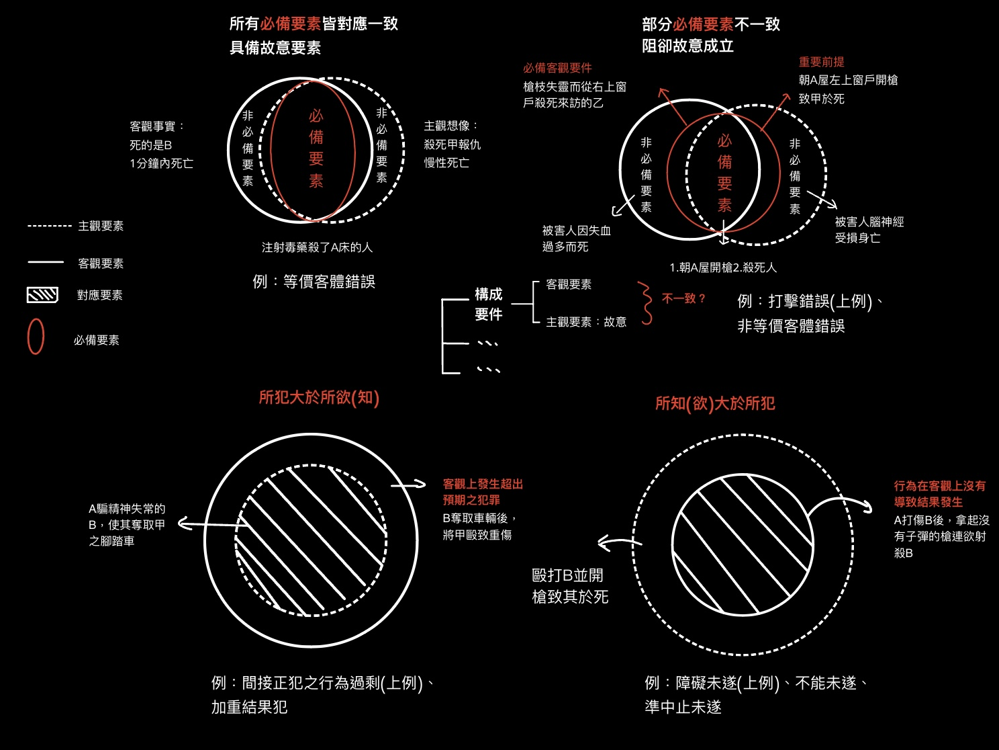
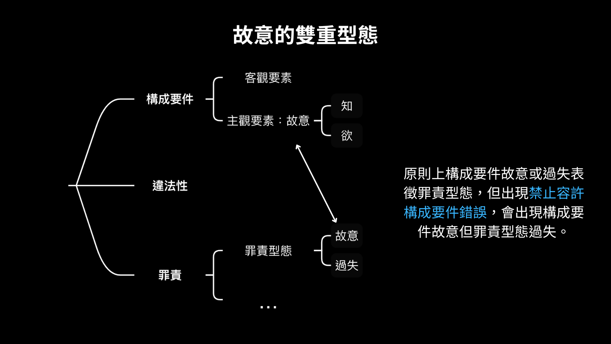

# 刑法中的錯誤

## 錯誤理論

過去在罪責章節提過所謂「不能避免的法律錯誤」是刑法上錯誤的一種。錯誤可以是行為人在**客觀上**、**主觀上**對**行為事實**或**法律事實**出現**不ㄧ致**的情形。而如何在刑法上**評價**，就是本章討論的主軸。

## 早期分類：事實與法律

早期的錯誤理論對「事實」與「法律」的誤認

- 事實錯誤：行為人對於行為事實的認識錯誤 
  例如：A誤以為b為在偷菜的台灣獼猴，而將其打死。
  
- 法律錯誤：行為人對於法律事實的認識錯誤 
  例如：A誤以為殺害台灣獼猴不構成犯罪，但實則不然。
  
### 效果

在這樣的分類下，對事實上的誤解會**阻卻故意**，但若對法律上的誤解(缺失)，則通常**不影響犯罪成立**。而若是對刑法以外的法律產生誤解(如民法、行政法)，通長會如事實上的誤解如**阻卻故意**。

\pagebreak

例：

- 誤人為猴而殺之，會阻卻故意成立

- 誤以爲殺了猴不構成犯罪，不影響犯罪成立

- 行為人誤以為UBike非民法上**他人之物**，則因欠缺故意而不成立竊盜罪

### 停用理由

雖然這樣的法律簡單易懂，但兩種錯誤存在模糊空間，判斷上沒有足夠客觀的標準。更重要的原因是，錯誤理論本身就是**刑法理論**的一環，隨著二次大戰後罪責體系的重新建構，錯理論也迎來現代化的修正。不過，這樣的錯誤觀點部分被繼承了下去，也就是**構成要件錯誤**與**禁止錯誤**的雛形。

## 現代錯誤：構成要件與禁止錯誤

<table>
  <tr>
    <th>類型</th>
    <th>解釋</th>
    <th>效果</th>
  </tr>
  <tr>
    <td>構成要件錯誤</td>
    <td>對於犯罪事實產生誤認</td>
    <td>阻卻構成要件故意成立</td>
  </tr>
  <tr>
    <td>禁止錯誤</td>
    <td>對法律上有所誤解</td>
    <td>不可避免：免除其刑 可避免：得減輕其刑
    </td>
  </tr>
  <tr>
    <td>容許錯誤</td>
    <td>對阻卻違法事由界線錯誤</td>
    <td>同禁止錯誤</td>
  </tr>
  <tr>
    <td>容許構成要件錯誤</td>
    <td>對阻卻違法事由前提事實錯誤</td>
    <td>阻卻罪責故意而不成立故意犯，但不影響罪責成立</td>
  </tr>
</table>

## 犯罪構成要件錯誤

本質上，犯罪構成要件錯誤與上述之事實錯誤非常相似，只是在其中加入構成要件理論作為內涵。在構成要件的章節，我們提到故意犯的成立必須是**主觀上有故意**並符合**構成要件**，即**所謂主客觀不ㄧ致**的分支。以誤人為猴殺人案為例，行為人缺乏「殺人」故意，屬於主觀要素的缺失。

## 主客觀不一致

{100}

過去曾說過，成立故意犯，必須同時具備主觀之知與欲，並且通過構成要件該當性。但除此之外，**主客觀必須對應**，例如某犯人客觀上為搶劫而過失致死行為，通過殺人之構成要件該當性，但其主觀為搶劫故意，與該客觀殺人行為欠缺對應關係。

首先，所謂的對應並非要一模ㄧ樣才屬對應，而是有區分必備與非必備要素。如殺人案中，行為人死亡方式，逃跑路線等細節不影響對應關係，相反，其下手之對象、因果關係等才是必須審視的必備要件，以下分主觀要素之知與欲說明其須對應之要素

### 知要素對應

知要素需要**所有客觀要件**，也就是行為主體、侵害客體、行為、行為情狀等，結果犯則在客觀上有行為結果、因果關係與客觀歸責。

而加重與減輕要素，必須是**具備構成要件的品質**才討論對應ㄧ致(會影響罪名之成立與否)。如殺害直系血親尊親屬(§272)，若行為人未意識客體為直系親屬，或客觀上殺害的事普通人，皆僅能以普通殺人罪論處(§271I)

除了客觀要素以外，其他**皆不需考量對應**，如：

- 量刑要求與追溯要件

與加重減輕同屬**變體**，但皆不具備構成要件之品質，故不需對應。如親屬竊盜(324I)，行為人是否認識有刑罰豁免資格或告訴乃論的追溯要件存在，不影響犯罪成立，**根本不是構成要件的一環**。

- 客觀處罰要件

完全客觀並且屬於三階以外之要素，不需考慮主觀問題

### 欲要素對應

為何知與欲要分開討論？兩者不是都要對應所有客觀要素嗎？

所謂欲要素，是指行為人對結果(犯罪事實)發生之決行，是針對**犯罪之實現而發**

因此，非所有客觀構成要件行為人都必須有意欲，如交通事故逃逸罪(§185-4)，所謂「發生交通事故」僅需行為人有所認知(知要素對應)，但不需要對造成事故有意欲(欲要素不需對應)。反之，「逃逸」為實現犯罪之客觀構成要件，必須以行為人有「逃跑之意欲」做為對應。

### 客體錯誤

行為客體即侵害對象，行為人在**主觀上必須認知到的要素**，所謂客體錯誤就是對此要素產生誤認。又可依誤認的情況分為**等價**與**非等價**，前者如A誤以為B是仇人C而殺之，B與C皆為27條II所謂之「人」。後者如誤人為猴案，ㄧ者殺人罪，ㄧ者毀損罪。

- 等價錯誤：**該錯誤對犯罪不生影響** 
例：不管死的是A計畫之C或意外之B，A皆為故意殺人既遂。

- 非等價錯誤：**阻卻故意既遂。行為人主觀欲為之犯罪成立未遂，客觀成立過失。** 
例：誤人為猴案中，A成立毀損之未遂(欲殺猴)與過失致死，兩者想像競合處理。

據「對應法則」，故意犯之成立必須是**主觀與客觀達到ㄧ致對應**。在殺人罪中，等價錯誤主觀意欲與客觀皆是殺「人」，主客一致；而非等價錯誤主觀意欲殺「猴」，客觀殺「人」，代表主觀要素根本不存在。

\pagebreak

### 打擊錯誤

是在行為時發生錯誤，進而侵害了並無意欲侵害之客體，造成行為人鎖定之目標客體與客觀實際侵害客體不ㄧ致，不管是等價與不等價，基於對應法則，都應阻卻故意，並想像競合未遂與過失。

例：行為人不堪隔壁鄰居猴子吵鬧無比，舉槍欲殺之，不料槍法失誤，導致鄰居女兒生亡。法律效果應為毀損未遂與過失致死想像競合。

### 擇一故意

打擊錯誤必須建立在行為人對實際損害客體不存在**間接故意**，若行為人明知該行為有可能導致侵害非目標客體之情形，仍容任其發生，則為擇一故意之情形。

最典型之擇一故意就是行為人對目標客體存在直接故意，而對實際損害客體至少有間接故意。而由此，行為人之客觀行為與主觀意欲ㄧ致，其實際行為以**故意既遂**，目標客體則成立**未遂犯**，依ㄧ行為觸犯數罪名之想像競合從ㄧ重處斷。

例：行為人不堪隔壁鄰居猴子吵鬧無比，舉槍欲殺之，因為燈光昏暗，行為人無法瞄準而可能誤傷他人，但因連日折磨，行為人仍舉槍射擊，導致鄰居女兒生亡。法律效果應為故意殺人既遂與毀損未遂想像競合。

### 因果歷程錯誤

在客觀構成要件中，行為人之行為與結果之間必須符合一般之因果歷程，也就是該結果不超出一般人之**概略認識**範圍。舉例而言，行為人將仇人丟入河裡，欲將其溺死，但相對人在下落過程撞到橋墩生亡。雖然結果非行為人所預設，但這種不ㄧ致非一般人所難以預見。

在單一行為中(如上例)，若出現了偏離典型因果歷程以外之情形，就會阻卻客觀可歸責性，當然沒什麼好討論。因此，因果歷程錯誤出現在**複數行為**。

例：行為人因與鄰居吵架，以繩子將其勒暈，其後良心發現，緊急進行CPR搶救。而後O恢復生命跡象，但行為人過於緊張，未發現其尚且存活，將其丟入河裡棄「屍」。又如行為人欲將仇人殺死，ㄧ棍敲昏後，以為相對人死亡，遂將其活埋。

至於如何處理，目前缺乏一個完整有力之學說。依**計畫區分說**，應以實際之因果歷程是否**重大偏離**犯罪計畫。如上述繩子案，行為人並沒有顯現強烈之殺人意欲，並且實施救助，行為人溺死之結果超出其犯罪計畫慎遠，而行為人不應負殺人故意既遂之刑。相反，後例，行為人本來就要致仇人於死，就算最後因活埋而死，尚不超出其計畫，故意既遂。

### 錯誤競合

在故意犯之架構下，有可能存在多種錯誤連袂出席的狀況，最常見的情況是打擊錯誤與客體錯誤同時發生：殺手瞄準總統欲殺之，但因為買錯子彈型號導致彈道偏離，打中護衛之頭部使其身亡，未料總統今日與護衛交換衣服，身死的乃是總統本人。

故意的判斷乃於**行為當時**，由此，殺手之意欲為殺害「穿總統衣服的護衛」，但因打擊錯誤，錯手殺死「穿護衛衣服的總統」。依據對應法則，兇手的主觀目標與侵害客體不ㄧ致，因成立「殺穿總統衣服的護衛未遂」與「過失致穿護衛衣服的總統死亡」兩罪名。

### 禁止規範錯誤

本質上，禁止規範類似於法律錯誤，行為人誤認某種行為沒有違反法律的禁止規定。例如：誤以為某種法律廢除、被錯誤的解釋誤解某法條真正意義、甚至對某種法律完全缺失。這樣的情形，行為人欠缺的是**不法意識**。

禁止錯誤在現行制度下應區分為「**可避免**」與「**不可避免**」，而有不同的法律效果。不可避免的禁止錯誤是行為人已對法律有盡力的認識，因此為**完全阻卻罪責**。反之，可避免的禁止錯誤則**酌情況減免刑責**，這樣的區分讓法官得依個案的真實情況判決，也不至於過度縱容。

### 禁止錯誤理論發展

1.故意理論

早期故意除了現在的**認知**與**意欲**，還有**不法意識**。這樣的分類下，不管是法律錯誤或事實錯誤，都是**阻卻故意**。

這樣粗淺的分類，導致法律上實際只有一種錯誤，即「行為人不知所為有罪」。如此，根本是變相使月越不懂法律、越有錯誤想像的人越容易逃避刑責。

後來推出修正這種弊病的**限制故意理論**，行為人若是出於無知或存在法敵對性(不法意識存在)，仍應存在故意。這樣的修正看似解決問題，卻偏離了故意理論的基本立場。

2.罪責理論

罪則理論把**不法意識**拉出來獨立成為ㄧ種**罪責要素**。這樣修正了禁止錯誤必須與犯罪構成錯誤一起討論。

基於這樣的分立，讓程度有別的**可避免**與**不可避免**禁止錯誤得以區分，也讓法官有更多的裁量空間。結合罪責理論出於**可非難性**說，前者本可避免而為避免，雖欠缺不法意識，但仍須負一定的刑責，後者則完全阻卻罪責。

至於判斷「避免」的標準，是要綜合各種情況而定，行為人必須盡**諮詢義務**。即使是因錯誤的諮詢而導致，仍應判斷該諮詢者之狀況而加以定奪。

### 我國沿革

我國舊法16條：「不得因不知法律而免除刑事責任。但按其情節、得減輕其刑；如自信其行為為法律所許可而有正當理由者，得免除其刑。」首先，**自信其所為為法律許可而有正當理由者**，看似是**不可避免的禁止錯誤**，其他為可避免的禁止錯誤。

但這樣的區分顯然不夠明確，因此新刑法中，直接以**可避免與否**作為基準，象徵我國在錯誤規範中完全採取罪責理論為基礎。

>刑法16：禁止錯誤 
除有正當理由而無法避免者外，不得因不知法律而免除刑事責任。但按其情節，得減輕其刑。

## 容許錯誤

容許錯誤又稱為**間接禁止錯誤**，行為人誤認某個阻卻違法事由的界線，或誤信某種不存在的阻卻違法事由。

例：A以為制服闖進門之小偷後，將其毆打致死是正當防衛允許的界線，或誤以為中華民國本來就阻卻「打死小偷」的違法性。

這類的錯誤案例都對事實上有足夠之認識，但對法律的了解顯有錯誤或缺漏，因此在效果上與禁止錯誤相同，用**可避免與否**作為判斷是否阻卻罪責的基準(§16)。

## 容許構成要件錯誤

行為人對某個阻卻違法是由的**前提要件**認識有錯誤，即誤以為自己身陷某種可以阻卻違法的危難情況，但該情況實際上並不存在。

例：A拿著900公尺的大砍刀欲上台表演傳統武術，而B誤以為A欲加害他人，因此上前奪刀並將其打傷。

這樣的案例下，若A存在砍傷他人的真實故意，即**前提事實**存在，B得依「正當防衛」或「緊急避難」阻卻違法。

比較之下，**過當避難防衛**是存在前提事實，但手段超越必要性或適合性(如B奪刀後，將A砍死)，而**偶然避難、防衛**是在缺乏主觀的意識下做出了行為(如A確實為殺人魔，但B奪刀的行為單純出於好玩)，兩者皆存在**前提事實**。

法律效果上，**過當避難、防衛**視情況減輕或寬恕罪責(刑§23但、24I但)、**偶然避難、防衛**則無法阻卻罪責，僅得在量刑時減輕(少數未遂說)

### 法律評價

對於容許構成要件錯誤的法律效果，抱持著不同理論會帶有不同評價，以下講述不同觀點下的容許構成要件錯誤。

**1.二階理論**

二階理論：將不法構成要件與違法性視為一個整體，前者為正面，後者為負面。

基於這種立場，不管是**構成要件錯誤**或**容許構成要件錯誤**都是欠缺**構成要件故意**。

以主流的三階理論來看，容許構成要件錯誤本身不影響構成要件故意，如B誤以為A有殺人故意而出手，本身存在制服A的**知**與**欲**。

另外，因為二階理論將容許構成要件錯誤視為欠缺構成要件故意，不該當不法構成要件，因此在處理**惡意教唆犯或幫助犯**時出現制裁漏洞。

**2.嚴格錯誤理論**

嚴格錯誤理論將所有**欠缺不法意識**的情況都歸納於罪責處理，無一例外，並主張所有欠缺不法意識的錯誤都是**禁止錯誤**，都ㄧ樣在罪責方面上處理。

因此，不管是禁止錯誤(直接)、容許錯誤(間接)或是容許構成要件錯誤都是**禁止錯誤**，並無區分的實益。

批評此說者認為，容許構成要件錯誤與容許錯誤有區別之必要，不應相提並論。

**3.狹義限制罪責理論**

上述對嚴格錯誤理論的批評者，此說認為**構成要件錯誤**與**容許構成要件錯誤**有所不同，但有其相似，因以**比附援引構成要件錯誤**的方式處裡，即不成立故意犯。

這樣類似於二階理論的處理方式，ㄧ樣有共犯漏洞的問題，其二，真的有**前提事實**的阻卻違法與沒有前提事實的容許構成要件錯誤都會有**排除不法的法律效果**，在事理上有所欠妥。

?例子

\pagebreak

**4.限縮法律效果之限制罪責理論**

{500}

此說認為，容許構成要件錯誤本身不影響構成要件故意的成立，而是**故意罪責**，也就是說，會在**罪責層次影響故意犯成立**，但視情況可能成立過失犯。

這種論點是基於**故意之雙重可能**。構成要件的故意是知與欲所構成，ㄧ般情況下，構成要件的故意或過失同樣表徵了罪責之故意與過失。而容許構成要件錯誤為一種**例外**，行為人仍符合構成要件的故意，但排除了**罪責故意**，因此不成立故意犯，但不影響過失犯的成立，這樣的理解更貼近犯罪體系。

### 雙重錯誤

這裡雙重錯誤指的是**容許錯誤**與**容許構成要件錯誤**的同時存在，例如，某高中教官的錢包跑路，誤以為是學生O所竊取，即使O矢口否認，教官仍以校官對O施以拳腳。此例教官誤以為O竊盜之前提事實存在，並且對法規所給予的處罰權限得以阻卻其施以暴力之違法。

在上述脈絡下，實際並不存在**容許構成要件錯誤**，因為成立該錯誤的另一要件為**若前提事實存在，的確構成阻卻違法事由**。

而上述之例，即使O真有竊盜教官之錢包，該教官也無權施以暴力，也就是說教官僅誤判了法所容許的界線，又以其為**可避免的錯誤**，不阻卻成立傷害罪(§277I)

\pagebreak

### 不法與罪責以外之犯罪成立要件

區分而言，在**純客觀**的條件下，如聚眾鬥毆「致人死或重傷者」，本來就沒有主觀誤認導致不ㄧ致的情況。

至於**個人排除或解除刑罰事由**。大多數的事由皆如客觀處法條件，但在立法考量下，如**類似緊急避難立法考量的情形**，就應有行為人主觀的考量，也因此有錯誤。

例：A與逃犯B以夫妻相稱，但實際上過去所締結之婚姻無效，然二者並不知情。若A藏匿B，A對其個人排除或減輕事由錯誤，仍應比照系爭立法考量，產生排除或減輕刑責的效果。

>刑法§167 
配偶、五親等內之血親或三親等內之姻親圖利犯人或依法逮捕拘禁之脫逃人，而犯第一百六十四條或第一百六十五條之罪者，減輕或免除其刑。