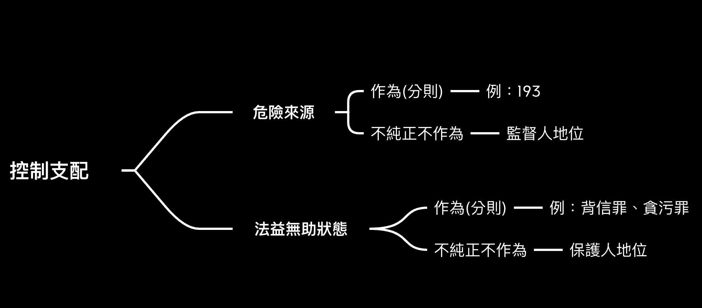

# 身分犯之正犯認定

身分犯，是只有具備特定行為主體資格之人，始能成立該罪正犯之犯罪規定，如背信罪、洩漏業務秘密罪等，不具備資格之人，原則上不能成立正犯。但，我國用刑法第31條第1項擬制了「身分犯之正犯」

>刑法§31： 
I：因身分或其他特定關係成立之罪，其共同實行、教唆或幫助者，雖無特定關係，仍以正犯或共犯論。但得減輕其刑。 
II：因身分或其他特定關係致刑有重輕或免除者，其無特定關係之人，科以通常之刑。 

雖然本條寫「正犯」或「共犯」，但實際上，使用本條就會以**正犯**論。又此為「擴張」刑法規定，立法者以**得減輕其刑**，來取得正當性。

而德國並未有這樣的規定，一來，其認為身分犯之犯罪，本圍繞著具備主體資格之特定人而設，換言之，一但欠缺此具備資格之人，其他人根本不會成立犯罪，因此其他人頂多為共犯。其二，即使以正犯論，以我國實務來說，皆會減輕刑責，與共犯無異。

## 身分犯的本質

以下要從歷史脈絡與法學理論，探究身分犯之不法內涵。

##  Roxin的義務犯理論

對於正犯的概念，即由此教授提出，也就是**犯罪支配說**，行為人以行為支配(直接正犯) 、意思支配(間接正犯)或功能性的犯罪支配(共同正犯)。能成立後兩者的，皆應為不限定主體的**支配犯**。而限定身分者，是我們熟悉的身分犯。

但，學者認為，「判定為正犯的認定指標，既不是公務員身分，也不是抽象的資格，而是從理解該項具體法律事物中所得出的特別義務」與其說是身分犯，不如說是**義務犯**，而義務是「違反刑法以外的特別義務（如民法、行政法等）」

如洩漏業務上所知悉的機密罪，醫生和律師必須違反從具體生活中所衍生出來的緘默義務。
職務傷害罪，是基於公法上的義務要球，不能放任為傷害行為。

然而，有認為，以**刑法以外的特別義務**為基礎，有些不妥，尤其是**將非保護法益的目的也納入**。因此，教授在後來將**義務犯**的概念，轉以「**違反創設正犯性的義務**」或「**與結果有關地違反構成要件特別義務**」取代，但仍有認為(老師)這樣的用語仍然處於混沌中。

## Jakobs的義務犯理論

首先，他擁護的是效能論，與通說認為**刑法保護法益為目的**不同，刑法的目的是**保護刑法本身**，也就是維持法律秩序，此派的刑法分類如下。

- 組織管轄：擴展自己的生活組織領域 
一般犯、危險前行為人保證地位、空間支配者(往來義務)

- 體制管轄：體制身分的衍伸 
父母與子女間的義務、特殊信賴義務(地位)、與生俱來的國家義務(警察)、不真正親手犯

總言之，此派是以**規範目的**來看刑法，從而拋棄通說所謂作為犯與不作為犯的概念，重要的是**違反刑法的原因**，對於義務犯的認定也因而較窄。

## 不純正不作為犯

為何突然談到不純正不作為犯？第一，其也屬於身分犯，第二，在研究中，身分犯與不純正不作為犯界定正犯性的基準是一致的。

所謂不純正不作為犯，指並無明定於法條內，但可透過不作為達成法律構成要件，做為作為犯之補充，我國以刑法15-1(監督、保護之保證人地位)與15-2（危險前行為保證人地位）來做規範。兩種概念都有對**身分**的要求，可以說是**隱藏版身分犯**。

Roxin教授創設不純正不做犯的法理基礎，**控制支配**，相較於其他作為犯討論在**犯罪中**以什麼方式參與，開始以「**犯罪發生之前，行為人對於特定的生活領域有掌控**」

這樣的概念延續自Schünemann教授的理論，也就是不純正不作為犯以「**對於造成結果的原因有支配**」者為正犯，但Roxin不接受Schünemann教授對於危險前行為的保證人地位的見解。

## Schünemann的保證人身分犯

教授認為，成為正犯，有兩種正犯基準，其一是對於法益的無助狀態有支配，其二是對於危險來源有支配

### 法益的無助狀態有支配

此類犯罪者，之所以負某種義務，是出於**具備使法益陷入無助有支配性**，並且在犯罪發生前就有支配性。

公務人員瀆職罪，是作為犯，也是身分犯最經典的案例。公務人員對於是否違反其義務，在行為前就有支配性。

>刑法§121： 
公務員或仲裁人對於職務上之行為，要求、期約或收受賄賂或其他不正利益者，處七年以下有期徒刑，得併科七十萬元以下罰金。

在某些**義務犯**的法條中，通常將**不作為**與**作為**合併，也就是同個法條能以兩種同狀態達成。如刑法§316條專業人士對其業務負緘默義務，此條既可以作為(主動洩漏相對人之秘密)，或不作為(不阻止秘密被洩露)。專業人士在洩漏情形發生前，對秘密有支配性。

>刑法§316： 
醫師、藥師、藥商、助產士、心理師、宗教師、律師、辯護人、公證人、會計師或其業務上佐理人，或曾任此等職務之人，無故洩漏因業務知悉或持有之他人秘密者，處一年以下有期徒刑、拘役或五萬元以下罰金。

又例如§342條之背信罪，僅為他人處理事務者之義務。受害人將1000萬以下基金完全交由理財專員保管，理財專員在其起貪念挪用基金前，就對基金有支配性。

>刑法§342： 
I：為他人處理事務，意圖為自己或第三人不法之利益，或損害本人之利益，而為違背其任務之行為，致生損害於本人之財產或其他利益者，處五年以下有期徒刑、拘役或科或併科五十萬元以下罰金。 
II：前項之未遂犯罰之。

## 對於風險來源有支配(分則)

如刑法193，工程的承攬人對於工程的一切細節皆有掌握，並且為其利益而違反建築術成規，使他人陷入危險，其對危險(風險)有支配性。

>刑法§193 
承攬工程人或監工人於營造或拆卸建築物時，違背建築術成規，致生公共危險者，處三年以下有期徒刑、拘役或九萬元以下罰金。

## 控制支配與不純正不作為犯(15條)

**保護類型的保證人地位**，對法益的無助狀態有支配，父母對子女的安危狀態有責任，這是出於子女對**自己的生命身體法益**無法完全的保護，如嬰兒無法自己去看醫生，中小學生缺乏自主的經濟與生活能力。

同樣的，保母對嬰幼兒之安危狀態有責任，除契約上的義務，也出於嬰幼兒不具備生命身體法益的控制能力。

在各種領域中，保母、登山領導、潛水教練等等，行為人將其生命身體法益託付由相對人，於是行為人對其法益處於無助狀態，相對人則成為**法益之保護人**，對法益的侵害有責任。

**監督類型的保證人地位**，則對應**風險來源有支配**，危險來源可能是建築、天氣、交通、甚至是人。

精神病院中，具備攻擊性的病人，其醫生或監管者，在其義務範圍內，對該病人所產生的任何危險，皆有責任，以其對於該病人的行為有支配性。

遊樂園的場主，在明知設施未良好保養，仍以盈利目的營運，同於釋放其可支配之危險。此兩例皆是行為人對特殊生活領域的控制，而成為**法益之監督人**，繼而對法益的侵害有責任。

### 男性曝陰行為罪

犯罪學上，此類犯罪幾乎都發生在男性上，並且女性之曝陰行為，極少數會造成法益侵害。因此本條看似是身分犯，然而實際上是將女性的曝陰行為除罪化，在思維上仍屬於犯罪支配。

此類身分犯是屬於**純粹的身分犯**，假使一女性控制一男性曝陰，該女仍依照犯罪支配中的意思支配成立間接正犯。中華民國刑法不具備此類條文。

## 實例與總結

使喚不知情之助理(無故意犯罪工具)是背信罪的間接正犯，然若為知情之助理，以德國法律來說，助理不具備該身分，即便具備共同犯意聯絡並共同施行，皆僅為幫助犯。而中華民國，透過刑法31條第1項，將該助理**擬制為身分犯的共同正犯**。

配偶之間共同謀劃收受賄賂，即便其中一者不具備公務員的身分，依然可依照我國刑法31條第1項，將其視為正犯論。

總的來說，身分犯有其特殊的正犯性認定(控制支配、義務犯)，而不套用與一般犯之正犯(犯罪支配)。而我國則利用刑法第31條第1項，先擴張刑法權，再利用減輕刑責的方式，獲取正當性。