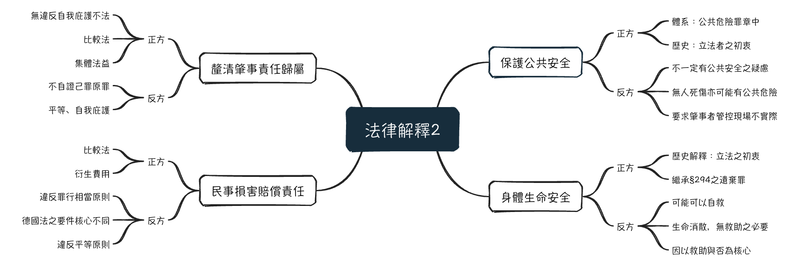

#  法律解釋

<link href="https://fonts.googleapis.com/icon?family=Material+Icons" rel="stylesheet">

本次著墨於最經典之法律解釋，並以探討刑201之肇事罪之沿革、法益、修法方向做為整合性之收尾。

## 本次架構

{width=80%}

## 文字解釋：

從立法者選擇的文字，以常人能理解釋之範內

### 刑122-II：「因」而違背職務者

以純文字面，似乎必須先收受賄賂，在違背職務才受罰

以**文義上之最承受範圍**。此條不分順序皆適用

> 刑§122： 
I:公務員或仲裁人對於違背職務之行為，要求、期約或收受賄賂或其他不正利益者，處三年以上十年以下有期徒刑，得併科二百萬元以下罰金。 
II：<mark>因而為違背職務</mark>之行為者，處無期徒刑或五年以上有期徒刑，得併科四百萬元以下罰金。

### 刑§125-I：有追訴或處罰犯罪之公務員

以文義上之**最大承載範圍**，且警察相較檢察官較有刑囚之可能，因屬於這裡的公務員

實務上，採限縮解釋，只有「檢察官」、「法官」

>刑§125-I： 
I：有追訴或處罰犯罪職務之公務員，為左列行為之一者，處一年以上七年以下有期徒刑： 
&emsp;&emsp;一、濫用職權為逮捕或羈押者。 
&emsp;&emsp;二、意圖取供而施強暴脅迫者。 
&emsp;&emsp;三、明知為無罪之人，而使其受追訴或處罰，或明知為 
&emsp;&emsp;有罪之人，而無故不使其受追訴或處罰者。

## 體系解釋

將法律當作一個整體，在法條所在之篇章體系以及法律位階加以解釋，需注意：

- **維護法律用語統一性**，相同概念做相同解釋

- 使下位階層與上位之規範**不互相矛盾**

### 侵佔與竊盜罪

<table>
  <tr>
    <th style="width:50%">竊盜罪</th>
    <th style="width:50%">侵占罪</th>
  </tr>
  <tr>
    <td>刑§§320~324</td>
    <td>刑§§335~338</td>
  </tr>
  <tr>
    <td>將「無關係之物」為己所有</td>
    <td>將「原持有之物」為己所有</td>
  </tr>
  <tr>
    <td>罰責輕</td>
    <td>罰責重</td>
  </tr>
</table>

依照上述，若一名小7店長未經付款，吃掉店裡的茶葉蛋，其「持有」關係無需質疑，因以侵占罪處斷。 
但如果只是一名工讀生呢？ 
若依竊盜罪論處，易科罰金不過3萬元，若依侵占(§336業務侵占)將是9萬之鉅款！

學理：「**持**有」關係薄弱，為竊盜罪 
實務：**短暫之持有依然為持有，依侵占罪論處**

補：吃掉與丟掉 -> 依「**物質本質**」定義

吃：根據物的本質加以使用 -> **竊盜** 
丟掉：使物無法再加以使用 -> **毀損**

>刑§320-I普通竊取動產： 
意圖為自己或第三人不法之所有，而竊取他人之動產者，為竊盜罪，處五年以下有期徒刑、拘役或五十萬元以下罰金。 
刑§335普通侵佔： 
意圖為自己或第三人不法之所有，而侵占自己持有他人之物者，處五年以下有期徒刑、拘役或科或併科三萬元以下罰金。 
刑§354普通毀損： 
毀棄、損壞前二條以外之他人之物或致令不堪用，足以生損害於公眾或他人者，處二年以下有期徒刑、拘役或一萬五千元以下罰金。

### 殺害直系尊親屬與當場義憤殺人

1.刑§272殺害直系尊親屬：加重刑責$\frac{1}{2}$ ; 至少15年

2.刑§273-I當場義憤殺人：七年以上

- 必須當場：現場看到； <i class="material-icons">clear</i>事後報復

- 義憤：引起「公眾」之憤怒； <i class="material-icons">clear</i>回家看配偶偷情

例：若在當場基於義憤殺害直系尊親屬該如何論處

1. 若優先適用272，將導致**刑度過高，刑責與罪責不符**

2. **優先適用273-I**，較符合前者所述之罪責

結：**基於體系解釋**，**刑273之特殊情形應優先於同體系之272**，即272之規定不包含基於義憤殺死血親

### 受人囑託殺之與殺害直系親屬

刑§275：得他人成諾而幫助、親自殺害他人

若一孝子受其父母囑託而殺其父母...

1. 該當§272再加以減刑：**實務**採此見解，透過減刑方式來符合其罪責

2. 直接依§275判刑：因272之罪雖可在裁量中加以減刑，但是為**得減而非必減**。

結：立法者之立法皆為**單向**，如此罪章中並未考量到272與275之衝突，既難以用歷史或體系。而體系解釋則可以透過比較互相關係，找出相關法條之定位

::: box

::: center1
**殺人罪章**
:::

> 刑§271：普通殺人罪 
殺人者，處死刑、無期徒刑或十年以上有期徒刑。

>刑§272：殺害直系親屬 
對於直系血親尊親屬，犯前條之罪者，加重其刑至二分之一。

>刑§273：當場義憤殺人 
當場激於義憤而殺人者，處七年以下有期徒刑。

>刑§275：受人囑託殺之 
受他人囑託或得其承諾而殺之者，處一年以上七年以下有期徒刑。 
教唆或幫助他人使之自殺者，處五年以下有期徒刑。 

:::

### 強制性交罪與趁機性交罪

<table>
  <tr>
    <th style="width:50%">強制性交</th>
    <th style="width:50%">趁機性交</th>
  </tr>
  <tr>
    <td>刑§221</td>
    <td>刑§225-I</td>
  </tr>
  <tr>
    <td>3~10年</td>
    <td>3~10年</td>
  </tr>
  <tr>
    <td>狀態來自行為人</td>
    <td>狀態不來自行為人</td>
  </tr>
</table>

例：輔大學弟性侵喝醉酒學姊...

1. 若醉酒狀態能為學弟製造 => 強制性交

2. 若醉酒狀態非學弟製造   => 趁機性交

區別實益為何：

1. 因為**法益相同**，核心概念亦同，立法者將兩罪之刑責一樣

2. 但法官受過去教育的影響，強制性交之**實際刑度**依然會大於趁機性交

> 刑§221： 
對於男女以強暴、脅迫、恐嚇、催眠術或其他違反其意願之方法而為性交者，處三年以上十年以下有期徒刑。 
&emsp;刑§225-I： 
對於男女利用其精神、身體障礙、心智缺陷或其他相類之情形，不能或不知抗拒而為性交者，處三年以上十年以下有期徒刑。

## 歷史解釋：從立法的歷史爬書，探求立法者之真意

通常從立法、修法理由切入，而中華民國常見之立法方式有兩種

- 較大型的立法：由行政院主導，通常有較嚴謹之立法理由、背景及不同意見 
程序：司法院招集學者研修、草稿之擬定 -> 行政院拍板通過 -> 立法院通過

- 較隨性的修法：通常由立法委員之助理負責草擬，在立法理由上之交代較少，且一般只修刑度。 
程序：由立法院連署，發起修正草案。

立法時間**越近**之法條的的立法解釋就越重要

## 目的解釋：客觀的探求立法制定之目的

法比立法者更聰明，好的法律無需反覆修改，而留有彈性，讓其符合每個時代之需求。

而其又可再分為限縮解釋與擴張解釋，但擴張解釋通常陷入**類推適用**，較少出現。

類推適用：超出文義最大可能的範圍而進行比附援引

### [刑法§201偽造有價證券](https://law.moj.gov.tw/LawClass/LawSingle.aspx?pcode=C0000001&flno=201)

> 1.意圖供行使之用，而偽造、變造公債票、公司股票或其他有價證券者，處三年以上十年以下有期徒刑，得併科九萬元以下罰金。 
2.行使偽造、變造之公債票、公司股票或其他有價證券，或意圖供行使之用而收集或交付於人者，處一年以上七年以下有期徒刑，得併科九萬元以下罰金。

### 有價證券之定義

- 立法手法：列舉＋概括 
列舉：公債票、公司股票 
概括：其他有價證券

- 公債票：中央政府為解決財務收支問題或為募集資金而發行的1年期以上可轉讓的債務憑證。

- 股票：目前已無實體化，其餘實體股票為公開市場難以取得之小公司股。

- 其他：面上表彰著一定之權利，持卷者可以憑藉著券之支持有向相對人主張一定權利之行使。

### 有價證券特性

- 不需具備流通性：一般之證券皆具有流通性。少數記名之證券不具備流通性。
支票、本票、匯票

- 可再細分為：投資型(公債票、公司股票）、支付型（本票、匯票、支票）、資格證明型

\pagebreak

### 刑§201目的限縮解釋：將價值較低的資格證明刑有價證券排除。

- 資格證明型的有價證券：必須證明資格後才能提領。例如：提單、折價券、樂透、發票

偽造公益彩券則乃依照偽造有價證券而判，因其**價值較高**。

價值較低者會被排除適用，如超商之折價券。

中獎發票雖價值高，但因其**本質為會計憑證**，中獎為附加，不屬於偽造證券。(偽造文書、詐欺)

## 擴張解釋與限縮解釋：屬於結論而非方法

### 實務見解之限縮解釋1：[刑§125-I-2](https://law.moj.gov.tw/LawClass/LawSingle.aspx?pcode=C0000001&flno=125)追溯權之公務員

> I、有追訴或處罰犯罪職務之公務員，為左列行為之一者，處一年以上七年以下有期徒刑： 
1、濫用職權為逮捕或羈押者。 
2、意圖取供而施強暴脅迫者。 
3、明知為無罪之人，而使其受追訴或處罰，或明知為有罪之人，而無故不使其受追訴或處罰者。 

在現實運作上，犯下刑求罪(刑§125-I-2)通常以警察為最大宗。 
若不將其納入刑§125之公務員範圍，刑§125-I-二將形同具文。

但實務仍採取<mark>限縮解釋</mark>，警察不適用此條，而採傷害、強制、瀆職等罪章。

### 實務見解之限縮解釋2：[刑173-I](https://law.moj.gov.tw/LawClass/LawSingle.aspx?pcode=C0000001&flno=173)放火罪

> 放火燒燬現供人使用之住宅或現有人所在之建築物、礦坑、火車、電車或其他供水、陸、空公眾運輸之舟、車、航空機者，處無期徒刑或七年以上有期徒刑。

分析：現有人所在之建築物著眼於**使用狀態**，非是否真實有人

例：若一棟辦公大樓晚上無人，亦無保全亦算現有人所在之建築物

### 放火燒自己的屋子

- 集合式住在：放火罪為**抽象危險犯**，只要放火就會對往來之人構成危害 
[最高法院81年台上字第2734號刑事](https://shuofeng.com.tw/newsdetail_5_2014.html)

  > 況當今房屋，無論為大廈或公寓式，俱屬整體建築，自己與他人擁
有之住宅，就公共安全言，具有不可分性...故在自己使用之住宅內放火，實與對整棟公寓或大廈放火無異...自仍應依第一百七十三條第一項論處。

- 獨棟式住宅：

  + 實務：應排除 
  理由：因放火之客體限定於他人之限**供使用或現有所在之建築物**，因此無此款之適用。  
  質疑：無法從文義判讀、亦無目的之解釋，而有逾越**司法權**之質疑。
  
  + 學說：不應排除 
  理由：只要其為現供人所用之住宅，即有**被他人使用之可能性**，因此應適用此款。

  + 少數學說：若以確認安全無虞，且真正無危險，排除。 
  理由：在無人能抵達之地方，燒毀自己之房屋，並不會造成公共危險 
  推翻：依此說見解，若醉態駕車時確認所經之道路無人，也將免於受罰！

### 實務上之擴張解釋：[刑法§144投票行賄罪](https://law.moj.gov.tw/LawClass/LawSingle.aspx?pcode=C0000001&flno=144)

### 刑法§144本文

> 對於有投票權之人，行求、期約或交付賄賂或其他不正利益，而約其不行使投票權或為一定之行使者，處五年以下有期徒刑，得併科二十一萬元以下罰金。

### 最高法院94台上1059判決：將選舉權人擴張至可預期與事後投票人說

A議長在議員選舉期間，資助B候選人選舉資金，爭取支持議長連任。是否有§144之適用？ 
  
  > 第144條投票行賄罪所為之處罰，旨在端正選風，維護選舉之公平、純正。...如謂刑法144條所謂『有投票權之人』，係指已當選為縣市議會議員之人，將議員當選前乃至選舉前即已授受賄賂，而事後當選為議員之人排除在外，無異鼓勵提前賄選，以為脫法，自非立法之本意。縣市議會正、副議長之 選舉，其行賄、受賄當時雖尚未當選為議員，但事後選舉結果，已當選為議員而取得選舉 正、副議長之投票權，即與『有投票權之人』之要件相當。」
  
### 結論：
  
- 實務：肯認選舉權人應擴張至可預期與事後投票人

- 學理：此擴張適用已有違反類推適用之嫌疑

\pagebreak

## 肇事逃逸罪之沿革

### 修正前的刑185-4

> 駕駛動力交通工具肇事，致人死傷而逃逸者，處1年以上7年以下有期徒刑。

- 動力交通工具：具備有引擎，透過機械動力運作之交通工具 
<i class="material-icons">clear</i>：腳踏車，三輪車 
<i class="material-icons">check</i>：電動車，油車

- 行為主體：駕駛者本人 
<i class="material-icons">clear</i>：副駕(頂多為教唆犯)

- 肇事：引發事故者，限定於非故意之犯罪 
<i class="material-icons">clear</i>：故意開車撞死仇家 
<i class="material-icons">check</i>：包含過失、無過失： 
無過失：車子打p檔，被後車追撞 
過失：撿手機追撞前車

- 致人死傷：不管大傷或小傷都算，且必須知道有人傷亡 
<i class="material-icons">clear</i>：僅有嚴重之財損 
<i class="material-icons">clear</i>：不知道有撞到人

- 逃逸：實務著眼的逃逸並非離開現場，而是因救助而無救助。 
<i class="material-icons">check</i>：肇事後偽裝第三人藏匿於人群之中

### [釋字第777號【駕駛人無過失及情節輕微之肇事逃逸案】](https://cons.judicial.gov.tw/docdata.aspx?fid=100&id=310958)

> 一、「肇事」構成要件語意所及之範圍，部分違反法律明確性原則，就此部分應失其效力 (無過失之參與難以使一般人有可預見性) 
二、規定之刑度，於情節輕微個案構成顯然過苛之處罰部分，與比例原則有違 
(過失、無過失皆適用同等刑責有違反比例原則)

### 修正後的刑185-4：明定無過失、減輕無過過失刑責

> 駕駛動力交通工具發生交通事故，致人傷害而逃逸者，處六月以上五年以下有期徒刑;致人於死或重傷而逃逸者， 處一年以上七年以下有期徒刑。 
犯前項之罪，駕駛人於發生交通事故致人死傷係無過失者，減輕或免除其刑。

\pagebreak

## 肇事逃逸罪之法益：

{width=100%}

### 前提：當一條法律過多法益，其將難已修正或解釋，而此條共有四個法益...{-}

法益要發揮指導構成要件解釋的作用，多重法意既無法發揮定錨之作用，反而成為多頭馬車

以下法益皆有其正反之論據，端看其有無被駁斥。

288墮胎，主要法益保護將來之生命，母體之保護僅為反射之利益

放火罪，主要法益避免公共危險，保護個人財產、生命是反射之利益而非主要法益

### 1、保護個人身命及身體之安全{-}

- 正方解釋

  + 歷史解釋：立法之初衷

  + 繼承§294之遺棄罪：此條罪章除刑度繼承，概念上亦屬**特殊之遺棄罪**
  
  > 1.對於無自救力之人，依法令或契約應扶助、養育或保護而遺棄之，或不為其生存所必要之扶助、養育或保護者，處六月以上、五年以下有期徒刑。 
2.於死者，處無期徒刑或七年以上有期徒刑；致重傷者處三年以上十年以下有期徒刑。

法令：依道路交通管理處罰條例

- 反方理由：

  + 若為保護生命及身體之安全，因將逃逸二字改為<mark>不施以救助</mark> 
  例：已達成救護之責任而無侵害生命及身體安全，但於其後藏匿或逃逸者，應免除適用此法
  
  + 在被害人已**死亡**之情形下，其生命既已無可挽回，而<mark>無救助之必要</mark> 
  例：被害人在車禍當場已無生命跡象，行為人根本無法滿足救助之義務
  
  + 受害人不一定無自救力，可能<mark>可以自救</mark>： 
  此法繼承之刑§294保護之對象皆為無自救能力者 
  刑185之4的受傷分為已到達無自救力與尚有自救力之受傷 
  若以此法益作為見解，因將目標限於**無自救力之受傷**

### 2、保護公共安全{-}

- 正方理由：

  + 體系解釋：坐落於<mark>公共危險罪章中(173~194)</mark>： 
肇事之現場易引發公共危險而要求肇事者停留在現場以免危害無關之第三人。 
不能作為唯一之憑證

  + 歷史解釋：立法者之初衷
  

- 反方理由：

  + **無致人死傷**之現場**亦有可能形成公共危險**： 
  若為維護公共安全，就不應將範圍限縮於有人受傷之情形。
  
  + 肇事之現場**不一定有公共安全之疑慮**： 
  例：若為電瓶車撞傷行人之小車禍，不會造成公共安全之危害 
  因將範圍限縮至行為足以造成共共安全之疑慮。
  
  + 要求一位已肇事者**管控現場不切實際**： 
  例：酒醉肇事者顯已神智不清，要求其管現場根本天方夜譚，甚至適得其反。 
  

### 3、保護民事損害賠償請求權不受抽象危害影響{-}

- 論據知識點補充：
  
  + 何為抽像危害？ 
  犯罪之侵害會從抽象 -> 具體 -> 實際危害
  <table>
  <tr>
    <th>x</th>
    <th>抽象</th>
    <th>具體</th>
    <th>實際</th>
  </tr>
  <tr>
    <td>定義</td>
    <td>依生活經驗，一旦發生 即可預期危害法益</td>
    <td>行為若滿足某些要件極 有可能造成危害法益</td>
    <td>行為有具體之外在結果</td>
  </tr>
  <tr>
    <td>例子</td>
    <td>醉態駕車</td>
    <td>恐嚇公眾</td>
    <td>殺人、偷竊</td>
  </tr>
</table>

- 正方理由：

  + 衍生費用說：應確保被害人因車禍孳生之財損得以補償 
  死亡有喪葬、精神撫慰費，受傷有工作、醫療賠償，甚至於財務之受損。 
  實務上強制險之費用難以填補此類損失，自當由此法介入規制。

  + 比較法： 
  德國之此法保護法益即為民事之損害賠償，而本國刑法繼受於該國，自當同等而論之

- 反方理由：

  + 違反<mark>罪刑相當原則</mark> 
  對財產之實際危害頂多處五年以下有期徒刑，此條僅為抽象危險卻可罰一年以上七年以下 
  違反舉重明輕。
  
  + 德國法與本條之構成要件、核心訴求不同 
  德國法之構成要件擴及**一定程度之財損**，可看出其重視財產上之保護 
  德國只處3年以下 
  反之，無擴及財損之我國顯不以此法益為核心宗旨。
  
  + 違反平等原則： 
  有時人員之傷亡之嚴重程度尚不及財損，將單純財損排除是不平等之舉

### 4、協助確認刑法與行政上事故與責任歸屬{-}

- 論據知識點補充：
  
  + 何為<mark>自我庇護不罰</mark>？ 
  若行為人為確保其犯罪隱匿之手段未違反其他法益，不得額外苛刑。 
  <i class="material-icons">clear</i>：將不法所得丟進河流裡銷毀，因為其是為了確保原來之犯罪，無另外苛刑。 
  <i class="material-icons">check</i>：洗錢，將違反洗錢防制法，因其違反額外之法意(國家司法權力之圓滑運作)。
  
  + 德國與我國對此條法意之見解沿革： 
  德國：保護司法權之追訴不受妨害 -> 免於司法訴罪之問題 -> 追究民事歸屬權 
  我國：公共利益 -> 釐清相關行政、刑事則任歸屬 -> 實務法益從兩個變四個
  
  + 德國刑法重罪不舉發： 
  基於一個社會主義國家，德國刑法§138規定人民有釐清**重大**刑事責任之歸屬。 
  而我國未見此類之規定，依舉重明輕，因此理論上不存在舉發之義務。
  
- 正方理由：

  + 保護集體法意：保護司法權，妨礙司法之追訴

  + 比較法： 
  德國之此法保護法益即為民事之損害賠償，而本國刑法繼受於該國，自當同等而論之
  
  + <mark>無違反自我庇護不法</mark>： 
  若損害賠償請求權之法益成立，肇事逃逸後自我庇護將會因觸犯前述法益而受罰

- 反方理由：

  + <mark>違反不自證己罪原罪原則</mark> 
  行為人應得形式<mark>緘默權</mark>，但此法卻使其必許澄清、表明自己之行徑。 
  德國之肇事逃逸罪**只用表明身份，無須加以釐清事件**，因此無違反不自證己罪原則。 
  反之我國要求行為人幫助釐清案件，使行為人不得行使其應有之緘默權。
  
  + 表面違反平等原則，實質違反自我庇護不罰 
  故意犯罪、情節較重之犯罪均無處罰逃逸，僅有此法，有違平等之嫌。 
  實質上本見解認為違反自我庇護不罰，即為確立原本之犯罪隱匿之手段不應加以苛刑

## 修法方向

### 1、以保護個人生命生體為方向{-}

使本法真正成為刑§294(遺棄罪)之特殊條款，必須對構成要件做**目的性之限縮**

- 明顯死亡排除

- 仍自救力者排除

結：駕駛動力工具有過失導致他人陷入無自救力者，而不施行必要救助者，處一年以上七年以下有期徒刑

### 2、以保護個人財產為方向{-}

使本法與德國法相同，先對構成要件做限縮，再對法律效果加以限縮

- 肇事者僅有表明身份而無協助釐清責任之必要，以保護緘默權

- 因爲其為抽象危險犯，刑度應至少降至3年以下

結：以此方向修法必須更加嚴謹仔細，以達保護法益之目標。

### 附錄：德國刑法交通事故現場不容許離開罪([參考來源](https://www.google.com/url?sa=t&rct=j&q=&esrc=s&source=web&cd=&ved=2ahUKEwiFka7jmYmCAxUZilYBHQP8A3IQFnoECAkQAQ&url=https%3A%2F%2Ftpl.ncl.edu.tw%2FNclService%2Fpdfdownload%3FfilePath%3DlV8OirTfsslWcCxIpLbUfvtkl6y56mnsQxsJnY-wcnR54YemPu81c5xzFjBu1X1A%26imgType%3DBn5sH4BGpJw%3D%26key%3DHJ-V2NcIicwgHDpsZxyRl1Ap-e1LXLYPWAdWYWEsAhAeVVU9OyINO4qBZJhLTxWd%26xmlId%3D0006621355&usg=AOvVaw0SnncHUHfErLm4maXH_Mdl&opi=89978449)){-}

> I：事故參與者，於道路交通事故發生後，在完成下列行為之前，即離開事故現場者，處 3 年以下有期徒刑或罰金: 
1.經由其在場及參與交通事故之說明，有助於其他事故參與者與受損害者能夠確認其身分、交通工具與參與方式; 
2.如無人準備好作出確認，依據具體情況等待適當的時間 
II：事故參與者，有下列情形之一，且未能於事後即時使確認有可能者，亦依第I項罰之: 
1.在等待時間(第1項第2款)經過之後離開事故現場; 
2.有理由地或可寬恕地離開事故現場 
III：如果事故參與者將其所參與的事故通知有權利之人(第1項第1款)或附近的警察勤 務機構，而且如果告知其通訊地址、居留處所 以及交通工具之車牌(識別符號)與停放地 點，並且在可期待的時間之內提供該交通工具 作為即時確認之用者，則事故參與者已履行事 後使可能確認之義務。但如果事故參與者經由其行為有意地破壞此等確認者，不適用之。 
Ⅳ：如果事故參與者在發生於流動交通之外 且僅產生非重要財物損害後果的事故後 24 小時 之內，事後自願地使確認有可能者，法院在第 1 項與第 2 項之情形減輕或免除其刑。 
Ⅴ事故參與者是指其行為依照事實情況足 以促使事故發生之人

