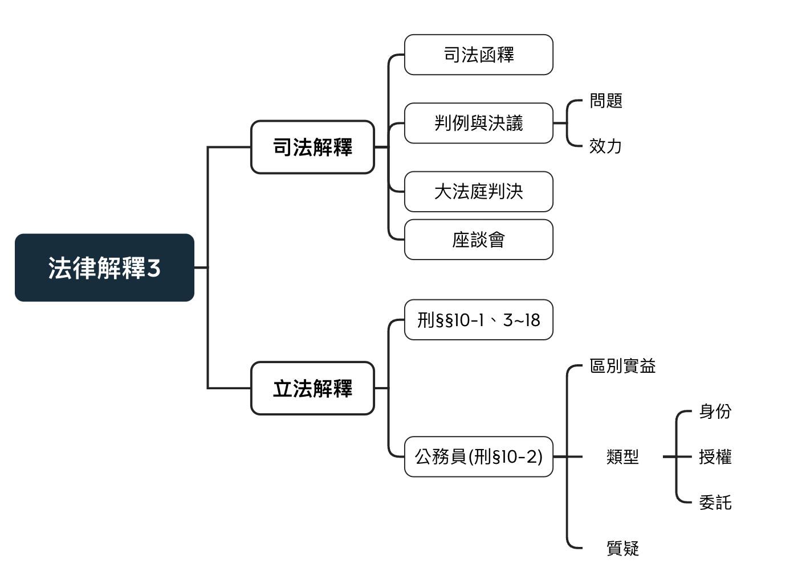

# 司法與立法解釋

<link href="https://fonts.googleapis.com/icon?family=Material+Icons" rel="stylesheet">

## 法律解釋3

{width=90%}

## 司法解釋

### 大法官解釋(已廢除)

### 司法函釋：司法院院字、院解字 ([參考來源](https://www.judicial.gov.tw/tw/cp-1654-2836-e2518-1.html))

司法院依當時法令，以最高司法機關地位，就相關法令之統一解釋，所發布之命令。

於現行憲政體制下，法官於審判案件時，可予以引用，但仍得依據法律，表示不同見解，並不受其拘束。

於大法庭新制下：

- 若司法院院字、院解字之見解**未曾**為最高法院先前裁判所採，依司法院釋字§771，法官之判決不受其拘束。

- 若司法院院字、院解字之見解為先前裁判所採，則**成為先前裁判之見解**，若最高法院之見解與裁判產生分岐，應**依法院組織法§51-2**開啟歧異提案程序，以挑戰裁判。

### 判例與決議

- 決議：最高法院及最高行政法院召開會議的方式來研討法律問題而作成的結果。

行政法院組織法第16條第3項（已廢止），目前不會再有任何決議，但可作為裁判參考

> 最高行政法院之裁判，其所持之法律見解，各庭間見解不一致者，於依第一項規定編為判例之前，應舉行院長、庭長、法官聯席會議，以決議統一其法律見解。

- 判例：最高法院、最高行政法院透過決議將指標性的裁判編撰而成，交給其他法院參考

[法院組織法§57條之1](https://law.moj.gov.tw/LawClass/LawSingle.aspx?pcode=A0010053&flno=57-1)

> I 最高法院於中華⺠國一百零七年十二月七日本法修正施行前依法選編之判例，若無裁判全文可資查考者 ，應停止適用。 
II 未經前項規定停止適用之判例，其效力與未經選編為判例之最高法院裁判相同。

\pagebreak

### 判決與判例有何問題

- 判決與法例並無所謂強制之效力，但因為其為最高法院所製成，下級法官會遵循其之規定。

- 又依司法院釋字第374號解釋，判決與決議都可以如命令性質向大法官申請違憲審查，使其近乎有**命令**之地位。

如此延伸出兩種問題：

- 將本質為**抽象性的法規**視為一般的抽象法規範來適用，將產生**個案是否適用**之疑異。

- 因決議與判例皆為最高法院僅透過決議而製成，又其被視為一般的抽象法規範來適用，恐有逾越**司法權**之虞。

### 大法庭判決

- 提案時機

  + 歧異提案： 
  (1)積極歧異：相同法律問題，過去已有多個見解不一的判決。 
  (2)潛在歧異：相同法律問題，過去未有見解不一的判決，但本次判決擬採取不同見解。
  
  + 原則重要性提案： 
  新興且重大的法律問題，有預為統一見解的必要，審判庭經評議後，可提案大法庭。

- 效力
  
  + 個案：法院組織法第51條之10 
  對提案庭有**絕對之拘束力**
  
  + 其他法庭：法院組織法第51條之2 
  因提案庭必須依大法庭之見解作成終局裁判，大法庭之見解**間接有約束之效力** 
  
### 座談會：無法律位階但有內部拘束性  
  
- 高等法院法律座談會：由法官組成，投票決定採取哪種決議  
  
- 法務部的法律座談會：檢察官組成，決定哪些是由不起訴

\pagebreak

## 立法解釋：[刑§10](https://law.moj.gov.tw/LawClass/LawSingle.aspx?pcode=C0000001&flno=10)

立法者在刑§10中為一些特定用語特別定義

### 以上、以下、以內：據連本數或本刑計算(§10-1)

例：法定刑為5年上12年以下有期徒刑，包含5年及12年在內。

### 公務員(§10-2)

>稱公務員者，謂下列人員 
一、依法令服務於國家、地方自治團體所屬機關而具有法定職務權限，以及其他依法令從事於公共事務，而具有法定職務權限者。 
二、受國家、地方自治團體所屬機關依法委託，從事與委託機關權限有關之公共事務者。 

- 區別實益：界定數額犯罪之成立要件之判斷

  + 以公務員為**主體之犯罪**：具備公務員資格所構成之犯罪 
  1.**純正特別犯**：只有公務員能構成之犯罪(§§121,122-1公務員收受賄絡罪) 
  2.**不純正特別犯**：公務員加重處罰(§134非純粹瀆職罪)

  + 以公務員為**犯罪對象**： 
  例：妨害公務員依法執行職務(§135)
  
  + 公文書之相關犯罪： 
  涉及刑§10-3之公文書之定義，會影響公文書之定範圍
  
- 公務員之分類：公務員種類繁多，應視個案而定

<table>
  <tr>
    <th style="width:33%">身分公務員</th>
    <th style="width:33%">授權公務員</th>
    <th style="width:33%">委託公務員</th>
  </tr>
  <tr>
    <td>1.服務於政府 
    2.法定職務權限</td>
    <td>1.依法從事公共事務 
    2.法定職務權限</td>
    <td>1.受政府機關委託 
    2.從事有關公共事務者</td>
  </tr>
  <tr>
    <td><i class="material-icons">clear</i>非服務於政府: 政大行政人員 
    <i class="material-icons">clear</i>無法定權限: 政府雇用之保全</td>
    <td><i class="material-icons">clear</i>非依法從事: 一般之教務人員 
    <i class="material-icons">check</i>依法從事: 承辦採購之教務人員</td>
    <td><i class="material-icons">check</i>依建築法委託 檢查建築物之人員 
    <i class="material-icons">clear</i>行政助手: 拖吊車司機</td>
  </tr>
</table>

- 對新法公務員之質疑 
相對舊法，新法將公務員之定義加以限縮與分類，避免過度擴張解釋，卻仍有不少質疑

  + 某些財團法人得逃到司法領域規避公法監督
  
  + 應貫徹法理基礎之義務犯
  
  + 與國際刑事政策保護公共法益而擴張公務員背道而馳

### 公文書：謂公務員職務上製作之文書(§10-3)

區別標準： 
1.不需要至始至終皆為公務員製作 
2.不以簽名為必要 
3.必須基於公法行為 
4.本於職務之必要 

區別實益： 
在偽造公文書罪章中(210~220)，偽造、變造公文書與私文書刑責有別(§§210、211)，公文書登載不實有特別之處罰(§§213,214)

### 重傷(§10-4)

> 重傷者，謂下列傷害： 
一、毀敗或嚴重減損一目或二目之視能。 
二、毀敗或嚴重減損一耳或二耳之聽能。 
三、毀敗或嚴重減損語能、味能或嗅能。 
四、毀敗或嚴重減損一肢以上之機能。 
五、毀敗或嚴重減損生殖之機能。 
六、其他於身體或健康，有重大不治或難治之傷害。 

- 採用列舉+概括，兼顧法之明確性與適用彈性 
列舉：1~5 
概括：6

### 性交(§刑10-5)

> 稱性交者，謂非基於正當目的所為之下列性侵入行為： 
一、以性器進入他人之性器、肛門或口腔，或使之接合之行為。 
二、以性器以外之其他身體部位或器物進入他人之性器、肛門，或使之接合之行為。

- 沿革：逐漸擴大強制性交罪適用範圍

  + 早期：使用姦字，使適用範圍僅限與男女之性器接合
  
  + 1999：隨妨害性自主罪章修法，而增訂性交之定義。 
  1.將口交、肛交、異物插入肛門或性器增訂，擴張強制性交罪(間接限縮強制猥褻罪) 
  2.將男性對男性、女性對男性也列入
  
  + 2005:增訂2款 
  1.增列目的正當之排除 
  2.增列「或使之接合」：使女性對男性之性侵更合理適用
  
### 電磁紀錄(§刑10-6)

> 稱電磁紀錄者，謂以電子、磁性、光學或其他相類之方式所製成，而供電腦處理之紀錄。

儲存於電腦可讀取之容器的數位資料

### 凌虐 (§10-7)

> 稱凌虐者，謂以強暴、脅迫或其他違反人道之方法，對他人施以凌辱虐待行為。

- 適用法律：1.凌虐人犯罪(§126) 2.凌虐犯強制性交罪(§221-1-5) 3.凌虐未滿18歲之人(§286)

- 立法理由：

  + 依社會通念，只要是非人道待遇，不管消極或積極，皆屬凌虐
  
  + 參酌德國法亦由類似之立法例
  
  + 其他違反人道之方法應屬獨立之行為樣態，爰列入本條
  
### 性影像(§10-8)

> 稱性影像者，謂內容有下列各款之一之影像或電磁紀錄： 
一、第五項第一款或第二款之行為。 
二、性器或客觀上足以引起性慾或羞恥之身體隱私部位。 
三、以身體或器物接觸前款部位，而客觀上足以引起性慾或羞恥之行為。 
四、其他與性相關而客觀上足以引起性慾或羞恥之行為。

- 立法理由：

  + 客觀上足以引起性慾或羞恥之身體隱私部位： 
  依一般社會通念，例如臀部或肛門等
  
  + 以身體或器物接觸前款部位，而客觀上足以引起性慾或羞恥之行為： 
  例如親吻、撫摸或以性器接觸前述之部位，且不論自己或他人所為
  
  + 其他與性相關而客觀上足以引起性慾或羞恥之行為：
  例如以打馬賽克等方式遮掩、迴避前述部位。

