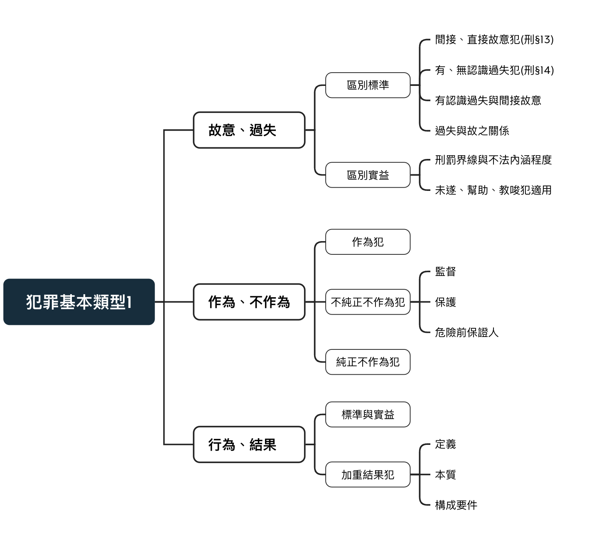
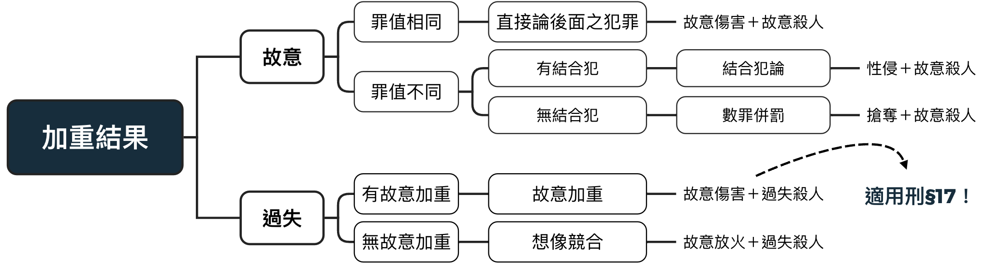

# 犯罪基本類型

學習目標：判斷每條刑法分則的切入角度，判斷其犯罪之基本類型。

{width=70%}

## 故意、過失犯之區別標準

必須綜合一切動機、情況等一切情狀判斷。

故意犯，行為人主觀上出於故意而犯罪。可再細分直接故意和間接故意。

過失犯，因為過失行為而成立犯罪，再依行為人之預見與否分為有認識過失及無認識過失。

### 故意犯之定義([刑§13](https://law.moj.gov.tw/LawClass/LawSingle.aspx?pcode=C0000001&flno=13))

> 行為人對於構成犯罪之事實，明知並有意使其發生者，為故意。 
行為人對於構成犯罪之事實，預見其發生而其發生並不違背其本意者，以故意論。 

- **直接故意犯**：<mark>「知」與「欲」都非常強烈</mark>

- **間接故意犯**：<mark>遇見其發生(較低的知)並且不違背行為人本意(較低的欲)</mark>

當法條明確寫到「明知」，則僅限於直接故意：

例：偽造公文書罪([刑§231](https://law.moj.gov.tw/LawClass/LawSingle.aspx?pcode=C0000001&flno=213))：必須出於**直接故意**

> 公務員明知為不實之事項，而登載於職務上所掌之公文書，足以生損害於公眾或他人者，處一年以上七年以下有期徒刑。

### 過失犯之定義([刑§14](https://law.moj.gov.tw/LawClass/LawSingle.aspx?pcode=C0000001&flno=14))

> 行為人雖非故意，但按其情節應注意，並能注意，而不注意者，為過失。 
行為人對於構成犯罪之事實，雖預見其能發生而確信其不發生者，以過失論。 

- 無認識過失：<mark>可以也應該注意卻沒有注意(知＝0)</mark>

- 有認識過失：<mark>100%確信其不會發生(欲 = 0)</mark>

### 有認識過失與間接故意
有認識過失與間接故意之界線向來難以釐清。簡而言之，<mark>判斷標準在「欲」上</mark> 
間接故意之行為人，無論滿不滿意，最後**接受並容忍構成要件的風險** 
有認識過失之行為人則**信賴結果根本不會發生**。

- 例1：參加一場「有可能」射死人之射箭比賽而後射死人

老手：射箭技術精湛，其信賴射死人的結果不會發生 => 有認識過失 
新手：射箭技術為0且明知風險依然參加比賽 => 間接故意

客觀歸責：其兩種情況皆侵害相同之法益與結果 
主觀歸責：老手本身對法有忠誠，新手則與法敵對

\pagebreak

- 例2：酒駕肇事

交通事故，99%難以認定為間接故意，因為沒有人會認為自己有問題 
立法者曾想將酒駕殺人擬制為間接故意，雖修法失敗，但不排除酒駕慣犯有推定之空間。 
德國：德國聯邦法院曾將一名酒駕慣犯以謀殺罪之罪名判刑。

- 例3：毒蠻牛案

行為人至量販店買了幾瓶能量飲料，透過管道獲得氰化鉀，並研究與實驗實踐了其毒性。 
最後將有毒性之飲料放回超商貨架，使多名被害者死亡與重傷。

> 刑191-1: 
1.對他人公開陳列、販賣之飲食物品或其他物品滲入、添加或塗抹毒物或其他有害人體健康之物質者，處七年以下有期徒刑。 
2.將已滲入、添加或塗抹毒物或其他有害人體健康之飲食物品或其他物品混雜於公開陳列、販賣之飲食物品或其他物品者，亦同。 
3.犯前二項之罪而致人於死者，處無期徒刑或七年以上有期徒刑；致重傷者，處三年以上十年以下有期徒刑。

若此案行為人被判為過失者，其應適用刑191-1-3，罪不至於死刑。 
若對死亡之結果有間接故意，即有可能以數個殺人未遂與殺人罪處斷(想像競合)，可至死刑

- 小結：這裡只淺顯的討論兩者之區別，再犯罪之不法構成要件或再次細說兩者差異。

### 故意與過失之關係

- 事實結構

從事實結構來說，故意與過失本身是互斥關係。 
不會同時成立過失與故意。

- 概念結構

從概念結構而言，故意包含了過失。 
如故意殺人會將過失致死之不法內涵包含在其中。 
故意是行為人有認知、有意欲，過失則為有認知無意欲或無認知有意欲。 
因此從內涵而言，故意與過失應為加減而非互斥。

### 哪種類型為常態
從條文來看，100條以下之法律幾乎為故意犯

但以實際層面來說，過失犯才是大宗。
過失犯的不法內涵較低，因此若取得和解，即使最高本刑達5年之犯罪都有可能被判成2年以下，在無前科之前提甚至得以緩刑。

## 故意、過失犯區別實益

1.限定刑罰界線與區別不法內涵程度

2.未遂、幫助犯、教唆犯適用的有無

### 罪責原則之有責原則-刑§12：罰與不罰之界線

條文只要無明文處罰過失犯一律限定於故意犯。

>行為非出於故意或過失者，不罰。 
過失行為之處罰，以有特別規定者，為限。

例：毀損罪([刑354](https://law.moj.gov.tw/LawClass/LawSingle.aspx?pcode=C0000001&flno=354))：條文無提及過失犯逞罰，即只處罰故意犯。

> 毀棄、損壞前二條以外之他人之物或致令不堪用，足以生損害於公眾或他人者，處二年以下有期徒刑、拘役或一萬五千元以下罰金。

例：過失致死([刑276](https://law.moj.gov.tw/LawClass/LawSingle.aspx?pcode=C0000001&flno=276))：直接將過失犯另訂法條。

> 因過失致人於死者，處五年以下有期徒刑、拘役或五十萬元以下罰金。

例：公務員洩漏國防以外秘密罪([刑132](https://law.moj.gov.tw/LawClass/LawSingle.aspx?pcode=C0000001&flno=132))：在條文內直接寫明「前項過失犯罰之」

> 公務員洩漏或交付關於中華民國國防以外應秘密之文書、圖畫、消息或物品者，處三年以下有期徒刑。 
因過失犯前項之罪者，處一年以下有期徒刑、拘役或九千元以下罰金
。

### 不法程度的差別，連帶影響刑責

以侵害生命法益舉例，過失致死之不法內涵明顯低於故意殺人 
當然刑度也有天壤之別(見下表) 
對於法官而言，要判斷故意與過失極其困難，甚至容易被推翻

於此，應考慮將故意與過失之犯罪的刑責拉近，並將不法內涵特別高之法律單獨立法。

例：新增預謀殺人罪，將其刑責設定為無期徒刑。 
並將一般殺人罪之下限訂於5年以上，銜接過失殺人罪之5年以下。

<table>
  <tr>
    <th style="width:10%"> </th>
    <th style="width:45%">間接故意</th>
    <th style="width:45%">有認識過失</th>
  </tr>
  <tr>
    <td>法條</td>
    <td>刑§271：殺人罪</td>
    <td>刑§276：過失致死</td>
  </tr>
  <tr>
    <td>刑度</td>
    <td>最低本刑10年以上</td>
    <td>最高只有5年</td>
  </tr>
</table>

### 適用的有無

因為過失犯指處罰不法之結果，只有過失犯處罰未遂、幫助、教唆犯

同上，過失犯只有處罰正犯，因此無認定幫助犯與教唆犯之必要。

## 作為犯與不作為犯

### 作為犯

以積極的作為形成構成要件

刑法上大多數之罪以作為犯為大宗(殺人、傷害罪...)

### 不純正不作為犯：

並無明定於法條內，但可透過不作為達成法律構成要件，作為作為犯之補充

[刑§15-1](https://law.moj.gov.tw/LawClass/LawSingle.aspx?pcode=C0000001&flno=15)：監督、保護之保證人地位

> 對於犯罪結果之發生，法律上有防止之義務，能防止而不防止者，與因積極行為發生結果者同。

- 監督類型：

父母已預見不做必要之阻止將使小孩撞傷，而不出手制止，將因父母對孩子之死結果有監督義務而不監督，以刑§15成立傷害罪(刑§271)

- 保護類型：

父母已預見不做必要之治療將使孩子生命垂危，而不救助，將因父母對孩子之死結果有防止義務而不防止，以刑§15成立傷害罪(刑§277)

[刑§15-2](https://law.moj.gov.tw/LawClass/LawSingle.aspx?pcode=C0000001&flno=15)：危險前行為保證人地位

> 因自己行為致有發生犯罪結果之危險者，負防止其發生之義務。

若肇事逃逸，認為被害人只是危險而非有實際損害，因適用肇事逃逸罪(刑184)

若認為有實際損害仍逃逸，可能成立不作為之殺人，因為依據15-2產生防止其死亡之義務。

\pagebreak

### 純正不作為犯

單純違反法規。即法律有明文規定應做特定之行為而以不作為之方式違反。

在法條中有明文規定，在刑法中占極少數，且以實質角度而言多會適用刑§15而成為不純正不作為犯

例1：[有義務之遺棄罪(刑§294)](https://law.moj.gov.tw/LawClass/LawSingle.aspx?pcode=C0000001&flno=294)

> 對於無自救力之人，依法令或契約應扶助、養育或保護而遺棄之，或不為其生存所必要之扶助、養育或保護者，處六月以上、五年以下有期徒刑。

遺棄：積極的作為

不為其生存所必要之扶助、養育或保護者：消極的不作為

從實質角度，這裡的不作為也可以適用不純正不作為

例2：[貪污治罪條例§13](https://law.moj.gov.tw/LawClass/LawSingle.aspx?pcode=C0000007&flno=13)

>直屬主管長官對於所屬人員，明知貪污有據，而予以庇護或不為舉發者，處一年以上七年以下有期徒刑。 
公務機關主管長官對於受其委託承辦公務之人，明知貪污有據，而予以庇護或不為舉發者，處六月以上五年以下有期徒刑。

庇護：積極的作為

不為舉發：純正、消極的不作為

### 純正不作為犯之爭

[刑§149：聚眾不解散](https://law.moj.gov.tw/LawClass/LawSingle.aspx?pcode=C0000001&flno=149)

> 在公共場所或公眾得出入之場所聚集三人以上，意圖為強暴脅迫，已受該管公務員解散命令三次以上而不解散者，在場助勢之人處六月以下有期徒刑、拘役或八萬元以下罰金；首謀者，處三年以下有期徒刑。

不解散：

- 通說：不作為之態樣

- 老師：若將條文改寫為「繼續停留在現場」，本質上還是積極的作為

[刑§306：不法侵入住宅罪](https://law.moj.gov.tw/LawClass/LawSingle.aspx?pcode=C0000001&flno=306)

> 無故侵入他人住宅、建築物或附連圍繞之土地或船艦者，處一年以下有期徒刑、拘役或九千元以下罰金。 
無故隱匿其內，或受退去之要求而仍留滯者，亦同。

留滯：

- 通說：不作為之態樣

- 老師：應為不離去導致持續之侵害，應是以積極之作為在實現，並非不作為。

- 不純正不作為：有義務阻止外人入侵而不防止之保全

## 行為、結果犯

### 區別標準與實益：

需不需要等待結果之發生

- 行為犯：只要滿足特定之行為即滿足構成要件，不以外界產生之變動或影響為基準。

放火罪(§173)：有放火之行為即可

醉態駕駛(§185-3)：只要滿足飲用一定量之酒精並且有駕車之行為即可

偽證罪(§168)：只要有虛偽的成述，不需法官真實受其誤導，即構成犯罪

- 結果犯：不只要有結果，結果也要與行為人之行為有因果關係並且有客觀可歸責性。

若不滿足以上條件，最多為未遂犯，刑法以結果犯為大宗

殺人罪(§271-1)：受害者必須死亡且與行為人之行動有關係

### 加重結果犯定義：刑§17

行為人之行為導致基本構成要件之結果以外之加重結果(產生比原犯罪更嚴重之結果)

> 因犯罪致發生一定之結果，而有加重其刑之規定者，如行為人不能預見其發生時，不適用之。

例：行為人滿足強制性交罪(§221)之構成要件，但卻額外產生受害人重傷或死亡之結果，應依§226加重論處

\pagebreak

>§§221、226、226-1 
第 221 條: 
對於男女以強暴、脅迫、恐嚇、催眠術或其他違反其意願之方法而為性交者，處三年以上十年以下有期徒刑。 
第 226 條(加重) 
犯第二百二十一條...，因而致被害人於死者，處無期徒刑或十年以上有期徒刑；致重傷者，處十年以上有期徒刑。 
第 226-1 條(結合) 
犯第二百二十一條...，而故意殺害被害人者，處死刑或無期徒刑；使被害人受重傷者，處無期徒刑或十年以上有期徒刑。

### 加重結果犯之本質
加重結果犯之本質及為加重處罰之法律效果

例：行為人出於普通傷害之故意，動手傷害被害人之時失手殺之

- 若無加重結果犯： 
基於想像競合，普通傷害罪(277I)與過失致死(276)之最高本刑皆為5年，最多只能判處5年有期徒刑，即使數罪併罰也不過10年以下有期徒刑

- 若有加重結果犯： 
依現行277II，至少應處7年以上，最高到無期徒刑 
遠遠高於無加重結果犯之結果。

>§§227I、227II 
I：傷害人之身體或健康者，處五年以下有期徒刑、拘役或五十萬元以下罰金。 
II：犯前項之罪，因而致人於死者，處無期徒刑或七年以上有期徒刑；致重傷者，處三年以上十年以下有期徒刑。

### 加重結果犯要件

- 基本構成要件為故意犯

- 加重結果本質為過失犯

- 基本構成要件必須與加重結果有直接關連性 
實務上：相當因果關係，根據經驗法則而推定之結果。 
學理上：直接風險關聯性取代因果關係 
正例：行為人毆打被害人，被害人因倒地而顱內出血，不治死亡 
死亡之結果來自於行為人傷害之行為，具直接關聯性。 
反例：被害人因躲避毆打而摔下樓梯，不治身亡 
死亡之結果與傷害之行為無直接關聯性

- 法律必須有加重其刑之明文規定： 
若無特別之設置，僅能以一般的競合關係處理。 
例：放火致死因為沒有加重結果犯之條文 
即使其二者有非常強大之相關聯性，僅得依想像競合，從放火罪與過失殺人罪從一種處分。

- 必須為無直接故意或間接故意

  + 兩故意行為犯罪性質相同： 
  應視為犯意之變更處以加重結果相當之故意犯罪 
  例：初實行故意傷害，復實行故意殺害，直接成立普通殺人罪。
  
  + 兩故意行為犯罪性質不同
  
    + 有結合犯者：依結合犯處斷 
    性侵後故意殺死被害人：刑226-1
    
    + 無結合犯者：依數罪併罰處斷
    
{width=70%}
