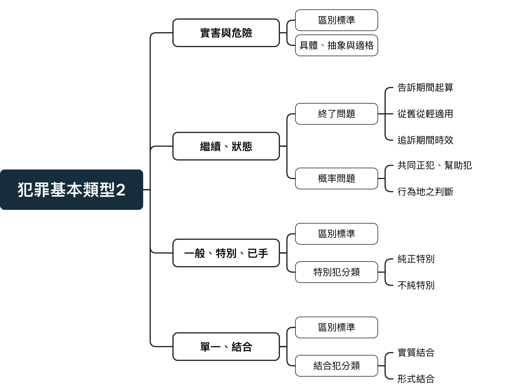

# 犯罪基本類型2

<link href="https://fonts.googleapis.com/icon?family=Material+Icons" rel="stylesheet">

## 本次架構

{width=80%}

\pagebreak

## 實害犯與危險犯區別之定義

### 實害犯：

必須對**行為客體造成客觀可見之傷害**，只會出現在**個人法益之侵犯** 
例：殺人罪、竊盜罪、傷害罪 
若行為缺乏結果，則有成立**未遂犯**之可能。 
例：殺人未遂(271-II)

> 刑§271 
I：殺人者，處死刑、無期徒刑或十年以上有期徒刑。 
II：前項之未遂犯罰之。 
III：預備犯第一項之罪者，處二年以下有期徒刑。

### 危險犯：對**法益或行為客體引起危險之狀態**，無須等待結果之發生

例：刑§185分別涵蓋了實害犯與危險犯

第一項為**危險犯**，只要損壞或壅塞公眾往來之設備致生「往來之危險」

第二項為**實害犯**，必須有死亡或重傷之客觀可見犯罪。

而危險犯之狀態繼續昇高，即有可能成為實害犯；如此條若只是造成陸橋之損壞，僅構成危險犯(185-1)。果爾致人於死者，將升格成實害犯(185-2)。

> 刑185： 
I: 損壞或壅塞陸路、水路、橋樑或其他公眾往來之設備或以他法致生往來之危險者，處五年以下有期徒刑、拘役或一萬五千元以下罰金。 
II：因而致人於死者，處無期徒刑或七年以上有期徒刑；致重傷者，處三年以上十年以下有期徒刑。

## 具體危險犯、抽象危險犯與適格犯

### 具體危險犯：

**以發生一定的具體危險狀態為「構成要素」** 
由法官依**個案**判斷是否招致危險狀態，肯定始構成具體危險犯。

屬**結果犯**之一種， 
所謂結果，是**構成要件要素所描述該具體危險**。

有些法條裡有明定構成要素(具體危險) 
例：放火燒毀無人使用且為自己之建築(175-II)，必須要由法官判定有「致生公共危險」之危險狀態，始構成此構成要件。

>刑§175-II： 
II：放火燒燬前項之自己所有物，致生公共危險者，處六月以上五年以下有期徒刑。

有些法條則未寫明 
例：遺棄罪(294)，必須判斷有無產生「致無自救之人之生命產生危險」之危險狀態。 

>刑§294-I： 
對於無自救力之人，依法令或契約應扶助、養育或保護而遺棄之，或不為其生存所必要之扶助、養育或保護者，處六月以上、五年以下有期徒刑。

### 抽象危險犯：

經由觀察及經驗歸納揀選「典型行為」 
直接由**立法方式推定「只要從事該行為即具有危險性」** 
因此條文不以個案中以確實造成一定具體危險為「構成要素」 
只要**行為符合該構成要件，即可成立抽象危險** 
無須待法官就具體情節認定

歸類於**行為犯**，不問是否招致實害或法益的具體危險 
只要行為合乎構成要件的描述即可成立

例：燒毀供人使用之器物放火罪(173-1)，由於行為人燒毀之物為「現供人使用」之建築，其造成之傷亡的潛在可能性是隨附於此條之典型危險，因此立法者直接處罰。 
至於到底有無人在屋裡，法官無需就個案作有無危險之認定。

>刑173-I： 
放火燒燬現供人使用之住宅或現有人所在之建築物、礦坑、火車、電車或其他供水、陸、空公眾運輸之舟、車、航空機者，處無期徒刑或七年以上有期徒刑。

### 適格犯
以「足以產生危險」為要件，介於**具體危險犯與抽象危險犯之間**，又稱「抽象的具體危險犯」

例：凌虐未成年罪(286-I)，不需要真正發生危險狀態(身心健全發育遭妨害)，也不代表有凌虐之行為即構成此犯罪，而是發生「足夠影響身心狀態之行為」，即滿足特定危險性質才滿足構成要件該當。

\pagebreak

> 刑§286-I： 
對於未滿十八歲之人，施以凌虐或以他法足以妨害其身心之健全或發育者，處六月以上五年以下有期徒刑。

雖然有些法條有「足以」2字，但並非所有皆是適格犯 
例：雖有「足以生損害於公眾」，但其為抽象危險犯，即只要滿足構成要件之行為(偽造、變造私文書)，行為不需真的「足夠生損害於公眾」。

>刑§210： 
偽造、變造私文書，足以生損害於公眾或他人者，處五年以下有期徒刑。

## 食品安全衛生管理法

1. 若將低價米種混雜於高價米種出售，構成15-7之參偽

2. 將主管機構禁止之添加劑加入沙拉油中，構成15-10之添加未經中央主管機關許可之添加物。

此條例保護的法益即**公眾之身體健康**，屬於集體法益。 
因此，如若其屬於案例1之情況，或屬於案例2之違規添加劑並無對人有所危險。 
其行為並**無造成公眾健康法益之受損**， 
其不法內涵應不至49條之7年以下，甚至本不應在此納入規制之範疇。 
於此**學界**認為應該**加入適性犯之要件**，即行為足以對公眾健康產生危害，做**目的性限縮**。 
但**最高法院**仍採取**抽象危險犯**為此條構成要件。

>食品安全衛生管理法§15-7、15-10： 
食品或食品添加物有下列情形之一者，不得製造、加工、調配、包裝、運送、貯存、販賣、輸入、輸出、作為贈品或公開陳列： 
七、攙偽或假冒。 
十、添加未經中央主管機關許可之添加物。

> 食品安全衛生管理法§49： 
有第十五條第一項第三款、第七款、第十款或第十六條第一款行為者，處七年以下有期徒刑，得併科新臺幣八千萬元以下罰金。情節輕微者，處五年以下有期徒刑、拘役或科或併科新臺幣八百萬元以下罰金。

\pagebreak

## 繼續犯與狀態犯

### 狀態犯：

法益並無持續之受損，只有狀態之延續，即行為無延續。 
例：殺人罪(271-I)

### 繼續犯：

法益之侵害延續，即行為持續一段時間。 
例：剝奪行動自由罪(302)、侵入住居住(306)

>刑§302：
I：私行拘禁或以其他非法方法，剝奪人之行動自由者，處五年以下有期徒刑、拘役或九千元以下罰金。 
II：因而致人於死者，處無期徒刑或七年以上有期徒刑；致重傷者，處三年以上十年以下有期徒刑。 
III：第一項之未遂犯罰之。

## 繼續與狀態犯之區別實益

繼續犯行為一旦繼遂，但仍未停止法益之侵害，視為「未終了」 
例：剝奪行動自由罪之終了時間在於行為人何時停止侵害被害人自由之法益(停止拘禁)

### 時機問題

1.**有無從就從輕原則之適用(刑§2)：** 
繼續犯之行為若**跨越新法與舊法**，應依行為「終了」時之法律為準。 
例：行為人在9/1拘禁甲，總統在9/5發布加重之剝奪行動自由罪，而後甲在9/10後被釋放。
這時不適用從就從輕原則，因其行為之「終了」於發佈之後，適用新法。

> 刑§2-III： 
III：行為後法律有變更者，適用行為時之法律。但行為後之法律有利於行為人者，適用最有利於行為人之法律。

2.告訴期間之起算(刑訴§237)： 
**告訴乃論**之繼續犯之告訴起算日由**行為終了時起算** 
狀態犯則由完成日後起算或**知悉犯罪日**。

>刑訴§237： 
I：告訴乃論之罪，其告訴應自得為告訴之人知悉犯人之時起，於六個月內為之。 
II：得為告訴之人有數人，其一人遲誤期間者，其效力不及於他人。

3.追訴時效之起算(刑§80)： 
繼續犯之**追溯起算日由行為終了時起算** 
狀態犯則由**既遂後**起算。

- 例：某何侵佔政府土地25年並在其上蓋了一間西瓜城，犯竊占罪(302-II)

1. 若為狀態犯，依刑§80追訴權為20年(5年)，檢察官不得加以起訴

2. 若為繼續犯，其犯罪根本還未完成，得將之起訴。

實務：認定其為狀態犯

老師：竊占罪無存在之必要，前項之竊盜罪應其為動產，難以追索，非得有國家之介入才能保護。 
而不動產不會不知被誰侵佔，可直接依民法之損害賠償責任，無須動用刑法

> 刑§302 
I：私行拘禁或以其他非法方法，剝奪人之行動自由者，處五年以下有期徒刑、拘役或九千元以下罰金。 
II：意圖為自己或第三人不法之利益，而竊佔他人之不動產者，依前項之規定處斷。

>刑§80： 
I：追訴權，因下列期間內未起訴而消滅： 
一、犯最重本刑為死刑、無期徒刑或十年以上有期徒刑之罪者，三十年。但發生死亡結果者，不在此限。 
二、犯最重本刑為三年以上十年未滿有期徒刑之罪者，二十年。 
三、犯最重本刑為一年以上三年未滿有期徒刑之罪者，十年。 
四、犯最重本刑為一年未滿有期徒刑、拘役或罰金之罪者，五年。 
II：前項期間自犯罪成立之日起算。但犯罪行為有繼續之狀態者，自行為終了之日起算。

\pagebreak

### 概率問題：

1.成立共同正犯、幫助犯之可能： 
在繼續犯之已「既遂」後，因其行為仍持續，有更大概率加入共同正犯、幫助犯。
雖狀態犯亦可能有狀態犯共同正犯、幫助犯，但其在既遂後即不生前二者，因此概率較低

2.行為地之判斷(刑訴§5)： 
繼續犯與結果犯行為持續時間之所有犯罪地點皆屬犯罪地。 
但繼續犯之跨地點行為較為普遍。

>刑§5-I： 
I：案件由犯罪地或被告之住所、居所或所在地之法院管轄。

### 競合問題

在繼續犯之持續行為不會產生其他犯罪 
例：將某甲先拘禁在住處7天，後再將其帶到山洞拘禁一年，其後屬同一犯罪 
而狀態犯之後續行為則有另外之犯罪 
例：殺完人後將其屍體遺棄，將成立遺棄屍體罪(實務上有成立但不另論)

>刑247-I： 
損壞、遺棄、污辱或盜取屍體者，處六月以上五年以下有期徒刑。

\pagebreak

## 一般犯、特別犯、已手犯

### 一般犯

沒有對特殊身份加以限制，**任何人都能成為適格行為人**

大多數犯罪數之屬之，例如殺人罪(§271)、竊盜罪(§320)

### 特別犯(身分犯)

法定構成要件中**限定行為人資格**，特定之人才能成為適格行為人。
又可再分為純正特別犯與不純正特別犯 

1.**不純正特別犯**： 
基本型態為一般犯，只是針對**特定人加重刑度**。

例：在[公務員定義](https://criminal.lsyverycute.com/%E5%8F%B8%E6%B3%95%E8%88%87%E7%AB%8B%E6%B3%95%E8%A7%A3%E9%87%8B.html#%E5%85%AC%E5%8B%99%E5%93%A110-2)有提及之§134非純粹瀆職罪即是一經典案例，若公務員藉由職務之便搜查他人之房子時犯下竊盜罪(§320)，則依此條加重其刑之1/2

> 刑§134 
公務員假借職務上之權力、機會或方法，以故意犯本章以外各罪者，加重其刑至二分之一。但因公務員之身分已特別規定其刑者，不在此限。

2.**純正特別犯**： 
行為人之特別資格是「創設刑罰」之理由，欠缺該項即無法構成犯罪 
例如：§121公務員收受賄絡罪，符合此條犯罪之行為人必定為公務員

>刑§121： 
公務員或仲裁人對於職務上之行為，要求、期約或收受賄賂或其他不正利益者，處七年以下有期徒刑，得併科七十萬元以下罰金。

### 已手犯：

因惟有親自實施才滿足不法內涵，必須由親自並直接構成要件使成為犯罪。 
非親自實施者不成立正犯、共同正犯或間接證犯，最多成立教唆或幫助犯

\pagebreak

例1：重婚罪(237)，配偶必須「親自」與數人「結婚」才構成犯罪 
其一，此罪不可能藉由他人之手為之，不可能藉由間接正犯達成之可能。 
其二，即使父母有意幫助其女子重婚，頂多以教唆犯或幫助犯。

>刑§237： 
有配偶而重為婚姻或同時與二人以上結婚者，處五年以下有期徒刑。其相婚者亦同。

例2：為證罪，同時具備已手犯與身份犯 
1.身分：證人或、鑑定人或通譯 
2.己手：必須「親自」為虛偽陳述 
若某甲威脅證人在庭上講述虛偽的案發過程，因某甲並無「親自」陳述。

>刑§168偽證罪： 
於執行審判職務之公署審判時或於檢察官偵查時，證人、鑑定人、通譯於案情有重要關係之事項，供前或供後具結，而為虛偽陳述者，處七年以下有期徒刑。

### 以間接正犯方式檢測已手犯

間接正犯：**透過資訊落差、權勢高低或組織性權利機器使人完成己所欲之犯罪** 
己手犯與間接正犯為**矛盾**之概念，因此得成立間接正犯即不會成立己手犯。

例：醫生調包針劑，使護士在不知情之情狀下將有毒物質助於患者體內至其死亡。 
此例之醫生為殺人罪之間接正犯，利用護士之無故意無過失之行為(資訊落差)殺人。

例：某甲在知情狀況下，將妓院紅牌乙媒介給其哥哥，而乙在不知此人為其哥哥的情況下與其發生性關係。

1. 妓院紅牌乙不應成立血親性性交罪，因其無故意也無過失(客觀上已預見)

2. 某甲亦無構成血親性性交罪，即使其利用資訊落差使乙完成犯罪，但此罪為己手犯，即必須親自完成「血親性交」此構成要件即可

例3：若某A知道某B如果吃西瓜製品就會對女性實施侵犯。而一日某A故意在某B的檸檬汁裡加入西瓜，使其在不知情的情況下性侵了某女。

1. 此案例中，某A即透過西瓜的力量使某B完成強制性交罪，而此罪不為「己手犯」，即不需要親自完成強制性交也能成為己手犯。

2. 於此，如某A是拿西瓜刀強迫某B與某女為性行為，即使不親自加入，亦使B與某女之性自主受到侵害

\pagebreak

## 單一犯、結合犯

### 單一犯

實現一個單獨構成要件，大多數之犯罪屬之

### 結合犯

結合兩構成要件之刑罰，可再依**立法技術**與**兩構成要件相關性強弱**分為「形式」與「實質」

### 形式結合犯：

為**兩分立之構成要件組合**，提高原罪之下限或上限。

例：刑332-II-3為放火罪(173)與強盜罪(328)之結合，為兩個獨立之構成要件，無己身之特殊構成要件。 
強盜+放火罪之結合增設了法定刑之上限至死刑，有正當性之考驗。

我國**實務上**面對結合犯通常採取**寬鬆之規定**： 
例：98台上1031指出，刑§332-I之形式結合犯應從寬認定，不需有犯意之聯絡，只要時間、地點有銜接性

>刑§332 
犯強盜罪而故意殺人者，處死刑或無期徒刑。 
犯強盜罪而有下列行為之一者，處死刑、無期徒刑或十年以上有期徒刑： 
一、放火者。 
二、強制性交者。 
三、擄人勒贖者。 
四、使人受重傷者。

### 實質結合犯：

非單純結合兩構成要件，而其**己身有構成要件**

例：擄人勒贖罪(347-I)乃結合私行拘禁罪(346)與恐嚇取財罪(347)，從條文可知其非如結合犯單純寫入兩罪加以提高刑度，而有自身之構成要件。

>刑§347-I 
意圖勒贖而擄人者，處無期徒刑或七年以上有期徒刑。

