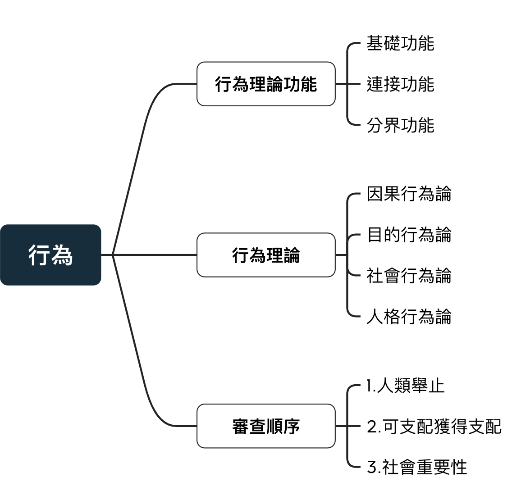

# 刑法行為

## 刑法上的行為

:::ex2

{width=60%}
:::

**無「行為」則無「行為人」; 無「不法」則無「罪責」**

刑法檢驗：行為 => 構成要件該當性 -> 違法性 -> 有責性 => 犯罪

所有的刑法檢驗都從不法**行為**開始

\pagebreak

### 行為：

定義：受到⼈類的意思⽀配，將內部的意思⾏諸於外，產⽣積極的⾏為或消極不⾏為，且對外界造成具有刑法意義的後果 

下面四種學說也有其對應的行為定義

## 行為理論功能(要素)

良好的犯罪行為理論應有三項功能：基礎/連結/分界

### 1.基礎功能：描述所有刑法上可罰舉止所共通的基礎要素，成為其上位概念

可罰舉止：如故意、過失、作為、不作為

行為理論必須**涵蓋所有可罰舉止並給予合理解釋**

### 2.連結功能：必須連接構成要件該當、違法性、有責性以支撐犯罪階層體系

為達成連結要素的功能，行為概念身必須為「**中性**」而**不能將其中一點先行解決**

例：不能先將無責任能力人之行為從行為概念中排除出去

### 3.分界功能：足以將明顯不屬於刑法判斷對象的非行為排除

透過**過濾**特定犯罪對象、行為使其不再進入犯罪體系判斷

例：過濾 動物行徑(野豬咬人)、自然事件(雷雨毀損農作物)

## 行為理論

### 因果行為理論

行為係指由人**內心的意思帶動身體動作，而引發外界變動的因果歷程**

只要有內在意思並有外在之因果歷程，不論意思內容、故意過失、因果變動的社會意義等因素

\pagebreak

弊病：

1.缺乏基礎要素：

**非所有可罰舉止皆有「外界變動因果歷程」**; 例：未遂犯、不純正不作為犯

2.連結要素雜亂空泛

包括過多毫無刑法重要性之外界變動，且過於空泛難以乘載犯罪體系

### 目的行為論

行為是為達成某種目的，而有意識執行某種能達成目的之作為

**預設行為人有相當之遇見能力，得以設定目標、駕馭行為並有計劃地追求目標**

弊病：

1.缺乏基礎要素：

因其強調「**目的支配**」，在過失行為(尤其是**無認識過失**)，根本上**缺乏有意識目的性操縱** 
**不純正不作為**之行為人也同樣難認其行為之目的性

2.分界要素疑問：

通說認為「有意識地設定設定目標並且選擇行為手段而實現目的」是人的特有本質 
以此區分非行為尚無不妥，但**人亦具有許多無意識行為**。

3.連結要素疑問：

縱使**過失行為**有目的可言，該**目的在犯罪體系上毫無價值可言** 
例：擦槍時走火致人死亡，頂多是有目的性的擦槍，非目的性殺人

母親未注意其幼子喝下有毒物品因而致死，並無知悉目的而能駕馭因果歷程而言， 
但此類判罰卻對**社會有重大意義**，若奉行此理論，則有**過早排除無目的可罰行為**。

### 社會行為論

現今通說，綜合個人、目的、因果與規範的觀點，認為核心在於**人類之作為與不作為所產生的社會重要性** 
即行為是「由意思支配或可由意思支配，且因而在外界引起社會重要性結果的人類舉止」

優勢：包容性高，幾乎囊括各種人類的意思與社會重要性行為之樣態

**社會重要性**給予各種可罰行為提供重要基礎，卻也建立在模糊的缺陷之下

同時並未先行解決任何問題，免強能區分刑法上的行為

### 人格行為論

行為是「人格的表現」，必須**足資在外表徵人之所以為人的心理、精神活動**

不具備人格表徵的行為，夢遊舉止、生理強制等欠缺內在意識支配或可得知配的性質不屬行為

單純的思想僅屬於個人心理精神層面，沒有表現，則無行為可言

評：無重大缺陷，但非主流

### 審查順序(依社會行為論)

**1.人類舉止乎？**

應不是為動物、自然所為

**2.舉止由人之意思所支配或得支配乎？**

非無意識行為包含：病理行為、反射行為、無意識睡眠行為或外力強制支配行為

**3.舉止是否有社會之重要性？**

無社會重要性 = 無刑罰重要性

## 構成要件介紹與學說

:::ex2

{width=60%}
:::

狹義的構成要件：指三階犯罪階層論第一層之構成要件，寫在刑法分則的規範中 
立法者藉由此界定各種不同犯罪類型之**法益侵害** 

廣義的構成要件：指所有可罰性的前提要件，相當於**犯罪成立要件**，設定刑法的界線 
唯有合乎構成要件的行為才是刑法的可罰行為，以此維護**罪刑法定原則暨刑法保障功能**。

## 三階理論

### 古典犯罪學說

1920年由貝林與李斯特提出，將成立要素歸為三階段審察，改善原本鬆散的犯罪體系

1.構成要件該當(皆為描述性要件) -> 2.違法性 -> 3.罪責

受因果行為理論影響，將構成要件該當與違法性設為**客觀中性**，只有罪責判斷人的主觀想法(故意或過失)

### 新古典犯罪學說

反對古典犯罪學說，認為犯罪構成要件不應中性客觀，而具有主觀評斷色彩，並且採社會行為論

在1930~1940實證主義逐漸興起，此學說在違法性與罪責面有更深入地闡釋

1.不法構成要件該當：

客觀 -> **部分主觀評斷**(規範性構成要件)+客觀(描述性要件)

2.違法性：

區分為「法定」與「**超法定阻卻違法事由**」

3.罪責：

從原本的故意＋過失再增加「期待可能性」

### ⽬的行為論的犯罪階層體系

在新古典學說上再次增加目的行為論之觀點，主要在**不法構成要件**與**違法性**上區分**主觀**與**客觀**要素

1.不法構成要件：在主觀評斷上區分「**主觀違法意圖**」＋「**構成要件故意**」 
行為人要實現犯罪構成要件必須涵蓋「**知**」與「**欲**」

2.違法性：主觀必須「**認識有阻卻違法的客觀狀態**」；客觀有阻卻違法的事實 
例：正當防衛必須「認識能有正當防衛的客觀情狀」與正當防衛之事實才成立。

## 二階理論

將違法性併入不法構成要件該當，成為不法構成要件的**消極面**

在「容許構成要件錯誤」和「反⾯的容許構成要件錯誤」之裁判上會與三階有所不同

公式應為：

犯罪 ＝ **整體不法構成要件**(不法評價)＋罪責

### 以甲殺害Ａ，觸犯普通殺人罪(271)為例：

三階：構成要件該當層次僅對甲是否滿足條文之構成要件做討論，甲是否出於正當防衛或緊急避難因交由違法性層次討論。

二階：在**整體不法構成要件**中，除了判斷正面要件(構成要件該當)，還要檢驗負面構成要件要素(阻卻違法事由)，才能做最後的判定

依負面構成要件要素理論，殺人罪的內涵從「你不可以殺人」變成「你不要故意殺人，除非有阻卻違法事由」。只有具備阻卻違法事由，殺人就是**自始不禁止的行為**

### 評價

負面構成要件要素理論發現了「介於構成要件錯誤與禁止錯誤之間的常見錯誤類型」，即容許構成要件要素錯誤，並賦予其特別處理的理論基礎，當有其歷史地位。

但在二階犯罪理論中，在判斷上與三階**根本無異**

其次，將不法構成要件該當與違法性混為一談，將使「無侵害法益而不該當不法構成要件」行為與「已侵害法益但有阻卻違法事由」行為，等量齊觀，**評價不符**。

另外，將購持要件不該當與具備組卻違法事由兩種情形併入容許行為，反而造成**防衛權利判斷標準之混淆** 
以使用竊盜為例，其為構成要件不該當之行為，物之所有人得主張正當防衛事由 
反之，如果是一具備阻卻違法事由之行為，物之所有人不得主張正當防衛事由

最後，構成要件該當性與違法性應為**禁止類推適用**的界線 
俠義之構成要件不得類推適用，但阻卻違法是由之類推有利行為人，不在禁止之列，將其二整合為一，無疑模糊兩者界線。

