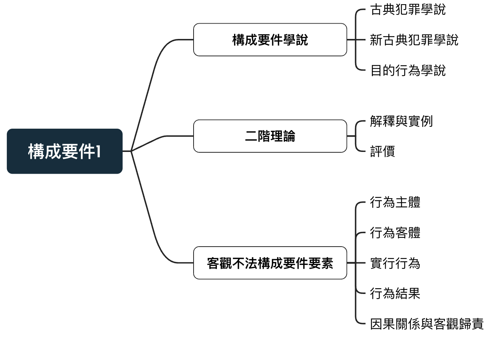

# 構成要件

## 構成要件介紹與學說

:::ex2

{width=60%}
:::

狹義的構成要件：指三階犯罪階層論第一層之構成要件，寫在刑法分則的規範中 
立法者藉由此界定各種不同犯罪類型之**法益侵害** 

廣義的構成要件：指所有可罰性的前提要件，相當於**犯罪成立要件**，設定刑法的界線 
唯有合乎構成要件的行為才是刑法的可罰行為，以此維護**罪刑法定原則暨刑法保障功能**。

## 三階理論

### 古典犯罪學說

1920年由貝林與李斯特提出，將成立要素歸為三階段審察，改善原本鬆散的犯罪體系

1.構成要件該當(皆為描述性要件) -> 2.違法性 -> 3.罪責

受因果行為理論影響，將構成要件該當與違法性設為**客觀中性**，只有罪責判斷人的主觀想法(故意或過失)

### 新古典犯罪學說

反對古典犯罪學說，認為犯罪構成要件不應中性客觀，而具有主觀評斷色彩，並且採社會行為論

在1930~1940實證主義逐漸興起，此學說在違法性與罪責面有更深入地闡釋

1.不法構成要件該當：

客觀 -> **部分主觀評斷**(規範性構成要件)+客觀(描述性要件)

2.違法性：

區分為「法定」與「**超法定阻卻違法事由**」

3.罪責：

從原本的故意＋過失再增加「期待可能性」

### ⽬的行為論的犯罪階層體系

在新古典學說上再次增加目的行為論之觀點，主要在**不法構成要件**與**違法性**上區分**主觀**與**客觀**要素

1.不法構成要件：在主觀評斷上區分「**主觀違法意圖**」＋「**構成要件故意**」 
行為人要實現犯罪構成要件必須涵蓋「**知**」與「**欲**」

2.違法性：主觀必須「**認識有阻卻違法的客觀狀態**」；客觀有阻卻違法的事實 
例：正當防衛必須「認識能有正當防衛的客觀情狀」與正當防衛之事實才成立。

## 二階理論

將違法性併入不法構成要件該當，成為不法構成要件的**消極面**

在「容許構成要件錯誤」和「反⾯的容許構成要件錯誤」之裁判上會與三階有所不同

公式應為：

犯罪 ＝ **整體不法構成要件**(不法評價)＋罪責

### 以甲殺害Ａ，觸犯普通殺人罪(271)為例：

三階：構成要件該當層次僅對甲是否滿足條文之構成要件做討論，甲是否出於正當防衛或緊急避難因交由違法性層次討論。

二階：在**整體不法構成要件**中，除了判斷正面要件(構成要件該當)，還要檢驗負面構成要件要素(阻卻違法事由)，才能做最後的判定

依負面構成要件要素理論，殺人罪的內涵從「你不可以殺人」變成「你不要故意殺人，除非有阻卻違法事由」。只有具備阻卻違法事由，殺人就是**自始不禁止的行為**

### 評價

負面構成要件要素理論發現了「介於構成要件錯誤與禁止錯誤之間的常見錯誤類型」，即容許構成要件要素錯誤，並賦予其特別處理的理論基礎，當有其歷史地位。

但在二階犯罪理論中，在判斷上與三階**根本無異**

其次，將不法構成要件該當與違法性混為一談，將使「無侵害法益而不該當不法構成要件」行為與「已侵害法益但有阻卻違法事由」行為，等量齊觀，**評價不符**。

另外，將購持要件不該當與具備組卻違法事由兩種情形併入容許行為，反而造成**防衛權利判斷標準之混淆** 
以使用竊盜為例，其為構成要件不該當之行為，物之所有人得主張正當防衛事由 
反之，如果是一具備阻卻違法事由之行為，物之所有人不得主張正當防衛事由

最後，構成要件該當性與違法性應為**禁止類推適用**的界線 
俠義之構成要件不得類推適用，但阻卻違法是由之類推有利行為人，不在禁止之列，將其二整合為一，無疑模糊兩者界線。

