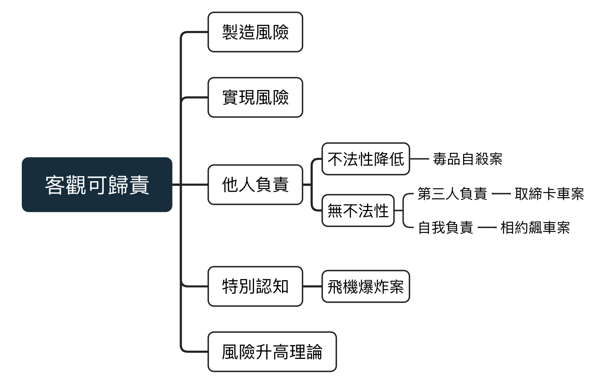

# 因果關係與客觀可歸責

## 因果關係與客觀歸責分立

### 實務見解：相當因果關係

行為與結果的相當性：有此環境，有此行為，就會有此結果

> 最高法院76年台上192號判例：  刑法上之過失，其過失行為與結果間，在客觀上有**相當因果關係**始得成。  所謂相當因果關係，係指依**經驗法則**，綜合行為當時所存在之一切事實，為客觀之事後審查，認為在一般情形下，**有此環境、有此行為**之同一條件，  均可發生**同一之結果者**，則該條件即為發生結果之相當條件，行為與結果即有相當之因果關係。 
反之，若在一般情形下，有此同一條件存在， 而依客觀之審查，認為**不必皆發生此結果**者，則該條件與結果不相當， 不過為偶然之事實而已，其行為與結果間即**無相當因果關係**。

經驗法則：吃砒霜會死亡；喝菊花茶不會墮胎

**問題：將客觀歸責與因果關係合併會使案例無法解釋清楚**

::: box
::: center
台九線飆車案
:::
有兩個情敵比賽飆車，輸的退出戀情，其中Ａ逼近Ｂ車，意外使其掉入山谷，Ａ當論何罪？
:::

 

1.Ａ並無殺害Ｂ之故意，當**以過失犯論處**  (雖然我們以故意犯的脈絡談，但兩者差別只是在過失犯少了**主觀要素**)

2.審查相當因果關係：符合相當因果關係

  1.Ａ確實違反注意義務，不應在危險之區域飆車與逼車
  
  2.沒有在狹窄危險之車道逼車，就不會發生事故 
  在危險之區域，進行超速、逼車，就有可能造成事故之結果

但

本案例Ａ並**不用負起過失致死之刑責**，但你沒有辦法從相當因果關係找到答案...,  (依條件理論，在狹窄危險之車道，本來就有可能發生意外，A之**逼車行為可想像其不存在**)

### 條件理論(等價理論)

所有造成結果發生**不可想像其不存在**的條件(正面檢驗) 
必須為結果發生之原因

若**可想像其不存在**，結果依然發生者，則非造成結果的條件(負面檢驗) 

以下毒殺人為例：

  1.行為人下毒是造成死亡之不可想像其不存在的條件

  2.若沒有毒性發作行為人依然死亡，則為**可想像其不存在之條件** 

### 雙重因果關係(擇一)

::: box
::: center
雙重毒藥案
:::
甲娶了A後，又與女管家B和廚師C有所染指，並欺騙兩人其快要結束與Ａ的關係  因為等不及甲與正宮A離婚，於是乎B與C同時下了殺害A的念頭...  廚師C先在飯裡下了致死量的毒藥，而後管家B又下了另外一種致死量的毒藥，A而後毒發生亡  若科學無法證明是誰的毒藥害死A，依條件理論又應當如何論處？
:::

 

Ｂ可以主張其行為是「**可想像其不存在**」，即沒有Ｂ的下毒，Ａ依然會被廚師Ｂ下的毒給殺死  Ｃ亦可以有同樣之主張！

依此，雖兩人都投下致死藥物並且造成結果，但欠缺因果關係，僅得以未遂犯論處。  豈不可笑！

修正：**合乎經驗法則的因果關係**

單獨看Ｂ(C)之行為，下致死毒藥會使行為客體死亡，即符合因果關係

結：B與C之行為皆與結果有因果關係

### 累積因果關係
::: box
::: center
5050毒藥案
:::
若B與C分別下50%致死量的毒藥，導致A死亡
:::

 

此時B與C之行為**皆為不可想其不存在**，且若無B與C之行為，A並無毒發生亡之可能  此時通過客觀歸責理論的第一關卡(**製造法所不容許的風險**)

但

其欠缺「常則性」的因果關係，根據經驗法則，下50%之毒藥並不會毒死人  A之死亡不過是**偶然毒藥累積之結果**，因此，B之行為並不能實現法所不容許的風險  不符合第二關卡(**實現法所不容許的風險**)

結：**不具備客觀可歸責性**，因此也只成立未遂犯

### 相關批評

批評：牽連過廣

殺人兇手的媽媽也為不可想像其不存在之要件，那其母親是否也遭連累？

駁：媽媽在**行為前審階段**即遭排除

但若母親看見未成年子女拿刀而不加以阻止，此時其不作為應可成立不作為之殺人

## 客觀歸責理論

客觀歸責理論為因果關係的下一個階層

目前客觀歸責理論仍為刑法上的主流，只是不同學說對其有不同的解釋

## 製造法所不容許的風險

因與犯罪類型提到之危險(德文：Gefahr)做出區分

我們處在風險的社會中，例如求快而坐上有可能脫軌的火車、有機率故障的汽車

製造法所不容的風險指的並非為生活中可預見之風險，而是**法律明文規定禁止造成之風險**

::: box
::: center
貢丸殺人案
:::
例1：若A想要B死亡，推薦B吃貢丸，心裡有使其死亡之想法，A有何責任？
:::
 
1.條件理論 
A請B吃貢丸確為造成其死亡**不可想像其不存在之條件**，符合因果關係

2.客觀歸責 
A僅單純利用**生活中的風險（吃貢丸噎死）**並不符合製造法所不容許風險

::: box
::: center
姪子爭財案1
:::
叔叔因為沒有其他子嗣，將姪子列為繼承人，因為其極度缺錢，姪子推薦叔叔去登山，希望他遭遇山難，果不其然，不久後叔叔真的在山上遭台灣黑熊獵捕而亡，發生繼承事實，姪子是否應當負起刑責？
:::

 

不需要，此僅為利用生活的風險

在交通事件中也很常有此類例子，例如不超速，但因為行人未注意而遭汽車撞傷，

此時法所不容許的風險即車速過快，超越速限之法規

在此例中行為人並沒有製造法所不容需的風險，因此無客觀歸責

::: box
::: center
姪子爭財案2
:::
姪子慫恿叔叔去危險的佛羅里達州遊玩，希望其被殺害也發生叔叔死亡之結果
:::

 

世界上每個地方都有歹徒殺人之風險，僅是為生活上之風險。

\pagebreak

::: box
::: center
姪子爭財案3
:::
例5：若姪子推薦叔叔去戰火連天的烏克蘭採集野生植物，叔叔並不知情 
且姪子希望其被殺害也發生叔叔死亡之結果
:::

 

行為人確實知道，有「**特殊之認知**」，此時風險上升，成為**法所不容許之風險**

### 降低風險

::: box
::: center
火場推人案
:::
在火在現場，A之頭頂有一根巨大的火柱要掉下來，B為保護A，在千鈞一法之際，推了A一把使其免於頭部重創之危難，但使A之肩膀受傷
:::

 

此案中，行為人Ｂ**滿足刑法§24之避免他人之生命受到危害之緊急避難**，符合阻卻違法

但我們在不法構成要件就欲將其排除，此案原本之風險為「頭部受到火柱重創」， 
Ｂ之行為將**風險降低至「肩膀受傷」**，**不具備客觀可歸責性**

::: box
::: center
偷竊金費案
:::
甲在得知乙欲進入教授研究室裡偷取1000塊之研究基金，苦勸乙偷一半(500)就好
:::

 

此案，研究團隊原本有損失高達1000元之基金之風險，但經過甲之勸說，**風險降低**至500元 
甲之**行為不具備可客觀歸責性**

### 替代性之風險

::: box
::: center
火場嬰兒案
:::
例：在火場中，某甲抱著一嬰兒，甲認為在不做出決定，他們兩人同死 
此時其觀察到底下有平整之灌木叢，他將嬰兒往下一丟，嬰兒因此受到輕傷但未死亡 
但不久之後，消防人員將甲完好無損的就出...
:::

 

將原本**舊而高之風險**(在火場被燒死)，替代為**新而低的風險(丟下樓摔死傷)** 
此時甲所製造的**新風險符合法所不容許的風險，有客觀可歸責性** 
是否免除刑責應交由**違法性(有阻卻違法事由)討論**

### 信賴原則

在行駛交通工具時，必需遵守交通規則，為避免造成他人生體生命安全受到危害，必須負起注意義務 
而交通管理處罰條例為這些注意的規定來源

::: box
::: center
撞死熊孩子案
:::
若符合所有交通規則，不分心的行駛在一小巷內，但一男孩違規穿越馬路，導致你將其撞死...
:::

 

在道路交通案例中**講求一種信賴原則，我可以信賴別人遵守交通規則，不侵害法益** 
當我遵守四面八方的注意義務，並且無違反交通規則，更盡量避免此為害發生(採煞車)
則無造成任何法所不容之風險，再實務上無「相當因果關係」 
學說上不能預期我能躲避違規之路人而撞傷，因此無客觀可歸責性

## 實現法所不容許的風險(相當性)

典型的風險/符合規範保護目的/無第三人負責/無因果關係超越

::: box
::: center
開槍救護車車禍案
:::
例：甲以殺人故意向乙開槍，乙僅受輕傷。 
救護車送醫途中，乙因他車違規所造成之交通事故死亡
:::

 

1.甲之行為為**不可想像其不存在之要件**，即沒有甲開槍就不會有乙上救護車的行為，符合因果關係

2.再者，其開槍確實造成乙死亡之風險，符合**製造法所不容之風險**

3.但，其槍傷並沒有打到要害，在經驗法則中，只要來的及送醫，或作簡單之治療就可以**免於死亡** 
甲之行為欠缺**典型之因果關係**，只是有異常之因果流程介入(車禍) 
因此此案並**無實現法所不容許的風險**，阻卻客觀可歸則性之成立

在無客觀可歸則性之前，使用的是「因果關係中斷」 
例：雖為甲開啟了乙死亡之因果鏈，但其因果關係被違規車主所中斷 
此學說以故時，因果關係並不會被中斷，只會被「超越」

### 因果關係超越

::: box
::: center
毒藥案4：超越關係案
:::
回到毒藥例子，若此時廚師Ｃ下了30分鐘毒性發作的藥，Ｂ更狠，下了5分鐘的藥，女主人Ａ因為B下的毒藥而毒發生亡。此時，Ｃ應該如論處？
:::

 

此案例中，廚師Ｃ的行為被Ｂ超越，沒有Ｃ的行為，Ａ仍舊會死亡，**可想像其不存在**，不存在因果關係

和上述案例對比，甲開槍之**行為的因果關係一直在作用**。 
而本案Ｃ之行為的**因果關係**都還沒開始，Ａ就已經死亡，再因果關係階段被排除

### 典型的風險實現關係

實現風險關係必須**為常態、符合經驗法則((的典型風險，並非是偏異之因果關係

::: box
::: center
推人下橋案
:::
甲以殺死乙之故意，從乙背後將乙從碧潭吊橋上推下，於本預計將乙溺死，不料乙卻因撞擊橋墩而當場死亡
:::

 

依照生活經驗，將人從橋上推下不外乎溺死，撞死或悶死，只要在此範圍，即使出現與原本計劃之些微偏差(如同上述案例)，也在預料之內，仍為典型的風險實現關係，具可歸責性

### 規範保護目的

行為製造之風險必須與規範保護目的**相吻合，才有實現法所不容許的風險**

反之，若不相吻合，僅管有造成法所不容許之危險，亦**不構成風險實現關係**

\pagebreak

::: box
::: center
毛筆加工案
:::

例：毛筆工廠之主人甲將未經消毒之山羊鬍鬚交給工廠工人加工，依法該原料事先應經消滅病毒之程序，但甲違規，而後其工人因感染病菌而死。隨後鑑定結果發現，即使甲施行消毒之義務，亦可「幾記確定」地判定無法避免該死亡之結果發生，因爲當時技術還不足以消滅該致死病毒。請問甲是否須承擔刑責？ 
(此涉及的是積極的作為)
:::

 

消毒的保護目的何在？ -> 降低，消滅病菌，長期保護生命身體

此案中即便消毒，**也不能達到保護工人生命身體之目的**。 
消毒成為無效的義務，欠缺風險實現關係，無法以不消毒歸咎工廠主人有故意致死

::: box
::: center
單車未開燈案
:::

例：兩個單車騎士甲、乙於夜間魚貫而行，皆沒有依照規定開啟燈光。前騎士甲因欠缺照明，迎面撞上丙所騎的單車，導致其頭部受創。依事後鑑定的結果，若乙騎士有點亮車燈，則意外很可能避免
:::

 

甲丙兩人都對雙方有過失傷害的刑責

1.乙沒點車燈是不可想像其**不存在之條件**

2.沒點車燈上路，乃製造法所不容許之風險(法律有規定要開燈)

3.點車燈的規範目的何在？**保護自己與別人發生對撞**

事件乃甲與丙相撞，兩對撞人製造的風險皆與規範保護目的相同

但乙製造之風險僅為「未開燈使自己以外之人相撞」，與規定之「自己與他人相撞」明顯不同

因此，乙**沒有實現風險**，不滿足客觀可歸責性

::: box
::: center
違規心肌梗塞案
:::
甲違規超速，導致被超車之乙因驚嚇過度而已發心肌梗塞
:::

 

1.甲之超車是不可想像其不存在之條件

2.違規超車，乃製造法所不容許之風險(法律有規定不得超速)

3.禁止超車的保護目的何在？ 避免產生交通事故

甲製造之風險為「**嚇到他人**」與規定之「**產生交通事故**」明顯不同

因此，甲**沒有實現風險，不滿足客觀可歸責性**

::: box
::: center
撞樹回天乏術案
:::
甲開車不慎撞到行道樹，至同車乘客乙陷入重傷昏迷。乙於醫院進行手術，但因撞擊過重，醫生盡其醫療能事仍回天乏術
:::

 

1.甲之疏忽撞車是**不可想像其不存在之條件**

2.疏忽撞車，乃**製造法所不容許之風險**(造成乙重傷)

3.乘客之死亡，亦在規範保護目的之下(不危險駕駛以免造成自己或乘客傷亡)

4.並沒有存在**第三人或被害人**自我負責之條件

**具備客觀可歸責與因果關係，應成立過失致死罪**

### 第三人負責？

:::center1
撞樹醫生致死案
:::
甲開車不慎撞到行道樹，至同車乘客乙左腿骨折。乙於醫院進行手術，但因醫生丙之疏失所引發之敗血症導致其死亡

 
論點一：骨折本就不足以致死，已經**偏離了經驗法則的典型風險**，不符合客觀可歸則性

論點二：嚴重之骨折在沒有處理好的情況下能造成死亡之結果，是可預見之因果流程 
存在第三人負責，即**醫生承接此風險**，甲**本身不符合客觀可歸則性**

## 第三人負責？

{width=80%}

\pagebreak

:::center1
**取締卡車案**
:::

一輛卡車後車燈壞掉，公路警察依法攔截取締，警車有開啟警燈，但停在大車前面，一名騎士因燈光昏暗，看不見大貨車迎面撞上，當場傷重不治，大貨車車主是否要為騎士之死負責?

<table>
  <tr>
    <th width = 20%>判斷</th>
    <th width = 80%>描述</th>
  </tr>
  <tr>
    <td>因果關係</td>
    <td>駕駛無法開燈之車輛上路是造成騎士撞上之不可想像其不存在之條件</td>
  </tr>
  <tr>
    <td>製造風險</td>
    <td>駕駛無法開燈之車輛上路乃製造法所不容許之風險</td>
  </tr>
  <tr>
    <td>實現風險</td>
    <td>此事件中，導致他人追撞符合規範目的，且非異常之事件</td>
  </tr>
  <tr>
    <td>自我負責</td>
    <td>在此事件中，警察已依規定攔查駕駛，風險自當轉接於警察，此案之交警並未依規定將警車停至後方提醒後面車輛，風險由警察負責。</td>
  </tr>
  <tr>
    <td>結論</td>
    <td>事件由交通警察接手，卡車無需負刑事責任</td>
  </tr>
</table>

:::center1
**相約飆車案**
:::

甲與乙相約在大度路飆車，車速超過規定之兩倍，甲在過程中不斷逼近乙車，高速行進之乙車輛翻覆，爾後傷重不治，甲是否須負起刑責？

<table>
  <tr>
    <th width = 20%>判斷</th>
    <th width = 80%>描述</th>
  </tr>
  <tr>
    <td>因果關係</td>
    <td>甲相約乙開車開啟乙死亡之因果鏈，因此不可想像其存在</td>
  </tr>
  <tr>
    <td>製造風險</td>
    <td>飆車超速已是法所不容許的風險</td>
  </tr>
  <tr>
    <td>實現風險</td>
    <td>依經驗法則，飆車翻覆無偏離正常因果關係，並且符合法所不容許的規範</td>
  </tr>
  <tr>
    <td>自我負責</td>
    <td>乙有意識到飆車之危險仍選擇參加博弈，其行為應由其自己負責</td>
  </tr>
  <tr>
    <td>結論</td>
    <td>乙應自我負責，甲不負過失之罪</td>
  </tr>
</table>

:::center1
**販賣毒品案**
:::

假甲依靠販賣毒品維生，乙則為潦倒失意之商人。某日，乙向甲購買海洛因，爾後其因服用過量而死，甲是否需付殺人罪之刑責？

<table>
  <tr>
    <th width = 20%>判斷</th>
    <th width = 80%>描述</th>
  </tr>
  <tr>
    <td>因果關係</td>
    <td>沒有賣毒給乙就不會造成其死亡之結果</td>
  </tr>
  <tr>
    <td>製造風險</td>
    <td>毒品之販賣已是法所不容許的風險</td>
  </tr>
  <tr>
    <td>實現風險</td>
    <td>依經驗法則，吸毒會死無偏離正常因果關係，並且符合法所不容許的規範</td>
  </tr>
  <tr>
    <td>自我負責</td>
    <td>乙在一心求死之心態下服用過量毒品，其行為應由其自己負責。 
    在故意犯的脈絡下，故意殺人罪的確無法成立。 
    但若甲明知其買毒品是為了自殺，可依刑法275幫助自殺罪判刑</td>
  </tr>
  <tr>
    <td>結論</td>
    <td>甲不需負故意殺人之刑責，但可成立275幫助自殺罪</td>
  </tr>
</table>

## 特別認知案

在客觀歸責的脈絡之下，會因為行為人之特定認知，會改變風險製造之標準

:::box
:::center
飛機爆炸案
:::

甲女乙男在外租屋處同居但漸行漸遠，甲欲去乙而後快。某日，甲得知某飛機已被歹徒安裝炸彈。故勸乙登上此飛機。乙從之，果不其然，乙男死於此飛機之上。

此案中，飛機失事應為異常之因果，非典型之情事，但會因為甲女對此事件有認知而提將其轉化為可預知之風險。
:::

 

:::box
:::center
卡車超車案
:::

卡車司機Ｌ超越前方車輛時，無保持安全距離，而將旁邊之腳車騎士Ａ(為酒醉之狀態)而將其輾斃。報告鑑定指出，因為Ａ之狀態過於糟糕，即使有保持安全距離，死亡之結果依然(有可能)發生，L是否負起過失致死罪？

**1.風險升高理論**

**只要有風險之提高，就具備風險實現之關係**

將實害犯當作危險犯？(此事件有外界因素介入(A喝醉酒)，不符合實現法所不容許之風險)

-> 依然要求有結果之發生，只是不考慮外界因素介入。

違反罪疑為輕？

-> 案例事實清楚，L確實沒有保持安全距離。罪疑為輕是事實判斷而不是價值判斷

**2.不需要風險升高理論也可以解決**

根本不用管A是否為酒醉之狀態，L未保持安全距離有可能將人輾斃，輾斃人是常態典型之事件。符合實現風險。

當一個人有製造法所不容許之風險時，其就是有過失。

:::

 

### 結論：

客觀歸責理論**定義了構成要件行為**，就是**對他人法益造成法所不容許之發險**

殺人是對他人法益製造法所不容許之風險，搶劫是對他人法益造成法所不容許之風險

構成要件合制的行為 <=> 製造法所不容許之風險

構成要件行為可被融入構成要件行為中，抽離客觀歸責之脈絡

