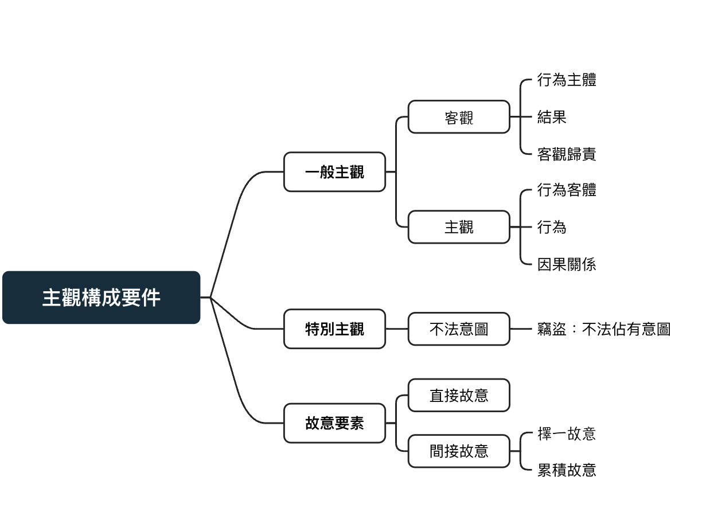

# 主觀構成要件

在**故意犯之脈絡下**，行為人必須滿足主觀構成要件(知與欲)，才能進入違法性判斷

其中，又可區分為一般性與特別性之主觀構成要件

### 一般性的主觀構成要件

構成要件故意指行為人對於犯罪層面的認識，即實現客觀構成要件之認知與意欲。

**行為主體應為客觀**

一名公務員無需主觀認識自己公務員的身分，僅需在**客觀層面**有公務員之身分

換言之，內政部之工友即使在主觀層面認為自己是公務員，也不會為收受賄賂罪之管制主體。

**行為客體則為主觀**：

往草叢開槍，以為裏面是一獵物，但其後發現射傷一小孩。此時行為人對行為客體有偏差之認知，**無主觀構成要件**之成立，只能以過失論

換言之想藉著打獵機會除掉同事，往其在之處開槍，打到一隻山豬，同事毫髮無損，但可應想殺同事之**意圖**成立殺人未遂

**行為為主觀**

必須認識到**行為本身會造成侵害法益之結果**

在嬰兒奶粉裡下鹽巴，導致嬰兒死亡：

1.若行為人不知道下鹽巴會使嬰兒脫水致死，頂多以**故失致死定罪**

2.若行為人對加鹽巴可以造成嬰兒死亡有認識，則有間接故意致死罪之可能

出於對因果法則之重大無知，而使行為有過分偏差的認識：**不能未遂**

>刑法§26： 
行為不能發生犯罪之結果，又無危險者，不罰。

例：妄想拿彈弓射下飛機，下符咒咒死他人

即使有犯罪之意圖，但因為行為人對行為本身有偏差之認識，致使其行為根本無法滿足其意圖，不罰

**結果為客觀**

判斷結果即有沒有發生法益之侵害，無主觀之判斷

無結果，討論是否有未遂犯，無未遂犯，無刑責。

**因果關係與客觀可歸責**

因果關係只要行為人對可預見之因果流程有大致之認識即可，算是**微主觀**

例：將人從橋上推下，只要認識行為客體有死亡之可能，**無須對如何死亡有精確之認識**

客觀歸責就是「**客觀**」，原則上不需討論主觀之認識

例外則是上述的「**特殊之認識**」，會將不罰之風險**上升**至法所不容許的風險

### 特別的主觀構成要件

竊盜罪：除了客觀構成要件，還要有「**不法所有意圖**」

>刑法320竊盜罪： 
意圖為自己或第三人不法之所有，而竊取他人之動產者，為竊盜罪，處五年以下有期徒刑、拘役或五十萬元以下罰金。 
意圖為自己或第三人不法之利益，而竊佔他人之不動產者，依前項之規定處斷。 
前二項之未遂犯罰之。 

使用竊盜：未經車輛主人同意，將其車輛開走，10分鐘後將車輛還回...

行為人雖滿足客觀構成要件，但其**無不法所有意圖**，不滿足特別的主觀構成要件不可類推適用

### 罪責意圖與主觀構成要件意圖

有一些「**意圖**」是屬於第三階層的罪責要素

涉及刑法的創設(成立之有無)為主觀構成要件，刑法之加重是罪責要素

刑法240條(和誘罪)第三條之「營利、猥褻、性交意圖」應為**罪責要素**，屬於刑法之加重。

>刑法240條： 
和誘未成年人脫離家庭或其他有監督權之人者，處三年以下有期徒刑。 
和誘有配偶之人脫離家庭者，亦同。 
意圖營利，或意圖使被誘人為猥褻之行為或性交，而犯前二項之罪者，處六月以上五年以下有期徒刑，得併科五十萬元以下罰金。

### 行為與故意同時存在

**行為當時必須有故意**

不管事前故意或事後故意，只要不是同時存在，皆無故意

**事前故意**：在行為之前有意欲，但行為之實施並非出於故意

甲對乙懷恨在心已久，並且有殺了乙的意欲，某天其出門買菜時，因燈光昏暗與乙對撞，而後乙傷重不治。

**事後故意**：在行為之前沒有意欲，行為之實施出於過失，但事後產生意欲

甲對乙懷恨在心已久，但無殺了乙之意欲，某天其出門買菜時，因燈光昏暗與乙對撞，而後乙傷重不治，而後認為殺了他剛剛好，本來就應該把她撞死。

## 故意的放棄與中止犯

故意的放棄：根本**不成立犯罪**

例：行為人想殺人，但根本沒殺人就已經放棄

中止犯：是三階層以外之成立要件，**已著手，但中途放棄**，減輕或免除其刑。有兩種情況

1.已著手，**還未有結果選擇放棄犯罪**。 
例：行為人想殺人，並且拿刀開始砍人，而後因太累選擇放棄

2.已著手，其後**選擇避免結果之發生**。 
例：行為人想殺人，並且拿刀開始砍人，行為客體被砍至輕傷，而後選擇將人抬去醫院治療，放棄殺人

>刑法§27： 
已著手於犯罪行為之實行，而因己意中止或防止其結果之發生者，減輕或免除其刑。結果之不發生，非防止行為所致，而行為人已盡力為防止行為者，亦同。 
前項規定，於正犯或共犯中之一人或數人，因己意防止犯罪結果之發生，或結果之不發生，非防止行為所致，而行為人已盡力為防止行為者，亦適用之。

## 故意的要素

在刑法13條中，規定了兩種不同的故意，分別為**間接故意**與**直接故意**

間接故意之意欲較弱，而直接故意的意欲較強烈

多數的刑法分則條文兩種故意皆可，例：殺人罪、強盜罪

少數之條文則以「**明知**」二字限制在「直接故意」

例：刑法213、131

### 間接故意

實務上判斷間接故意**採容任理論為主**，搭配其他理論

間接故意大致分為兩種，擇一故意與累積故意

1.**擇一故意**：

為達成某種結果，所定一特定對象，即使冒著波及無關之第三者之風險依然選擇執行，而後果真傷及第三者，以**間接故意論**。

例：在一場槍擊案中，殺手欲射殺做在車上之總統甲，但因為槍法太菜，子彈只畫過總統脖子，反倒將一旁之隨扈乙擊斃

此案中，兇手意圖射殺甲而未能成功，以殺人罪論處。

車子在移動過程中，殺手因可認識到有可能波及隨扈乙，以直接故意論處殺罪。

2.累積故意

=
~不重要
