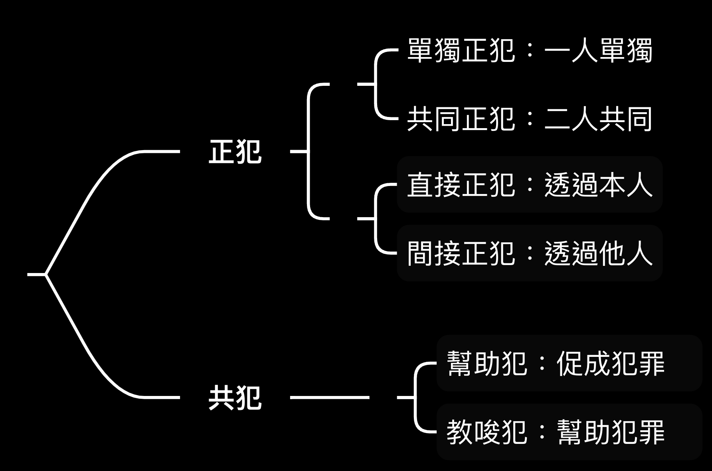
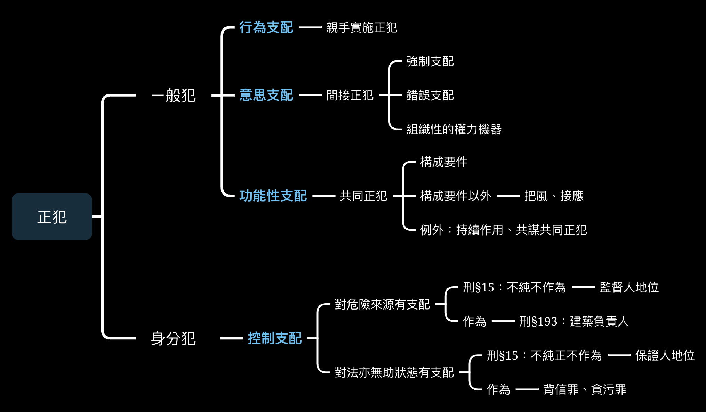
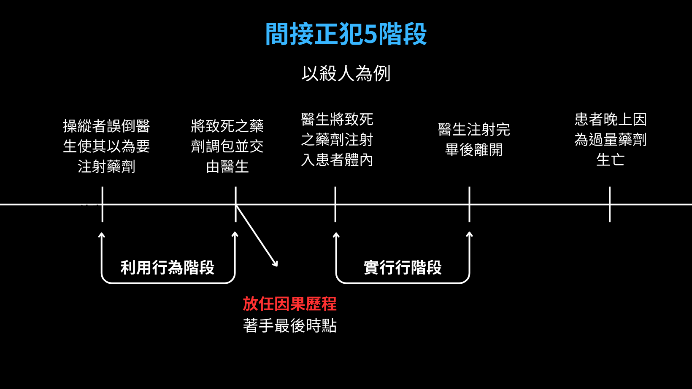
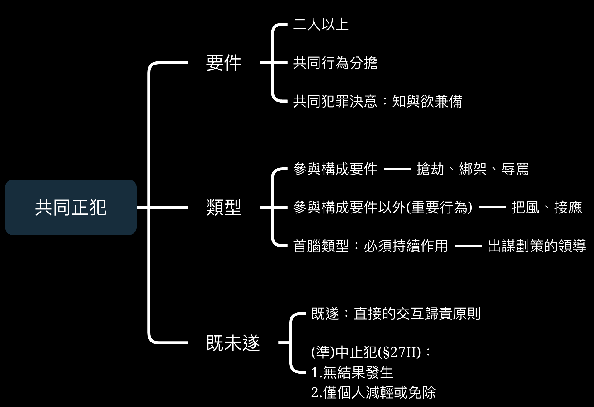

# 正犯

## 共犯與正犯體系

{width=500}

### 二元犯罪參與體系

上圖即為二元犯罪參與體系，正犯是施行犯罪之關鍵，過去所談及之犯罪幾乎都是單獨正犯。但有些案件為集團性犯罪，有人把風、有人破門、有人開車，此即多個共同正犯。又依施行構成要件是否透過他人分為直接與間接正犯。相對的，共犯僅促成或幫助犯罪成立。

區分何為間接正犯、共同正犯、幫助、教唆犯固然是重要課題，但就處罰標準、型態等需要有所依據，以免**擴張刑罰**之嫌。

我國刑法對共同正犯(§28)、教唆犯(§29)、幫助犯(§30)有寫在法律中的依據，唯獨缺少間接正犯，因此勢必還珠理論與解釋補充。

### 單一正犯

本理論不區分正犯與共犯，只要有對犯罪之**構成要件實現有因果貢獻者**，ㄧ律視為正犯處理，至於貢獻的多寡，則由法官做量刑的區別。

此體系有大量的漏洞：1.完全交由法官而無明文區分有違**罪刑法定** 2.共犯之未遂成為可罰 3.忽略實際行為樣態之重要性

### 不法內涵

從正犯、教唆犯到幫助犯具有**大包小**的概念，雖然在實際行動上有所區別，但在不法內涵上具有等第關係。

其影響之一是在**法條競合**的關係，若犯罪成立正犯行為，則教唆的行為被吸收，論以正犯。相同，若教唆行為成立，則幫助的行為被吸收，論以教唆。

另外一項則為錯誤型態，「主官要素必須與客觀構成要件要素之
間具備對應關係」，也就是**主客觀ㄧ致**，使負故意刑責。於此，若主觀所知為教唆，客觀則為正犯(所知小於所犯)或主觀為幫助，客觀為教唆(所知大於所犯)，僅得以對應型態判罰故意責任，有以「小」為主的狀況。

## 共犯與正犯區別理論

共犯與正犯，有其不同之不法內涵大小，進而影響其刑責，因此，判斷上，必須有嚴格合理的理論來區分，以下分別舉最具重要性的「間接正犯與教唆」和「共同正犯與幫助犯」。

例1：A為B之上司兼老師。A欲趁其仇人入院時殺之，遂以其畢業證書與職位，逼迫B進行錯誤之手術，並假裝醫療事故致死。A為殺人之間接正犯還是教唆犯？

例2：母親A欲溺死其子，但其瘦弱無力，此時B出於同情，替其執行殺子行為。B為殺人之幫助犯還是共同正犯？

- 形式客觀說：必須**親自執行**構成要件行為，僅提供或指使皆僅為共犯。

依此判定，例1之醫生僅指派與威脅，並未參與實際執行，僅可能為教唆犯。例2之B實際參與行動，成立共同正犯。

本學說主要批評在於過度排除正犯成立的可能，根本**無法解釋間接正犯之存在**。

- 主觀說：依行為人是否認知其為正犯，或僅主觀上認為自己是幫助或教唆。

早期德國學說偏向**極端主觀說**，即完全以行為人之主觀做判斷。而後在不同理論出現後，後期德國學說轉為**限制主觀說**，除了主觀之外，也考慮**客觀要素**，如是否得利、參與程度或支配性。

在訴訟上證據法觀點，主觀上之想法難以判斷與證明，因此淪為法官可操縱之結果。

- 犯罪支配說：正犯**以「故意」操縱整個流程之運作**，處於犯罪之關鍵角色。而共犯僅作為犯罪之幫助或促成，作為次要角色。

其實此學說實際上及主客觀混合說，主觀上行為人是否有意居於最高支配地位？客觀上是否有巨大貢獻？使區分更具可資辨識性與嚴謹性。

正犯支配分成3種類型，其他皆為共犯：

1.行為支配：行為人作為犯罪之主體，**直接正犯**

2.意思支配：行為人以其想法駕馭、蒙蔽使他人完成其犯罪計畫，**間接正犯**

3.功能支配：多人分工分擔犯罪要角，**共同正犯**

4.控制支配：對於特殊生活領域具支配性，從而以不作為或作為方式成立犯罪

{width=500}

### 特別犯罪類型

有些刑法條文對於行為主體有特別的要求，即**主體適格**。因此，此類犯罪不能成立共同正犯、間接正犯。

己手犯：在犯罪類型章節提過，此類型「惟有親自實施才滿足不法內涵，必須由親自並直接構成要件使成為犯罪。非親自實施者不成立正犯、共同正犯或間接證犯，最多成立教唆或幫助犯。」

純正特別犯：對特定行為主體設立的刑罰，如公務員收受賄賂(§121)，即使非公務員之某人為推動犯罪之主要共犯，也會因缺乏主體資格，只能成立**教唆**或**幫助**。

義務犯：必須具備構成要件所要求的特別義務。因此不具備義務者不為犯罪之正犯。 
例：背信罪(§342)，必須具備對他人財產照料之特別義務人。交通事故逃逸罪(§185-4)，必須是該駕駛動力交通工具而導致事故者負有在場之義務，即便他人鼓勵甚至載其逃逸，皆無此罪之正犯。

不純正不作為犯：此類型規範具有**保證人地位**之行為人可以不作為達成構成要件，因此缺乏保證人地位者亦不成立正犯。

## 間接正犯

間接正犯是指**透過資訊落差(錯誤支配)、權勢高低(強制支配)或組織性權利機器使人完成己所欲之犯罪**，所謂借人殺人(放狗咬人是直接正犯)。以犯罪支配說的角度，直接正犯對直接的行為有支配性，而間接正犯則具備操縱者優越的意思支配。

### 教唆與間接正犯

間接正犯之不法內涵高於教唆犯，因其對犯罪之支配性與地位高於教唆犯。換句話說，間接正犯之工具人是盲目的，可能出於(事實或法律)錯誤被其操縱。教唆犯所教唆者具有對整個犯罪計畫與行動具備支配性與自主性。

例1：A為B之上司兼老師。一天A之仇人被送入A與B之醫院。A想趁機至其仇人於死，但其為資深之醫生，若親自動手恐被看破手腳，於是以實驗為由請B進行高風險手術，果然使其仇人死亡； 
全案中，B因信任A而進行對仇人不利之手術，完全受A之蒙蔽，B具備完全支配性，成立殺人之間接正犯。

例2：若A以加薪為誘餌，說服B假借高風險手術失手殺死仇人，B權衡利弊後同意。; 
相較例1，B具備足夠之自主性，是殺人行為支配者，A僅為教唆者。

### 類型：依照犯罪體系

1.利用刑法上之行為

以人為犯罪工具，而其背後要求的是「刑法上行為」之品質，缺失則為直接正犯。

行為審查的第二階段**舉止由人之意思所支配或得支配乎**，反面來說，以反射、直接強制、外力支配達成犯罪者應為直接正犯。如O將T強制推向X，使X墜樓死亡，O應為直接正犯。

2.利用構成要件不該當之行為

- 客觀構成要件不該當：利用某種上位關係或誤導，使人自傷或自殺逃避刑責。 
例：A為騙取保險金，使B相信死後能復生讓B自殺，A是殺人罪之間接正犯非教唆犯。

- 利用無故意或無過失： 
例：為獲取保險金而隱匿親人病情使不知情之醫生錯手發生醫療事故，聞間接正犯

- 欠缺意圖：使他人在不具備特定意圖下，犯下特訂犯罪 
例：A假意請B幫忙借用他人手機，實則偷取。B欠竊盜罪之所有意圖。

3.利用他人之合法(阻卻違法)行為

例：利用警察合法之拘捕行為(依法令行為)拘捕無辜之人，強制罪之間接正犯。

4.利用無罪責行為

- 無責任能力：刑法18條(因年齡)或19條(精神狀態) 
例：使13歲之孩童殺死其母親，故意殺人的間接正犯

- 利用禁止錯誤：誤導、矇騙他人使其出現法律錯誤，達成犯罪 
例：讓不了解我國法律之外國人買賣槍械。

- 利用寬恕罪責事由：除了完全阻卻罪責事由，即使行為人僅為寬恕罪責事由，仍有可能成立間接正犯。如利用他人避難過當(被手拿木棒之嫌犯要球殺100個人)、15歲之少年殺人。但必須小心與教唆犯之區分。

5.利用他人之犯罪行為

過往當親手行為人成立犯罪時，會排除間接正犯存在，多數例子也都是操縱不成立犯罪之人。但目前也出現以操縱故意與過失犯罪之間接正犯。

- 過失：上述之調包藥劑案，被矇騙之醫生仍可能因未依規定檢查而成立過失致死，但不妨礙蒙騙者成立故意殺人行為。

- 故意：若案件中，被操縱者有故意要素，操縱者之支配性明顯會降低，但不乏操縱者成立間接正犯。

## 間接正犯既未遂

{width=500}

### 著手時點?

依照**主客觀混合說**，以行為人主觀之犯罪計畫，而施行足以實現構成要件或招致法益侵害危險，稱著手。於此，間接正犯乃**擁有犯罪計畫**，當其啟動犯罪因果流程時，就已經足以造成法益之危險，因此著手時點應在利用行為階段。

至於實際之時點，蓋因依照其犯罪計畫與類型而定，但至遲在**放任因果流程獨立運作時**起著手。

以上述殺人案為例，在調包藥劑案為例，護士A在掉包藥劑時，尚不能確認藥劑是否會被使用，不確認是否危險造成。當其將假藥劑送進病房交給醫生時，已放任因果歷程獨立運作，且足以造成危險，此案應著手。以此在護士將假藥劑放置病房後，到醫生施打藥劑時，應為殺人未遂階段。

### 中止未遂

中止未遂是**個人減輕或解除刑罰事由**，在多人犯罪下因**個自判斷**。在間接正犯存在的情況下，若被操縱者因自發醒悟而放器或阻止結果之發生，幕後的操縱者不會獲得任何中指未遂的福利。另外，間接正犯之操縱者在放任因果流程獨立運作後，以然是既了未遂，必須採取**積極行動**，否則仍是普通未遂。

## 間接正犯之錯誤

### 行為過剩？

在故意犯之脈絡下，**主客觀必須對應**，於此，若被操縱者所作為超越原本之計畫，如計畫騙取未成年之甲搶奪錢包，但其獸性大發，遂性侵並得逞，操縱者僅存在竊盜之故意，強制性交之故意不存在，因此會阻卻強制性交故意犯成立。

### 工具錯誤

前面說到間接正犯與既遂犯大包小，並且缺乏高度支配性會流向教唆犯，因此，當操縱者對被操縱者實際情況有誤認，即**主觀：是否自認有優勢地位**與**客觀：是否實際有優勢地位**不符時，操縱者僅令成立教唆犯。

<table>
  <tr>
    <th>類型</th>
    <th>缺乏要素</th>
    <th>效果</th>
  </tr>
  <tr>
    <td>誤無責為有責</td>
    <td>主觀缺乏支配性</td>
    <td>教唆犯</td>
  </tr>
  <tr>
    <td>誤有責為無責</td>
    <td>客觀缺乏支配性</td>
    <td>教唆犯</td>
  </tr>
  <tr>
    <td>誤無故意為有故意</td>
    <td>主觀缺乏支配性</td>
    <td>教唆未遂</td>
  </tr>
  <tr>
    <td>誤有故意為無故意</td>
    <td>客觀缺乏支配性</td>
    <td>教唆既遂(爭議)</td>
  </tr>
</table>

關於誤有故意為無故意成立哪種犯罪仍有爭議，被害人雖有主觀之駕馭心態，客觀上缺乏實際之完全支配而只能到達教唆之程度，若該存有故意之工具人既遂，操縱人僅可能成立教唆既遂。然亦有學者認為應成立未遂之間接正犯。

### 行為錯誤

- 打擊錯誤：視為本人打擊錯誤 
例：T想使O注射毒藥進入A之體內，不料O手滑將毒藥注入B隻體內，造成B死亡。打擊錯誤乃成立一殺人故意未遂與ㄧ過失致死兩者想像競合從一眾處斷，此例中，原屬O之刑責歸於間接正犯T。

- 客體錯誤：分為「視為打擊錯誤」與「個化理論」

    + 視為打擊錯誤：被操縱者如工具，當工具發生客體錯誤時，如同本人發生打擊錯誤，故因以打擊錯誤處理。
    
    + 個化理論：因視操縱者是否「交代清楚」。若發現客體錯誤是**可預見**情形，操縱者至少有間接故意，此理論更符合故意對應原則。

例：依**個化理論**，注射毒藥案中，若醫生非常清楚交代施打藥劑之對象為O，而因護士之誤認而施打錯人，應如同上案例一樣以打擊錯誤，成立一殺人故意未遂與ㄧ過失致死兩者想像競合從一眾處斷。但若醫生僅告知病房與部分特徵，並且將任務交給菜鳥護士，依正常情況下，難認其無預見施打錯誤之可能，醫生應成立間接故意之殺人罪。

## 共同正犯

{width=500}

## 要件

「二人以上共同實行犯罪之行為者，皆為正犯。」(§28)，簡言之，成立共同正犯與否，是**功能支配觀點的分工合作與角色分配關係**。所有犯罪參與者都視其他人為夥伴，並將犯罪視為己出。

共同正犯之要件大致有1.二人以上2.共同行為分擔3.共同犯罪決意，具備以上要件的所有參與者稱**共同正犯**，並適用「直接的交互歸責原則」，負起全部責任。

1.二人以上

雖然像廢話一句，但必須注意在犯罪計數中，限制責任能力人知參與不妨礙共同正犯成立，而其個人或得減刑優惠(18§II)。但若**無責任能力人，則僅成立間接正犯**。

2.共同行為分擔

成立共同正犯的基礎是所有犯罪者都投入一定之貢獻，而究竟貢獻程度到哪屬於共同正犯，和者屬於幫助犯，是本章重心所在。

**3.共同犯罪決意**

除了客觀之貢獻程度，也須具備主觀之考量，即所謂**共同犯罪之決意**，數個共犯要有ㄧ樣的之**知**與**欲**。

因此，若多人雖在客觀上有相等之貢獻，但若僅為偶然(如兩人在滬不知情下了相等之毒藥)，或利用關係(詐騙集團與車手)，難成立共同正犯，上述毒藥案中，兩人各下70%毒藥最後至死(累積因果關係)，或兩個缺乏共同犯意疊加，為**同時犯**，刑責判斷各自獨立。

過失犯，本身欠缺**欲**之要素，更難謂有共同犯罪決意，同樣不會參與共同正犯之討論。

而決意之表示，只要能傳達犯罪之決意者，即使不以言語或書面等方式表達，以**默示**或**間接聯絡**(77台上2135：「甲分別邀乙、丙，雖兩者無直接聯絡，不妨礙共同正犯成立」)。

**表達時點**，典型的例子是在行為前(著手)，但若在行為「中」加入，如擴張犯罪計畫(原先僅為竊盜，而後第二行為人加入，與第一犯罪者決意共同殺害屋主)，或加入原本的犯罪計畫，稱**相續共同正犯**。

**相續共同正犯**比較有爭議的點在於，若行為人在非常後期加入，甚至是**行為完成**後才加入，是否能成立共同正犯？其一，在行為完成前，即使在非常後期加入，但有共同犯意下並相當之貢獻，難謂無法成立共同正犯。其二，若犯罪既遂，則無成立可能。最大的爭議在於**若行為完成，但結果尚未發生(未既遂)時加入，能否再加入共同正犯?**

?例子

繼續犯：既遂後，行為尚未完成，則加入者可為共同正犯 
95台上4981:「擄人勒贖罪，固以意圖勒贖而為擄人之行為時即屬成立 (按 :已經既遂)，但勒取贖款，係該罪之目的行為，在被擄人未經釋放以前，其犯罪行為仍在繼續進行之中(按:尚末完成〉 。 是上訴人雖末參與擄人，而其出面取贖 ，既屬實施勒贖行 為之一部分 ，即係在擄人勒贖之繼續進行中，參與該罪之目的行為，自應認為共同正犯。」

## 共同正犯類型

前面提及，共同正犯之判斷最主要在於**貢獻如何**，而以下依照貢獻的類型，可窺見大致怎麼樣的行為，在我們的刑法體系中，被視為共同正犯。

- **參與構成要件**

可以說是最基本的款式，行為人**親自參與**法典所規範之要件，如殺人罪之殺人行為，擄人勒屬罪中之綁架、囚禁、要錢，只要一部即可。

- **參與要件以外重要行為**

在上百中犯罪中，並非所有達成犯罪之重要行為都能加入要件中。如在強盜罪中，除了動手搶奪外，其他支開其他群眾，把風、接應等皆為**密不可分之功能支配關係**。

- **策劃、準備或資助等不在場行為**

實際案例中，黑幫老大指揮小弟辦事，從中謀劃一切，並可分到最大利益，這種首腦類人物幾乎不會親自現場，看似更相近與教唆行為，但在事理上更應該視為共同正犯？

少數說認為必須「在犯罪行為實施階段」對犯罪結果共同產生作用者為限，於此，僅在犯罪前給指示與提供資金之首腦，而在犯罪實行當時卻置身事外不在場者，首腦僅能論以教唆犯 ;但若為**功能性**在場者，如在犯罪階段用電話遠端指揮者，仍有相互為用的支配關係。

而犯罪支配說的觀點，首腦之策劃只要在實行階段仍**繼續作用**以足，如此處理犯罪起關鍵作用的首腦，似乎更加合理。

## 共同正犯既未遂

所謂**直接的交互歸責原則**，任一人達成共同企求的犯罪目的，其他人共同承擔一樣刑責。一人既遂全部既遂，一人著手全部著手。

中止未遂屬於個人解除或減輕刑罰的事由，於此若共犯一人因己意中止犯罪，僅個人享優惠。然而，欲成立中止犯之共同正犯必須**成功阻止結果發生**。至於準中犯上，除了「積極防止但結果仍發生」，其他兩種「結果之未發生乃被害人或第三人阻止」與「誤認既遂而有積極防止行為」皆適用。

>刑法§27II：共正犯之準中止未遂 
II：前項規定，於正犯或共犯中之一人或數人，因己意防止犯罪結果之發生，或結果之不發生，非防止行為所致，而行為人已盡力為防止行為者，亦適用之。

## 共同正犯過剩與錯誤

- 過剩行為：

共同正犯必須基於共同的知與欲，因此，當行為過剩乃單一行為人造成，該行為人就其單獨負責(原計畫為偷竊，但一行為人突發性殺死相對人，則其他共同正非僅就偷竊負共同刑責)。但若行為過剩乃共同行為，只不過是擴張原行為。

- 打擊錯誤與客體錯誤：

共同正犯之下的錯誤，與單一犯的處理相同

- 加重結果：

僅需把握最基本的原則：「共同正犯出於共同之知與欲」，而加重結果的要件之一為：「前行為故意、後行為過失」。因此共同的部分僅可能在前行為，是否加重應屬行為個別判斷，如我國依各行為人有無預見可能性，而判斷是否加重。

例：以227II傷害致死罪為例，多人共謀傷害某甲欲給其一點顏色，未料甲因該傷致死。此時應就各人能否預見判斷是否成立傷害致死罪

## 身分犯之正犯認定

{width=500}

身分犯，是只有具備特定行為主體資格之人，始能成立該罪正犯之犯罪規定，如背信罪、洩漏業務秘密罪等，不具備資格之人，原則上不能成立正犯。但，我國用刑法第31條第1項擬制了「身分犯之正犯」

>刑法§31： 
I：因身分或其他特定關係成立之罪，其共同實行、教唆或幫助者，雖無特定關係，仍以正犯或共犯論。但得減輕其刑。 
II：因身分或其他特定關係致刑有重輕或免除者，其無特定關係之人，科以通常之刑。 

雖然本條寫「正犯」或「共犯」，但實際上，使用本條就會以**正犯**論。又此為「擴張」刑法規定，立法者以**得減輕其刑**，來取得正當性。

而德國並未有這樣的規定，一來，其認為身分犯之犯罪，本圍繞著具備主體資格之特定人而設，換言之，一但欠缺此具備資格之人，其他人根本不會成立犯罪，因此其他人頂多為共犯。其二，即使以正犯論，以我國實務來說，皆會減輕刑責，與共犯無異。

## 身分犯的本質

以下要從歷史脈絡與法學理論，探究身分犯之不法內涵。

##  Roxin的義務犯理論

對於正犯的概念，即由此教授提出，也就是**犯罪支配說**，行為人以行為支配(直接正犯) 、意思支配(間接正犯)或功能性的犯罪支配(共同正犯)。能成立後兩者的，皆應為不限定主體的**支配犯**。而限定身分者，是我們熟悉的身分犯。

但，學者認為，「判定為正犯的認定指標，既不是公務員身分，也不是抽象的資格，而是從理解該項具體法律事物中所得出的特別義務」與其說是身分犯，不如說是**義務犯**，而義務是「違反刑法以外的特別義務（如民法、行政法等）」

如洩漏業務上所知悉的機密罪，醫生和律師必須違反從具體生活中所衍生出來的緘默義務。
職務傷害罪，是基於公法上的義務要球，不能放任為傷害行為。

然而，有認為，以**刑法以外的特別義務**為基礎，有些不妥，尤其是**將非保護法益的目的也納入**。因此，教授在後來將**義務犯**的概念，轉以「**違反創設正犯性的義務**」或「**與結果有關地違反構成要件特別義務**」取代，但仍有認為(老師)這樣的用語仍然處於混沌中。

## Jakobs的義務犯理論

首先，他擁護的是效能論，與通說認為**刑法保護法益為目的**不同，刑法的目的是**保護刑法本身**，也就是維持法律秩序，此派的刑法分類如下。

- 組織管轄：擴展自己的生活組織領域 
一般犯、危險前行為人保證地位、空間支配者(往來義務)

- 體制管轄：體制身分的衍伸 
父母與子女間的義務、特殊信賴義務(地位)、與生俱來的國家義務(警察)、不真正親手犯

總言之，此派是以**規範目的**來看刑法，從而拋棄通說所謂作為犯與不作為犯的概念，重要的是**違反刑法的原因**，對於義務犯的認定也因而較窄。

## 不純正不作為犯

為何突然談到不純正不作為犯？第一，其也屬於身分犯，第二，在研究中，身分犯與不純正不作為犯界定正犯性的基準是一致的。

所謂不純正不作為犯，指並無明定於法條內，但可透過不作為達成法律構成要件，做為作為犯之補充，我國以刑法15-1(監督、保護之保證人地位)與15-2（危險前行為保證人地位）來做規範。兩種概念都有對**身分**的要求，可以說是**隱藏版身分犯**。

Roxin教授創設不純正不做犯的法理基礎，**控制支配**，相較於其他作為犯討論在**犯罪中**以什麼方式參與，開始以「**犯罪發生之前，行為人對於特定的生活領域有掌控**」

這樣的概念延續自Schünemann教授的理論，也就是不純正不作為犯以「**對於造成結果的原因有支配**」者為正犯，但Roxin不接受Schünemann教授對於危險前行為的保證人地位的見解。

## Schünemann的保證人身分犯

教授認為，成為正犯，有兩種正犯基準，其一是對於法益的無助狀態有支配，其二是對於危險來源有支配

### 法益的無助狀態有支配

此類犯罪者，之所以負某種義務，是出於**具備使法益陷入無助有支配性**，並且在犯罪發生前就有支配性。

公務人員瀆職罪，是作為犯，也是身分犯最經典的案例。公務人員對於是否違反其義務，在行為前就有支配性。

>刑法§121： 
公務員或仲裁人對於職務上之行為，要求、期約或收受賄賂或其他不正利益者，處七年以下有期徒刑，得併科七十萬元以下罰金。

在某些**義務犯**的法條中，通常將**不作為**與**作為**合併，也就是同個法條能以兩種同狀態達成。如刑法§316條專業人士對其業務負緘默義務，此條既可以作為(主動洩漏相對人之秘密)，或不作為(不阻止秘密被洩露)。專業人士在洩漏情形發生前，對秘密有支配性。

>刑法§316： 
醫師、藥師、藥商、助產士、心理師、宗教師、律師、辯護人、公證人、會計師或其業務上佐理人，或曾任此等職務之人，無故洩漏因業務知悉或持有之他人秘密者，處一年以下有期徒刑、拘役或五萬元以下罰金。

又例如§342條之背信罪，僅為他人處理事務者之義務。受害人將1000萬以下基金完全交由理財專員保管，理財專員在其起貪念挪用基金前，就對基金有支配性。

>刑法§342： 
I：為他人處理事務，意圖為自己或第三人不法之利益，或損害本人之利益，而為違背其任務之行為，致生損害於本人之財產或其他利益者，處五年以下有期徒刑、拘役或科或併科五十萬元以下罰金。 
II：前項之未遂犯罰之。

## 對於風險來源有支配(分則)

如刑法193，工程的承攬人對於工程的一切細節皆有掌握，並且為其利益而違反建築術成規，使他人陷入危險，其對危險(風險)有支配性。

>刑法§193 
承攬工程人或監工人於營造或拆卸建築物時，違背建築術成規，致生公共危險者，處三年以下有期徒刑、拘役或九萬元以下罰金。

## 控制支配與不純正不作為犯(15條)

**保護類型的保證人地位**，對法益的無助狀態有支配，父母對子女的安危狀態有責任，這是出於子女對**自己的生命身體法益**無法完全的保護，如嬰兒無法自己去看醫生，中小學生缺乏自主的經濟與生活能力。

同樣的，保母對嬰幼兒之安危狀態有責任，除契約上的義務，也出於嬰幼兒不具備生命身體法益的控制能力。

在各種領域中，保母、登山領導、潛水教練等等，行為人將其生命身體法益託付由相對人，於是行為人對其法益處於無助狀態，相對人則成為**法益之保護人**，對法益的侵害有責任。

**監督類型的保證人地位**，則對應**風險來源有支配**，危險來源可能是建築、天氣、交通、甚至是人。

精神病院中，具備攻擊性的病人，其醫生或監管者，在其義務範圍內，對該病人所產生的任何危險，皆有責任，以其對於該病人的行為有支配性。

遊樂園的場主，在明知設施未良好保養，仍以盈利目的營運，同於釋放其可支配之危險。此兩例皆是行為人對特殊生活領域的控制，而成為**法益之監督人**，繼而對法益的侵害有責任。

### 男性曝陰行為罪

犯罪學上，此類犯罪幾乎都發生在男性上，並且女性之曝陰行為，極少數會造成法益侵害。因此本條看似是身分犯，然而實際上是將女性的曝陰行為除罪化，在思維上仍屬於犯罪支配。

此類身分犯是屬於**純粹的身分犯**，假使一女性控制一男性曝陰，該女仍依照犯罪支配中的意思支配成立間接正犯。中華民國刑法不具備此類條文。

## 實例與總結

使喚不知情之助理(無故意犯罪工具)是背信罪的間接正犯，然若為知情之助理，以德國法律來說，助理不具備該身分，即便具備共同犯意聯絡並共同施行，皆僅為幫助犯。而中華民國，透過刑法31條第1項，將該助理**擬制為身分犯的共同正犯**。

配偶之間共同謀劃收受賄賂，即便其中一者不具備公務員的身分，依然可依照我國刑法31條第1項，將其視為正犯論。

總的來說，身分犯有其特殊的正犯性認定(控制支配、義務犯)，而不套用與一般犯之正犯(犯罪支配)。而我國則利用刑法第31條第1項，先擴張刑法權，再利用減輕刑責的方式，獲取正當性。

